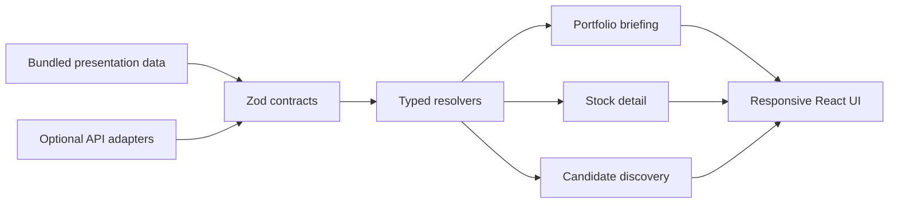

# Futur Insight

한국·미국 관심종목과 보유 포지션을 뉴스, 기업 맥락, 테마 흐름, 데이터 품질 상태와 함께 살펴보는 **반응형 투자 리서치 워크스페이스 프로토타입**입니다.

> 종목 주문·증권사 연동·개인화 매수/매도 지시를 제공하지 않습니다. 기본 실행은 저장소에 포함된 presentation data를 사용합니다.

## 무엇을 보여주나

- **포트폴리오 브리핑** — 관심종목 주변 이슈, 테마 노출, freshness와 주의 신호를 한 화면에 구성합니다.
- **종목 리서치 화면** — 가격 맥락, 기업 요약, 지표, 리스크, 체크포인트와 출처 영역을 제공합니다.
- **후보 탐색** — 관심종목·시장 신호·테마와 연결된 후보를 이유와 함께 설명합니다.
- **명시적인 데이터 상태** — `available`, `collecting`, `stale`, `text_only`, `missing`, `unsupported`, `error`를 UI까지 전달합니다.
- **반응형 인터랙션** — 데스크톱 navigation, 모바일 bottom tab, 독립 detail scroll, reduced-motion을 지원합니다.

## 설계 포인트



- **Runtime contract** — TypeScript 타입만 신뢰하지 않고 Zod schema로 화면 경계를 검증합니다.
- **Failure-aware UI** — 데이터가 없거나 오래됐을 때 그럴듯한 값으로 덮지 않고 상태를 그대로 노출합니다.
- **FSD composition** — `pages`, `widgets`, `features`, `entities`, `shared` 계층으로 화면 책임을 나눕니다.
- **Accessibility** — Playwright와 Axe 기반 smoke scenario, reduced-motion 경로를 포함합니다.
- **Adapter boundary** — API·DB package scaffold와 기본 presentation mode를 구분합니다. 저장소만 실행했다고 live data가 연결되지는 않습니다.

## 기술 스택

| 영역 | 기술 |
|---|---|
| Web | React 19, TanStack Start/Router, Vite, Nitro |
| Visualization | ECharts, Recharts, GSAP |
| Contract | TypeScript, Zod, typed API client |
| Workspace | pnpm workspaces, Turborepo |
| Quality | Node test runner, Playwright, Axe, Oxlint, Oxfmt |

## 로컬 실행

준비물: Node.js 24, Corepack

```bash
git clone https://github.com/Jigoooo/stock-insight.git
cd stock-insight
corepack enable
pnpm install --frozen-lockfile
pnpm dev
```

기본 주소는 <http://localhost:6100>이며 `VITE_PORT`로 바꿀 수 있습니다. 기본 presentation mode는 외부 API 키가 필요하지 않습니다.

주요 검증 명령:

```bash
pnpm format:check
pnpm lint
pnpm typecheck
pnpm test
pnpm build
pnpm test:e2e
```

## 현재 범위

- 이력서·포트폴리오용 단일 사용자 연구 UI prototype입니다.
- API·DB package는 확장 경계와 adapter를 보여주는 scaffold이며 운영 데이터 연결을 보장하지 않습니다.
- production authentication, multi-tenancy, broker connectivity, deployment는 범위 밖입니다.
- 투자 판단 전에는 원문 출처와 데이터 생성 시점을 별도로 확인해야 합니다.
