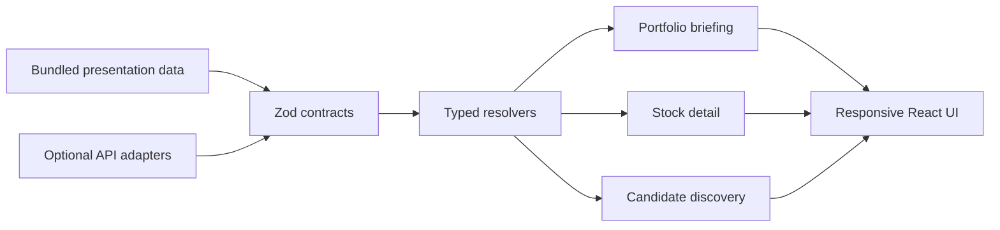

# Futur Insight

한국·미국 관심종목과 보유 포지션을 뉴스, 기업 맥락, 테마 흐름, 데이터 품질 상태와 함께 살펴보는 **반응형 투자 리서치 워크스페이스 프로토타입**입니다.

> 종목 주문·증권사 연동·개인화 매수/매도 지시를 제공하지 않습니다. 저장소 포함 presentation data는 `pnpm dev:workspace`, 운영 DB 직접 개발 모드는 setup 완료 후 `pnpm dev`로 실행합니다.

## 무엇을 보여주나

- **포트폴리오 브리핑** — 관심종목 주변 이슈, 테마 노출, freshness와 주의 신호를 한 화면에 구성합니다.
- **종목 리서치 화면** — 가격 맥락, 기업 요약, 지표, 리스크, 체크포인트와 출처 영역을 제공합니다.
- **후보 탐색** — 관심종목·시장 신호·테마와 연결된 후보를 이유와 함께 설명합니다.
- **명시적인 데이터 상태** — `available`, `collecting`, `stale`, `text_only`, `missing`, `unsupported`, `error`를 UI까지 전달합니다.
- **반응형 인터랙션** — 데스크톱 navigation, 모바일 bottom tab, 독립 detail scroll, reduced-motion을 지원합니다.

## 설계 포인트


```mermaid
flowchart LR
    A[Bundled presentation data] --> B[Zod contracts]
    C[Optional API adapters] --> B
    B --> D[Typed resolvers]
    D --> E[Portfolio briefing]
    D --> F[Stock detail]
    D --> G[Candidate discovery]
    E --> H[Responsive React UI]
    F --> H
    G --> H
```

- **Runtime contract** — TypeScript 타입만 신뢰하지 않고 Zod schema로 화면 경계를 검증합니다.
- **Failure-aware UI** — 데이터가 없거나 오래됐을 때 그럴듯한 값으로 덮지 않고 상태를 그대로 노출합니다.
- **FSD composition** — `pages`, `widgets`, `features`, `entities`, `shared` 계층으로 화면 책임을 나눕니다.
- **Accessibility** — Playwright와 Axe 기반 smoke scenario, reduced-motion 경로를 포함합니다.
- **Adapter boundary** — 자격증명 없는 presentation mode와 명시적으로 setup한 운영 DB 직접 모드를 구분합니다. 저장소 clone만으로 live data에 연결되지 않습니다.

## 기술 스택

| 영역 | 기술 |
|---|---|
| Web | React 19, TanStack Start/Router, Vite, Nitro |
| Visualization | ECharts, Recharts, Motion |
| Contract | TypeScript, Zod, typed API client |
| Workspace | pnpm workspaces, Turborepo |
| Quality | Node test runner, Playwright, Axe, Oxlint, Oxfmt |

## 로컬 실행

준비물: Node.js 24, Corepack

```bash
git clone https://github.com/Jigoooo/stock-insight.git
cd stock-insight
corepack enable
pnpm install --frozen-lockfile
pnpm dev:workspace
```

기본 주소는 <http://localhost:6100>이며 `VITE_PORT`로 바꿀 수 있습니다. 이 presentation mode는 운영 DB 자격증명이 필요하지 않습니다.

`pnpm dev`는 Cloudflare Access TCP를 거쳐 **운영 DB에 직접 연결한 두뇌(`apps/api-server`, 기본 6200)와 BFF(`apps/web`, 기본 6100)를 함께** 띄웁니다. 운영 DB를 사용하지 않는 원시 workspace 실행은 `pnpm dev:workspace`, 한쪽만 실행할 때는 `pnpm dev:web` / `pnpm dev:api`를 사용하세요.

두뇌 포트는 `STOCK_INSIGHT_API_PORT`로 바꿉니다. **`PORT`는 쓰지 마세요** — 두 앱이 같은 변수를 읽어 서로 포트를 다투고, 늦게 뜬 쪽이 `EADDRINUSE`로 죽습니다.

BFF가 두뇌를 바라보게 하려면 `STOCK_INSIGHT_BRAIN_URL=http://127.0.0.1:6200`을 지정합니다. 두뇌는 DB DSN(`DATABASE_READ_URL`)과 내부 컨텍스트 시크릿(`STOCK_INSIGHT_INTERNAL_CONTEXT_SECRET_FILE`)이 필요하고, BFF는 DB 자격증명을 갖지 않습니다.

### 다른 컴퓨터에서 운영 DB를 직접 사용하는 개발 모드

이 실행기는 **WSL/Linux**를 지원합니다. 신규 DB나 외부 전용 역할을 만들지 않고 Cloudflare Access TCP를 통해 기존 운영 `research_app`의 `stock_insight_app_reader` / `stock_insight_app_writer`를 그대로 사용합니다. 시크릿 값은 Git에 커밋하지 않습니다.

외부 PC에 최종 설치되는 파일은 아래 두 운영 시크릿과 기기별 session secret입니다.

```bash
~/.hermes/secrets/stock-insight-live-dev/pgpass
~/.hermes/secrets/stock-insight-live-dev/stock-insight-internal-context.secret
~/.hermes/secrets/stock-insight-live-dev/stock-insight-session.secret
```

모든 파일은 `0600`, 상위 디렉터리는 `0700`이어야 하며 실행기가 이를 강제합니다. 외부 PC에서 먼저 `age` recipient를 생성하고 공개 recipient만 운영 호스트에 전달합니다.

```bash
pnpm live:recipient:init
# 출력된 Age recipient(age1...)만 운영 호스트에 전달합니다. private identity는 반출하지 않습니다.
```

운영 호스트의 원본 위치와 단일 암호화 bundle 생성 명령:

```bash
# DB DSN 원본: $HOME/.hermes/workspace/stock-insight/.env.docker
# 내부 문맥키:   $HOME/.hermes/secrets/stock-insight-internal-context.secret
pnpm live:bundle:export \
  --recipient '<외부 PC의 age1... 공개 recipient>' \
  --source-env "$HOME/.hermes/workspace/stock-insight/.env.docker" \
  --internal-context "$HOME/.hermes/secrets/stock-insight-internal-context.secret" \
  --out "$HOME/.hermes/exports/stock-insight-live-dev.age"
```

외부 PC에는 Git 저장소와 `stock-insight-live-dev.age` 한 파일만 전달합니다. `age`, `cloudflared`, `bubblewrap`, Node.js, pnpm을 설치한 뒤:

```bash
pnpm install --frozen-lockfile
pnpm setup:live --bundle ~/stock-insight-live-dev.age
pnpm dev:live:check
pnpm dev
```

`pnpm dev`는 `insight-db.jigooo.com` Access 로그인을 열고 `127.0.0.1:55432` TCP listener가 실제로 방금 실행한 `cloudflared` Bubblewrap process tree 소유인지 확인한 후에만 API를 시작합니다. 설치된 `.pgpass`의 비밀번호는 환경변수나 로그에 들어가지 않으며, 실행 시 정확한 listener port로 제한된 임시 `0600` pgpass를 API에만 제공합니다. 임시 파일은 종료 시 제거됩니다.

API는 기동 전에 PostgreSQL system identifier, 실제 session/login role, reader 세션 read-only, 재귀 도달 role 속성, 전체 비시스템 relation·column-only·sequence·schema 권한, 접근 테이블의 RLS/policy, SECURITY DEFINER 함수 allowlist와 객체 비소유 상태를 운영 계약 digest와 대조합니다. 운영 cluster 재구축이나 권한·RLS 변경 뒤에는 계약을 명시적으로 갱신하기 전까지 fail-closed 됩니다.

Web/Vite와 `cloudflared`는 각각 Bubblewrap mount·PID namespace에서 실행되어 호스트 홈 전체와 API process를 볼 수 없습니다. 작업 트리와 필요한 실행 파일만 명시적으로 다시 노출하며, Web에는 BFF 동작에 필요한 내부 문맥키와 기기별 session secret만 읽기 전용으로 전달됩니다. 화면에는 `운영 DB · 실제 쓰기` 표식이 계속 표시됩니다. 시작 대기 중 종료하더라도 모든 process group을 `SIGTERM` 후 제한 시간 내 정리하며, 지연 `SIGKILL` 전에는 원래 process group identity를 다시 검증합니다.

기존 읽기 전용 원격 두뇌 모드는 롤백 경로로 유지합니다.

이 모드는 운영 DB 자격증명 대신 아래 기존 파일을 사용하며 회원가입과 mutation을 비활성화합니다.

- `~/.hermes/secrets/insight-api-access.env` (`0600`)
- `~/.hermes/secrets/stock-insight-internal-context.secret` (`0600`)
- `~/.hermes/secrets/stock-insight-dev-session.secret` (`0600`, 기기별 자동 생성)

```bash
pnpm dev:remote:check
pnpm dev:remote
```

운영 DB 직접 모드에서는 seed, reset, migration을 실행하지 마세요. Playwright는 기존 서버 재사용과 production-like DB를 기본 거부하며, 승인된 운영 mutation E2E에만 `STOCK_INSIGHT_E2E_PRODUCTION_MUTATION_ACK=I_ACKNOWLEDGE_PRODUCTION_WRITES`를 명시해야 합니다. bundle 또는 외부 PC가 유출되면 기존 reader/writer 비밀번호와 내부 문맥키를 운영 API와 함께 회전해야 합니다.

### 인증 E2E 실행

로그인·세션은 BFF가 아니라 두뇌(`apps/api-server`)가 처리합니다. 따라서 Playwright는 두뇌와 BFF를 함께 띄웁니다. `STOCK_INSIGHT_E2E_DATABASE_URL`에 **폐기용** QA 데이터베이스를 지정하면 두뇌가 먼저 기동하고 BFF가 그 두뇌를 바라봅니다.

```bash
export STOCK_INSIGHT_E2E_DATABASE_URL='postgresql://<qa-role>:<pw>@127.0.0.1:55432/stock_insight_e2e_<nonce>'
pnpm test:e2e
```

DB 이름은 `stock_insight_{p6_production,test,e2e,qa}_<nonce>` 형태만 허용되며, 운영 `research_app`이나 운영 역할·`*.jigooo.com` 호스트를 가리키면 포트·IPv6·유닉스 소켓·대소문자 변형과 무관하게 fail-closed 됩니다. 두뇌와 BFF는 실행마다 새로 만든 `0600` 내부 문맥키를 공유하며, 자격증명은 `env -i`로 시작해 셸의 운영 값이 섞이지 않습니다.

자격증명은 `~/.hermes/secrets/stock-insight-e2e.env`의 `STOCK_INSIGHT_E2E_USERNAME` / `STOCK_INSIGHT_E2E_PASSWORD`를 그대로 사용합니다. 이름이 다르면 인증 spec이 조용히 skip되므로 바꾸지 마세요.

주요 검증 명령:

```bash
pnpm format:check
pnpm lint
pnpm typecheck
pnpm test
pnpm build
pnpm test:e2e
```

## 현재 범위

- 읽기 중심 투자 연구 UI와 명시적으로 setup한 운영 DB 직접 개발 경로를 제공합니다.
- 운영 직접 모드는 기존 reader/writer 역할을 사용하지만 주문·증권사 연결 기능은 포함하지 않습니다.
- production deployment와 broker connectivity는 범위 밖입니다.
- 투자 판단 전에는 원문 출처와 데이터 생성 시점을 별도로 확인해야 합니다.
