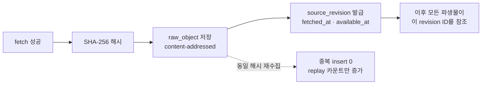
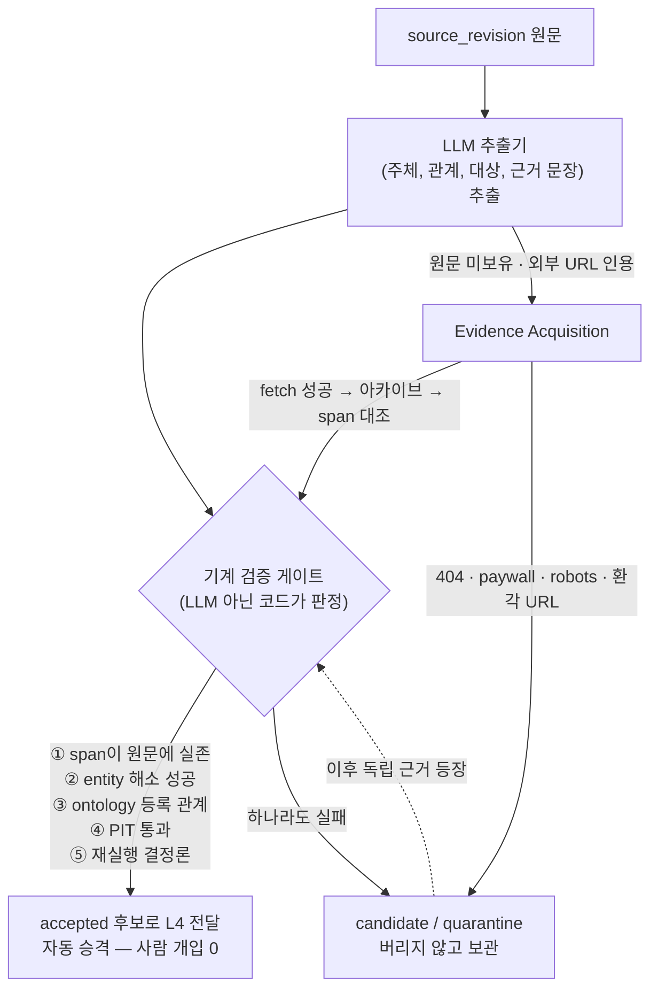
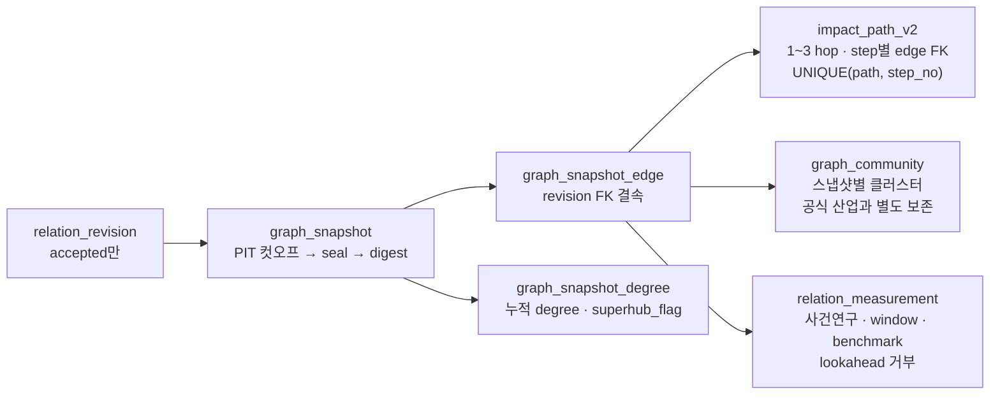
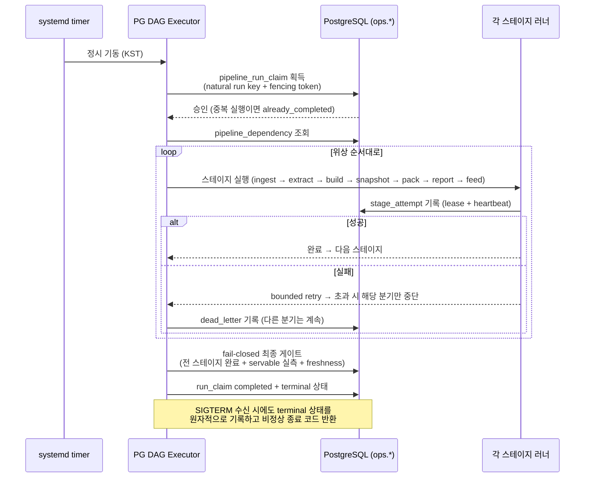
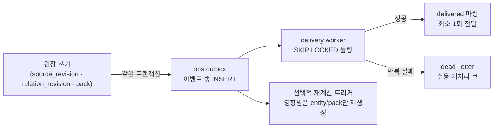
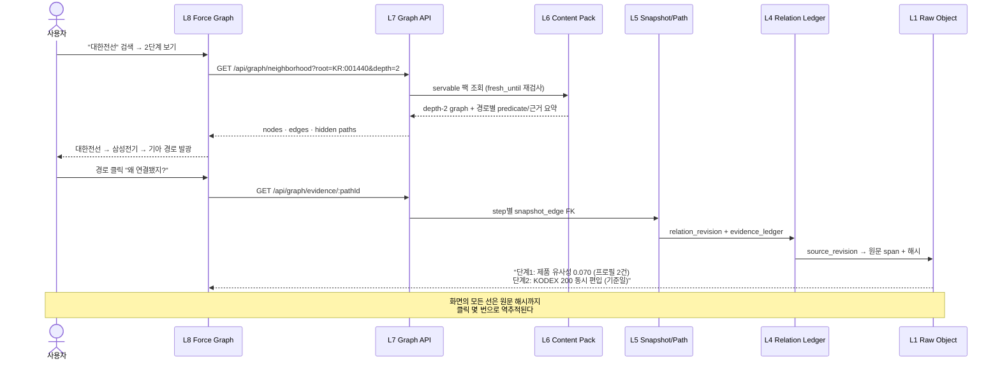

# Stock Insight — 웹에서 최종 끝단까지 전체 레이어 아키텍처 (완성형 V2 기준)

> **문서 성격**: 본 문서는 승인된 complete-v2 로드맵(관계 수집 완성 · 다중 홉 분석 · Obsidian형 그래프 UI · V2 전체 전환 · Phase 0/1/3/4 보완 · 코인 연구 레이어)이 **모두 구현 완료된 시점을 가정한 목표 아키텍처 정본**이다.
> 현재 실측 상태와의 차이는 문서 말미 [부록 A. 현재 실측 대비 상태](#부록-a-현재-실측-대비-상태)에 명시한다.
>
> - 작성일: 2026-07-20 (KST)
> - 기준 문서: `docs/plan/stock-crypto-insight-platform-architecture.md` (Phase 0~5 기준선)
> - 데이터 정본: PostgreSQL 단일 (`research_app`, TimescaleDB + pgvector 확장)
> - 문서 원칙: 사실과 추론의 물리 분리 · append-only 원장 · 시점(PIT) 무결성 · 원자적 포인터 교체 · 근거 없는 발행 금지
> - **개정 1 (2026-07-20, 구속력 있음)**: 본 문서는 `docs/plan/stock-insight-v2-enhancement-plan.md` §27의 수정 26건을 전건 수용한다. 본문과 아래 개정 조항이 충돌하면 **개정 조항이 우선**한다. 명칭·계약 동결은 `docs/adr/ADR-001-v2-naming-freeze.md`를 따른다.

## 개정 1 — V2 고도화 반영 조항 (enhancement-plan §27 전건)

| 본문 표현 | 개정 후 의미 |
|---|---|
| "웹에서 최종 끝단까지 전체 레이어" | "근거 기반 시장 월드모델 V2 전체 레이어"로 목적 명확화 |
| 확장이 새 메이저 버전으로 보일 수 있는 표현 | 전부 V2 additive enhancement. 명칭 고정 규칙(ADR-001) 적용 |
| `NEWS_COMENTION` | 표준 표기는 `NEWS_MENTION`. DB predicate는 migration 호환 위해 내부 alias 유지 |
| "뉴스는 영구 승격 불가" | **co-mention만** 영구 승격 금지. 뉴스 기사 내 assertion/event는 source tier·독립 corroboration·공식 확인 사다리로 승격 허용 |
| `Claim / Event 원장` 한 묶음 | assertion / numeric_fact / event / location_mention을 **물리 분리** |
| `event.location_id` 단일 | `event_location_revision`의 role-aware n-ary 모델 (OCCURRED_AT/APPLIES_TO/TARGETS/AFFECTED_AREA/ANNOUNCED_AT/ORIGIN/DESTINATION/ROUTE_THROUGH) |
| "L4 relation이 유일한 진실" | L4 = factual world-state + relation ledger 공동 정본. exposure/estimate/forecast는 **별도 truth class** |
| `AFFECTED_BY_EVENT` 단순 edge | event→shock→channel→exposure의 derivation projection으로 표현 |
| one-anchor typed evidence | one **derivation** anchor 유지. derivation bundle은 multi-input typed DAG (PROV-O) |
| `asOf` 단일 파라미터 | `validAt` + `knownAt` + `informationSet` 분리. `asOf`는 호환 alias |
| exact re-run determinism | stored output replay + model/prompt/schema/input hash 원장 |
| "최대 3-hop 분석" | UI 기본 1~3 hop 유지. offline 분석은 typed meta-path + cost budget으로 4-hop 이상 허용 |
| "웹 요청 중 그래프 계산 0" | 인기 결과 precompute + **bounded on-demand** 하이브리드 허용 |
| 단일 국가/지역 tag | source/mentioned/occurred/jurisdiction/target/affected/exposure **역할 분리** |
| 지도 pin | geometry + precision class + uncertainty가 결속된 projection으로 제한 |
| 좌표 저장 | PostGIS geometry 정본 + H3/MVT 파생 projection |
| 개인화 ranker | common asset view + private decision packet으로 확대 |
| buy/hold/sell 단일 라벨 | `ADD/HOLD/REDUCE/EXIT/WATCH/NO_ACTION/INSUFFICIENT_DATA` |
| 사용자별 LLM 판단 | 구조화 optimizer/guardrail이 action 생성. LLM은 설명만 담당 |
| 매입가 중심 판단 | cost basis는 세금·lot·제약·materiality에만 사용 (기대수익 입력 금지) |
| "PG outbox = Kafka급 보증" 표현 | 요구 범위 내 원자성·멱등 재처리·소수 소비자 최소 1회 전달로 **제한적으로** 기술 |
| "PG DAG의 같은 트랜잭션 이점" | 외부 fetch/LLM 호출은 stage-level short commit + immutable artifact manifest |
| "한계 도달 시 S3" | 복제(≥2 copy)·offsite encrypted backup·hash scrub·restore drill·RPO/RTO는 **지금부터 필수** |
| confidence 분해 | evidence confidence / effect distribution / calibration / spatial uncertainty 분리 (epistemic×magnitude 곱셈 금지) |
| community/path/measurement | exposure / mechanism / causal·statistical estimate / scenario / geo spillover 추가 |
| 작성일·기준일 | 본 문서 작성 2026-07-20, enhancement 검토 기준 2026-07-19 — 기준일 차이 명시로 정정 |

---

## 0. 한눈에 보는 전체 레이어

```mermaid
flowchart TB
    subgraph L0["L0 — 원천 소스"]
        DART["DART 공시"]
        SEC["SEC EDGAR"]
        ETF["ETF 구성종목 공시"]
        EXCH["거래소 시세·공지"]
        NEWS["뉴스 / RSS"]
        CRYPTO["코인 공개 API<br/>CoinGecko · DefiLlama · 공식 RPC"]
        ADHOC["LLM 인용 웹 문서<br/>ad-hoc evidence"]
    end

    subgraph L1["L1 — 수집·불변 원본"]
        RAW["Immutable Raw Object<br/>SHA-256 content-addressed store"]
        CONTRACT["Source Contract<br/>소스별 수집 정책·승인 상태"]
        SREV["Source Revision<br/>append-only 수집 이력"]
    end

    subgraph L2["L2 — 정체성·분류"]
        ENTITY["core.entity<br/>Company / Stock / ETF / Token / Protocol"]
        IDENT["entity_identifier<br/>INTERNAL_KEY · ISIN · CIK · corp_code"]
        TAXO["버전 관리 Taxonomy<br/>SIC · KSIC · 테마 · value-chain"]
    end

    subgraph L3["L3 — 검증 지식 추출"]
        CHUNK["document_chunk"]
        CLAIM["Claim / Event 원장"]
        LLMX["LLM 추출기<br/>span 필수 · 결정론 검증"]
        EVA["Evidence Acquisition<br/>내부검사 → fetch → 아카이브 → span 대조"]
    end

    subgraph L4["L4 — 시간 관계 원장"]
        RID["relation_identity<br/>안정 관계 식별자"]
        RREV["relation_revision<br/>append-only + PIT"]
        REVID["relation_evidence_ledger<br/>payload_hash 결속 근거"]
        CAND["candidate / quarantine<br/>근거 미확보 관계"]
    end

    subgraph L5["L5 — 그래프 분석"]
        SNAP["graph_snapshot<br/>sealed + digest"]
        PATH["impact_path_v2<br/>1~3 hop, step별 edge FK"]
        COMM["graph_community<br/>스냅샷별 클러스터"]
        MEAS["relation_measurement<br/>사건연구·시장확인값"]
    end

    subgraph L6["L6 — 서빙 팩"]
        PACK["serving.content_pack<br/>entity × kind × sealed snapshot"]
        RPACK["report pack<br/>주식·코인 일일 리포트"]
        FRESH["v_relation_graph_freshness<br/>servable 이중 게이트"]
    end

    subgraph L7["L7 — 읽기 API"]
        GAPI["Graph API<br/>neighborhood · paths · evidence · communities"]
        RAPI["Report / Feed API"]
        PAPI["개인화 API<br/>UUID fail-closed"]
    end

    subgraph L8["L8 — 웹 UI"]
        OBS["Obsidian형 Force Graph<br/>Sigma WebGL + ForceAtlas2"]
        WS["Research Workspace<br/>Today · 테마 · 종목 · 레이더"]
        RPT["리포트 뷰어 · 근거 drawer"]
    end

    L0 --> L1
    L1 --> L2
    L1 --> L3
    L2 --> L4
    L3 --> L4
    L4 --> L5
    L5 --> L6
    L6 --> L7
    L7 --> L8

    subgraph X["교차 레이어 — 운영"]
        DAG["PG DAG Executor<br/>ops.pipeline_*"]
        OUTBOX["Transactional Outbox<br/>+ delivery worker"]
        OBSV["운영 관측<br/>SLO · 비용 · 품질 게이트"]
    end

    DAG -.모든 배치 구동.-> L1
    DAG -.-> L3
    DAG -.-> L5
    DAG -.-> L6
    OUTBOX -.변경 이벤트.-> DAG
```



**읽는 방법**: 사용자가 웹(L8)에서 보는 모든 선(edge) 하나는 L6 팩 → L5 스냅샷 → L4 revision → L3/L1 원문 해시까지 **클릭 몇 번으로 역추적**된다. 이 역추적 사슬이 끊긴 데이터는 어떤 화면에도 나타날 수 없다(fail-closed).

---

## 1. 레이어 카탈로그

| 레이어 | 이름 | 정본 저장소 | 핵심 코드 | 한 줄 정의 |
| --- | --- | --- | --- | --- |
| L0 | 원천 소스 | (외부) | `apps/api/src/ingest/run-*.ts` | DART·SEC·ETF·거래소·뉴스·코인 공개 API·ad-hoc 웹 근거 |
| L1 | 수집·불변 원본 | `ingestion.raw_object` · `ingestion.source_revision` · `ingestion.source_contract_*` | `raw-object-store.ts` · `source-revision-store.ts` · `evidence-acquisition.ts` | 모든 원문을 SHA-256로 박제하고 수집 이력을 append-only로 기록 |
| L2 | 정체성·분류 | `core.entity` · `core.entity_identifier` · taxonomy 테이블군 | migration 021 | 회사≠주식 분리, issuer bridge, 버전 관리 산업/테마 분류 |
| L3 | 검증 지식 추출 | `knowledge.document_chunk` · Claim/Event 원장 | `run-knowledge-extraction.ts` · `evidence-acquisition.ts` | LLM이 원문에서 관계·사건을 **찾고**, 기계 검증기가 span 대조로 **판정** |
| L4 | 시간 관계 원장 | `knowledge.relation_identity` · `relation_revision` · `relation_evidence_ledger` | `builders/*.ts` · `relation-candidate-store.ts` · `relation-policy.ts` | 관계의 유일한 진실. 덮어쓰기 없음, 과거 시점 복원 가능 |
| L5 | 그래프 분석 | `analytics.graph_snapshot(_edge/_degree)` · `impact_path_v2` · `graph_community` · `relation_measurement` | `graph-snapshot.ts` · `impact-path-builder.ts` · `graph-community.ts` · `relation-measurement.ts` | sealed 스냅샷 위에서 다중 홉 경로·커뮤니티·시장 검증값을 사전 계산 |
| L6 | 서빙 팩 | `serving.content_pack(_item)` · report pack · `latest_report_pointer` | `content-pack-builder.ts` · `run-v2-graph-publish.ts` · `run-report-publish.ts` | 웹 요청 중 그래프 계산 0 — 발행 시점에 전부 미리 포장 |
| L7 | 읽기 API | (읽기 전용 뷰 + read model) | `graph-read-model-v2.ts` · `routes/api/graph/*` | 유일한 소비 창구. depth·필터·시점 파라미터의 경계 검증 |
| L8 | 웹 UI | (presentation projection만) | `relationship-graph-view.tsx` · `graph/*.tsx` | Obsidian형 탐색. 좌표·저장 화면은 원장에 절대 기록하지 않음 |
| X1 | 오케스트레이션 | `ops.pipeline_definition/_dependency/_run_claim/_stage_attempt` | PG DAG executor | 외부 오케스트레이터 없이 PostgreSQL로 DAG 실행 |
| X2 | 이벤트·전달 | `ops.outbox` · `outbox_delivery` · `dead_letter` | delivery worker | 원장 변경과 이벤트 기록의 원자성 + 최소 1회 전달 |
| X3 | 개인화 | `personalization.*` | `run-feed-build.ts` | 공통 팩 위 비LLM ranker, UUID fail-closed |
| X4 | 운영 관측 | `ops.slo_*` · migration_runs | 상태 대시보드 | 신선도·비용·지연·품질 SLO를 DB 자체로 계측 |

---

## 2. 레이어별 상세

### L0 — 원천 소스

| 소스 | 수집기 | 무엇을 가져오나 | 승격 자격 |
| --- | --- | --- | --- |
| DART | `run-opendart.ts` · `run-dart-financial-facts.ts` · `run-dart-relationship-disclosures.ts` | 사업보고서·공급계약·대주주·지분변동 | 구조 관계 accepted 가능 |
| SEC EDGAR | `run-sec-edgar.ts` · `run-sec-financial-facts.ts` · `run-sec-relationship-disclosures.ts` | 10-K 고객·경쟁 섹션, 13D/G·13F | 구조 관계 accepted 가능 |
| ETF 공시 | `run-etf-holdings.ts` | 구성종목·비중·기준일 | SAME_ETF_BASKET accepted 가능 |
| 거래소·시세 | `run-ohlcv.ts` · `run-corporate-actions.ts` · `run-finra-short-volume.ts` | OHLCV·기업행위·공매도 | measurement 전용 — **구조 관계 생성 금지** |
| 뉴스/RSS | `run-news-rss.ts` · `run-news-translation.ts` | 기사 원문·번역 | NEWS_COMENTION은 **영구 승격 불가**(candidate 전용) |
| 코인 공개 API | `run-crypto-market.ts` · `run-crypto-protocols.ts` | 시장·TVL·프로토콜·체인 지표 | 읽기 전용 연구 — 주문·지갑·거래 실행 없음 |
| ad-hoc 웹 | `evidence-acquisition.ts` | LLM이 인용한 URL 원문 | fetch+아카이브+span 대조 통과 시에만 근거 인정 |

### L1 — 수집·불변 원본 (진실의 시작점)



- **원칙 1 — 박제 우선**: "웹에 있다"는 근거가 아니다. **우리가 가져와 해시로 고정한 순간부터** 근거다. 기사 삭제·수정·paywall 전환(link rot)에도 관계의 감사 가능성이 영구 보존된다.
- **원칙 2 — Source Contract**: 소스마다 수집 정책(허용 도메인 · robots 준수 · 재시도 · 보존 기간 · 라이선스 경계)을 계약으로 명문화하고 승인 상태를 관리한다. 미승인 소스의 데이터는 accepted 관계의 근거가 될 수 없다.
- **원칙 3 — PIT 보수 처리**: 원문 발행일을 신뢰할 수 없으면 `known_at = 우리 fetch 시각`. 소급 적용 금지 — 미래 정보 누출을 원천 차단한다.
- **저장 위치**: 로컬 content-addressed store (해시 검증 · manifest · 고아 객체 검사 · backup/restore 포함). **S3는 필수 조건이 아니다** — 로컬 저장이 용량·내구성 한계에 도달하면 그때 이전한다(경로 계약은 URI 스킴으로 이미 추상화됨).

### L2 — 정체성·분류

- **회사와 주식은 다른 엔티티다**: `Company -(ISSUES)-> Stock -(LISTED_ON)-> Exchange`. 재무 사실·분류는 issuer(회사)에 붙고, 시세·수급은 security(주식)에 붙는다. 이 분리가 없으면 우선주·ADR·복수상장에서 관계가 오염된다.
- **식별자 유효기간**: `entity_identifier(valid_from, valid_to)` — 티커 변경·재상장에도 과거 시점 조회가 정확하다.
- **분류는 버전 관리**: SIC·KSIC 코드, 테마, value-chain stage 모두 `유효기간 + 출처 revision`을 가진다. GICS는 유료 라이선스라 도입하지 않는다(자체 taxonomy로 대체).
- **코인 확장**: Token · Protocol · Blockchain · Stablecoin · Exchange · Bridge가 동일 entity 체계에 편입된다. `CRYPTO:*` 키는 주식과 물리적으로 같은 테이블, 논리적으로 다른 네임스페이스다.

### L3 — 검증 지식 추출 (LLM의 역할과 한계)



- **핵심 구분**: `LLM 추출(extraction)` = 원문에 **있는** 관계를 찾음 → 승격 가능. `LLM 추측(speculation)` = 원문에 **없는** 관계를 생성 → candidate까지만. 승인 권한은 LLM의 자기 확신이 아니라 **원문 대조 검증기**에 있다.
- **Evidence Acquisition 사다리**: 내부 보유 검사 → LLM 인용 URL fetch → 성공 시 즉시 L1 박제 → span 대조. 실패 시 Wayback Machine 등 아카이브 폴백 → 그래도 실패면 실패 사유 코드와 함께 candidate 유지 + 재시도 큐.
- **candidate의 생애**: ① UI에서 "추정 관계" 점선 토글로 표시 가능(accepted와 시각 구분) ② 독립 근거 등장 시 자동 승격 ③ 반복 언급 시 검토 부상 ④ 수집기 누락 탐지 신호.
- **저작권 경계**: 내부 보관은 검증·감사용 전문 사본. 사용자 표시는 근거 문장 인용(span) + 원문 링크 + 수집 시점만 — 전문 재게시 없음.

### L4 — 시간 관계 원장 (플랫폼의 심장)

| 구성 | 역할 | 불변 규칙 |
| --- | --- | --- |
| `relation_identity` | (주체, predicate, 대상)의 안정 식별자 | 한 번 발급되면 영구. 엔드포인트·유형 변경은 새 identity |
| `relation_revision` | 관계의 시간 이력 | append-only. `valid_from/valid_to`(사실 시간) + `known_from`(인지 시간) 이원 관리 |
| `relation_evidence_ledger` | revision별 근거 | `payload_hash` 결속. evidence-before-revision 쓰기 순서를 DB trigger가 강제 |
| `predicate_ontology_revision` | 관계 유형 정책 | 승격 가능 predicate에만 approved ontology 존재. NEWS_COMENTION은 의도적 부재 → DB 레벨에서 accepted 차단 |
| candidate store | 미승격 관계 | 감사용 보존. 일반 recall·공개 projection에서 제외 |

**predicate 카탈로그 (완성형)**

| predicate | 방향 | 원천 | accepted 조건 | UI 표시 |
| --- | --- | --- | --- | --- |
| ISSUED_BY | 유향 | DART·SEC identifier | 공식 issuer 결속 | 발행 회사 |
| CLASSIFIED_AS | 유향 | KSIC·SIC | 공식 코드 + 유효기간 | 산업 코드·산업명 |
| SUPPLIES | 유향 | 공급계약 공시 | 공급자·고객 실명 + span | 공급자 → 고객 |
| CUSTOMER_OF | 유향 | 10-K 고객 집중도·DART | 상대 기업명 + 계약 근거 | 고객 → 공급자 |
| OWNS | 유향 | 대주주·13D/G | 지분율 + 기준일 | 보유자 → 회사 |
| COMMON_OWNER | 무향 | 13F·기관 holdings | passive superhub 제외 | 공통 기관·비중 |
| SAME_ETF_BASKET | 무향 | ETF 구성 공시 | ETF명 + 편입일 + 비중 | ETF 동시 편입 |
| PARTNERS_WITH | 무향 | 제휴·합작 공시 | 계약 당사자 실명 | 파트너십 |
| COMPETES_WITH | 무향 | 10-K·사업보고서 경쟁 섹션 | 경쟁사 실명 + span | 경쟁 관계 |
| PRODUCT_SIMILARITY | 무향 | 사업 설명 TF-IDF/TNIC | corpus lineage + 모델 버전 | 제품 유사성(점수) |
| SAME_VALUE_CHAIN | 유향 | 공시 기반 value-chain | stage taxonomy + 근거 | 원재료→부품→완제품 |
| AFFECTED_BY_EVENT | 유향 | 8-K·DART·거래소 공지 | 사건·대상·시점 명시 | 사건 영향 |
| NEWS_COMENTION | 무향 | 뉴스 | **영구 승격 불가** | "뉴스에 함께 등장" (점선) |
| MARKET_MEASUREMENT | — | OHLCV·flow | 별도 테이블 — 관계 아님 | 사후 검증값 |

- **confidence는 하나의 숫자가 아니다**: `source_quality / extraction_confidence / verification_state / economic_materiality / market_validation / uncertainty`로 분해 저장. 미보정 모델 점수를 확률처럼 표시하는 것을 금지한다.
- **가격 상관관계는 절대 구조 관계를 만들지 않는다**: 시장 데이터는 L5 measurement에서 기존 구조 관계를 **검증·가중**하는 데만 쓰인다.

### L5 — 그래프 분석 (다중 홉의 사전 계산)



- **snapshot은 sealed 후 불변**: 정렬된 revision-membership의 SHA-256 digest로 재현성을 보증. replay 시 digest 불일치 = 즉시 fail.
- **impact_path_v2**: 경로의 매 step이 `graph_snapshot_edge` FK를 가진다 — "왜 이 경로인가"를 단계별로 증명 못 하는 경로는 존재할 수 없다. 최대 3-hop, maxHops 하드캡 4(설정 오타로 인한 지수 폭발 차단).
- **community ≠ 산업**: Leiden류 클러스터는 발견 도구다. "이 커뮤니티가 곧 산업"이라는 표현을 UI에서 금지한다.
- **superhub 이중 방어**: builder 단계의 per-hub cap + snapshot 단계의 누적 degree 계측(`degree_by_predicate`). KODEX 200 같은 대형 ETF가 그래프 전체를 한 덩어리로 만드는 것을 차단한다.

### L6 — 서빙 팩 (웹이 읽는 유일한 형태)

| 계약 | 내용 |
| --- | --- |
| 팩 단위 | `entity × pack_kind × sealed snapshot × builder_version` + deterministic pack_digest |
| one-anchor typed evidence | 팩 item마다 typed FK(relation_revision / evidence_ledger / impact_path_v2 / measurement) **정확히 1개** — `num_nonnulls(...)=1` CHECK. 자유 부동 JSON 사실 금지 |
| freshness 이중 게이트 | view의 `servable` 플래그(published+sealed+fresh) + read model의 in-process `fresh_until > now` 재검사. 만료 시 `{status:'unavailable', reason}` 명시 반환 — 암묵적 stale 서빙 절대 금지 |
| 원자적 교체 | 새 스냅샷의 팩 전체 publish 성공 후 구 팩을 superseded로 전환. 실패 시 이전 팩이 그대로 서빙(무중단) |
| report pack | 주식·코인 일일 리포트도 동일 팩 체계. 모든 문장이 evidence 결속 — 근거 없는 문장은 발행 자체가 불가 |
| latest_report_pointer | 항상 존재. section 단위 재생성 지원 |

### L7 — 읽기 API

```text
GET /api/graph/neighborhood   root · depth=1|2|3 · relationTypes[] · nodeTypes[] · asOf · hiddenOnly · limit
GET /api/graph/paths          from · to · maxHops=3 · relationTypes[] · asOf
GET /api/graph/evidence/:id   경로·edge의 근거 원문 span + source revision + 수집 시점
GET /api/graph/communities    snapshotId · entityKey
GET /api/entities/:key/relations   depth=1|2 (기존 계약 유지 — V2 전용)
GET /api/reports/latest       주식·코인 최신 리포트 pointer
```

- 모든 응답의 edge는 `predicate 원형 + displayLabel + 방향 + validFrom/knownAt + 분해된 신뢰도 + evidenceSummary[]`를 분리 반환한다. "비교 기업" 하나로 뭉개지 않는다.
- 개인화 API는 인증 UUID 없으면 fail-closed. 타 사용자 row 노출 0을 2-사용자 negative fixture로 상시 검증.
- **V1 fallback 없음**: 관계가 없으면 "V2 원장에서 확인된 관계 없음" empty envelope를 반환한다. legacy 테이블을 읽는 실행 경로는 존재하지 않는다.

### L8 — 웹 UI (Obsidian형 관계 탐색)

| 요소 | 선택 | 이유 |
| --- | --- | --- |
| 렌더러 | Sigma.js (WebGL) | 수백~수천 노드에서도 드래그·줌 60fps. SVG 한계 회피 |
| 그래프 모델 | Graphology | Sigma 표준 페어링, 알고리즘 생태계 |
| 물리 배치 | ForceAtlas2 (Web Worker) | "쫀득한" 탄성 재배치를 메인 스레드 차단 없이 |
| React 결합 | @react-sigma/core | 기존 TanStack Router/Start 구조에 자연 편입 |
| 모션 | 기존 GSAP | 패널 전환·경로 pulse. `prefers-reduced-motion` 시 즉시 배치 |
| 아이콘 | 기존 Lucide SVG | 이모지 금지 원칙 유지 |

**화면 구조 (데스크톱)**

```text
+--------------------------------------------------------------------------------+
| 종목 검색 | A↔B 비교 | 1/2/3단계 | 시점(asOf) | 저장된 보기 | 전체화면        |
+--------------------+--------------------------------------+--------------------+
| 관계 필터          |        Force Graph Canvas            | 선택 노드 Inspector |
| [x] 공급망         |   드래그·확대·이중클릭 확장          | 직접 관계 N         |
| [x] ETF  [x] 산업  |   hover = 이웃만 발광                | 숨은 경로 N         |
| [ ] 소유 [ ] 사건  |   경로 고정 = 나머지 감쇠            | 근거·시점·신뢰도    |
| [ ] 추정(점선)     |                                      | 원문 열기           |
+--------------------+--------------------------------------+--------------------+
| 선택 경로: 대한전선 → 삼성전기 → 기아                                          |
| 단계 1: 제품 유사성 0.070 | 단계 2: KODEX 200 · MSCI Korea TR 동시 편입        |
+--------------------------------------------------------------------------------+
```

- **경로 설명이 1급 시민**: 어떤 2~3-hop 연결이든 하단 타임라인에 "단계별 이유 + 근거 개수 + 원문 링크"가 나온다.
- **추정 관계 토글**: candidate(근거 미확보·뉴스 공동 등장)는 점선 + 별도 라벨로만 표시 — accepted와 절대 섞이지 않는다.
- **접근성 병행**: Canvas와 동일 내용의 semantic path list(키보드 이동·화면 낭독기 "A → B, ETF 2개 공동 편입" 형식) 상시 제공. 모바일은 그래프 전체화면 + 하단 inspector drawer.
- **UI 좌표는 진실이 아니다**: 저장된 보기·레이아웃은 presentation projection 테이블에만 기록. 관계 원장에 역류하지 않는다.

---

## 3. 교차 레이어 상세

### X1 — PG DAG Executor (외부 오케스트레이터 대체)



**왜 Dagster / Airflow / Temporal이 아닌가**

| 판단 축 | 외부 오케스트레이터 | PG DAG Executor (채택) |
| --- | --- | --- |
| 운영 부담 | 별도 서비스·UI·DB·업그레이드 관리 | 이미 운영 중인 PostgreSQL 하나 |
| 트랜잭션 경계 | 데이터와 스케줄 상태가 분리 → 이중 커밋 문제 | 데이터 변경과 실행 상태가 **같은 트랜잭션** |
| 규모 | 일 1~수십 회 배치 — 오케스트레이터의 스케일 기능 불필요 | `SELECT ... FOR UPDATE SKIP LOCKED`로 충분 |
| 필요 기능 | dependency · retry · backfill · 관측 | 전부 `ops.pipeline_*` 테이블로 구현 |
| 도입 트리거 | — | 파이프라인 수백 개 · 다중 워커 노드 · 팀 단위 운영이 되면 재검토 |

### X2 — Transactional Outbox (Kafka를 지금 도입하지 않는 이유)



| 질문 | 답 |
| --- | --- |
| Kafka가 왜 지금 필요 없나 | 소비자가 소수(재계산 트리거 · 알림)이고 처리량이 초당 수십 건 미만. PostgreSQL outbox + SKIP LOCKED가 같은 보증(순서·최소 1회)을 훨씬 적은 운영 비용으로 제공 |
| "기반은 다졌다"의 의미 | 이벤트 envelope 스키마 버전 · 안정 ID · 파티션 키 후보 · 멱등 소비 계약이 **이미 outbox 설계에 포함**되어 있다. Kafka 도입 시 outbox → topic 릴레이만 추가하면 되고, 도메인 코드는 무수정 |
| 도입 트리거 | 외부 소비 시스템 3개 이상 · 재생(replay) 소비자 · 초당 수백 건 이벤트 · DB 폴링 p95 병목 실측 시 |
| Exactly-once 오해 방지 | Kafka를 넣어도 DB outbox/inbox 멱등 계약은 그대로 필요하다 — Kafka는 outbox를 대체하지 않는다 |

### X3 — 개인화 (Phase 3 완성형)

```text
공통 Content Pack (전 사용자 동일)
        │
        ▼
사용자 상태 (watchlist · holdings · affinity)   ← 인증 UUID fail-closed
        │
        ▼
비LLM ranker (규칙 + 점수 결합 — 사용자별 LLM 호출 0)
        │
        ▼
"왜 보이는가" explanation code
  direct(0-hop) / related(1-hop) / indirect(2~3-hop) / discovery / market
        │
        ▼
피드 lane: 꼭 알아야 할 것 · 나를 위한 것 · 탐색
```

- 개인 데이터 lifecycle: 탈퇴 → 개인화 상태·행동 데이터 삭제 workflow가 정의되어 있고, 삭제 후 공통 팩 서빙에는 영향 없음.
- 2-사용자 negative fixture가 모든 개인화 surface에서 cross-user row 0을 상시 검증.

### X4 — 운영 관측·SLO

| SLO 축 | 계측 위치 | 기준 |
| --- | --- | --- |
| 데이터 신선도 | `v_relation_graph_freshness` · dataset watermark | 팩 fresh_until 내 서빙 100% |
| 파이프라인 성공률 | `migration_runs` · stage_attempt | 일일 DAG 완주. 실패 시 해당 분기만 격리 |
| 발행 무결성 | pack digest · snapshot digest | replay 불일치 0 |
| 비용 | LLM 호출 원장 (model registry 결속) | 추출 단계 예산 상한, 초과 시 중단·알림 |
| 지연 | API read model 계측 | 그래프 조회 p95 목표 내 (사전 계산이라 낮음) |
| 품질 | machine gate 스냅샷 | 아래 §5 게이트 전부 0 위반 |

---

## 4. 기술 채택·보류 결정 원장

> 원칙: **병목이 실측되기 전에는 도입하지 않는다.** 단, 나중에 도입해도 도메인 코드가 안 바뀌도록 **이관 비용이 큰 계약(ID · 이벤트 스키마 · 멱등성)은 지금 고정**한다.

| 기술 | 결정 | 지금 대신 쓰는 것 | 이미 다져 둔 기반 | 도입 트리거 (실측 기준) |
| --- | --- | --- | --- | --- |
| Kafka / Redpanda | 보류 | PG transactional outbox + SKIP LOCKED worker | 이벤트 envelope 버전 · 안정 ID · 멱등 소비 계약 | 외부 소비자 3+ · replay 소비자 · 초당 수백 이벤트 · 폴링 p95 병목 |
| Redis | 보류 | PostgreSQL 자체 캐시성 뷰 + 사전 계산 팩 | 읽기 계약이 read model로 단일화되어 캐시 삽입 지점이 명확 | DB 읽기 p95 실패 실측 |
| Neo4j / AGE (Graph DB) | 보류 | sealed snapshot + 사전 계산 path/community | 그래프 조회가 bounded API로 추상화 — 저장소 교체 시 API 계약 불변 | bounded query 지연·규모 실패 실측 |
| Dagster / Airflow / Temporal | 보류 | PG DAG executor (`ops.pipeline_*`) | DAG 정의·dependency·claim·재시도 계약이 테이블로 존재 — 이관 시 정의만 옮김 | 파이프라인 수백 개 · 다중 워커 노드 · 팀 운영 |
| Kubernetes | 보류 | Docker Compose + systemd timer | 컨테이너화 완료 — 오케스트레이션 계층만 추가하면 됨 | 다중 노드·오토스케일 필요 실측 |
| S3 객체 저장 | 보류 | 로컬 content-addressed store (해시·manifest·backup) | URI 스킴 추상화 — `file:` → `s3:` 교체만으로 이관 | 용량·내구성·다중 리전 요구 |
| GICS | 미도입 (라이선스) | SIC · KSIC · 자체 versioned taxonomy | taxonomy 스키마가 다중 체계 공존 지원 | 유료 라이선스 승인 시 |
| pgvector 검색 | 부분 | 확장 설치됨 · TF-IDF 기반 유사도 우선 | embedding registry · content-hash 결속 계약 정의 | 검색 품질 평가에서 벡터 우위 실측 |
| CDN | 보류 | 단일 오리진 서빙 | 팩이 불변이라 캐시 키 설계가 자명 | 글로벌 사용자·대역폭 병목 |

**공통 패턴**: 각 행이 "지금 안 씀"이 아니라 "**계약은 지금, 런타임은 트리거 후**"다. 이것이 문서 원칙(Phase 5는 병목 실측 후)과 이관 비용 최소화를 동시에 만족한다.

---

## 5. 데이터 무결성 Machine Gates (전 레이어 fail-closed)

| 게이트 | 대상 레이어 | 허용치 |
| --- | --- | --- |
| 근거 없는 accepted 관계 | L4 | 0 |
| PIT 위반 (미래 정보 참조) | L1~L5 | 0 |
| 중복 active relation identity | L4 | 0 |
| dangling endpoint (엔티티 미해소) | L4 | 0 |
| 인과 주장 무근거 발행 | L6 | 0 |
| exact replay 중복 insert | L1·L4 | 0 |
| snapshot digest replay 불일치 | L5 | 0 |
| path step의 snapshot edge FK 누락 | L5 | 0 |
| 팩 item의 typed anchor ≠ 1 | L6 | 0 |
| stale 팩 암묵 서빙 | L6·L7 | 0 |
| V1 fallback 런타임 호출 | L7 | 0 |
| legacy 테이블 소비 SQL | L7 | 0 |
| 미인증 개인 조회 성공 | L7 | 0 |
| cross-user row 노출 | L7·X3 | 0 |
| 설명 불가 표시 edge (근거 클릭 불가) | L8 | 0 |
| console/HTTP 오류 (핵심 여정) | L8 | 0 |
| scheduler 중복 실행 | X1 | 0 (already_completed 처리) |
| outbox 미정착 terminal row | X2 | 0 |

이 게이트들은 문서가 아니라 **SQL probe + 테스트 + 발행 파이프라인의 fail-closed 검증**으로 존재한다. 위반 시 발행이 중단되고 이전 팩이 계속 서빙된다.

---

## 6. 사용자 여정으로 보는 전체 사슬 (수직 관통 예시)



---

## 부록 A. 현재 실측 대비 상태

> 본 문서는 완성형 가정이다. 2026-07-20 실측 기준 현재 위치:

| 영역 | 현재 실측 | 완성형까지 남은 것 |
| --- | --- | --- |
| L1 수집·원본 (B0~B2) | 완료 — raw 472건 · contract 32건(승인 3) | ad-hoc evidence acquisition · contract 승인 정책 확정 |
| L2 정체성·분류 (B3) | 완료 (주식) | 코인 entity 확장 |
| L3 지식 추출 (B4) | 기반 완료 | LLM 추출 + span 검증 + 근거 확보 사다리 결선 |
| L4 관계 원장 (B5~B6) | 완료 — accepted 3,430 edge | 공급망·소유·사건·파트너십·경쟁 predicate 생산 |
| L5 분석 (B7) | snapshot 완료 · path/community/measurement **0건** | 세 producer 운영 가동 |
| L6 서빙 팩 (B8) | 완료 — 248팩 66,443 item | report pack · latest pointer 정상화 |
| L7 API | V2 우선 + V1 fallback (7 root) | fallback 제거 · Graph API 신설 |
| L8 UI | depth-1 정적 SVG | Obsidian형 Force Graph 전체 |
| X1 오케스트레이션 (B9) | claim/fencing + 순차 shell | dependency 기반 DAG executor |
| X2 outbox | 이벤트 472건 · delivery 0건 | delivery worker · dead-letter |
| X3 개인화 | 프로토타입 (1 user) | V2 팩 기반 이전 · lifecycle |
| X4 관측·SLO | 부분 (migration_runs·freshness) | 통합 SLO·비용 대시보드 |
| 코인 연구 | Token 24건 (메타만) | 수집·그래프·리포트 전체 |

---

*본 문서는 `docs/plan/stock-crypto-insight-platform-architecture.md`(기준선)와 승인된 complete-v2 로드맵을 통합한 레이어 정본이며, 구현 진행에 따라 부록 A만 갱신한다. 본문 계약 변경은 오탈자 수정을 제외하고 승인 대상이다.*
