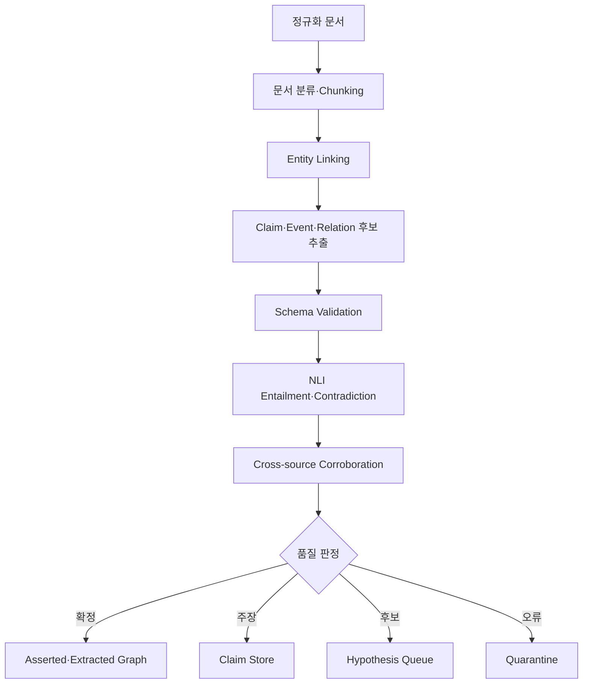
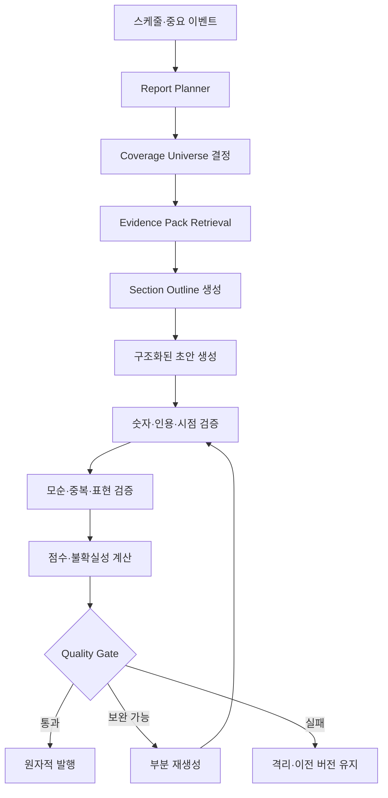

# 주식·코인 인사이트 플랫폼 아키텍처 설계서

> 상태: 기준 설계(Baseline)  
> 버전: 1.0  
> 작성일: 2026-07-18  
> 대상: 일일 주식·코인 리포트 배치 시스템과 종합 인사이트 웹앱  
> 핵심 저장소: PostgreSQL + pgvector + 원본 객체 저장소  
> 핵심 원칙: 사실·주장·추론·가설 분리, 시점 재현성, 근거 추적, 사전 계산 우선

---

## 1. 문서 목적

이 문서는 다양한 뉴스, 공시, 재무, 가격, 온체인, 거시경제, 산업 자료를 통합하여 다음 결과물을 만드는 플랫폼의 목표 아키텍처를 정의한다.

- 크론 또는 워크플로 스케줄에 의해 자동 생성되는 일일 주식 리포트
- 24시간 시장 특성을 반영한 일일 코인 리포트
- 모든 사용자가 보는 글로벌·시장·섹터 리포트
- 관심 종목, 보유 자산, 위험 성향을 반영한 개인화 리포트
- 개별 주식·코인 분석 페이지
- 산업·투자 테마 분석 페이지
- 결과에 포함된 사실, 추론 경로, 반대 근거, 불확실성, 출처의 재현 가능한 추적

이 시스템에는 사용자가 LLM에 자유 형식으로 질문하는 채팅 인터페이스가 없다. 따라서 전통적인 질문 응답형 RAG의 `질문 → 검색 → 즉시 생성` 흐름을 사용하지 않는다. 대신 다음 구조를 채택한다.

> **스케줄 또는 데이터 변화 → 분석 주제 후보 생성 → 근거 패키지 구성 → 구조화된 리포트 생성 → 검증 → 발행 → 웹앱 조회**

GraphRAG는 사용자 질문에 답하는 계층이 아니라, 산업 구조 탐색, 이벤트 영향 후보 발굴, 테마 커뮤니티 생성, 근거 경로 구성에 사용한다.

---

## 2. 범위와 비범위

### 2.1 포함 범위

- 주식, ETF, 코인, 토큰, 프로토콜, 블록체인, 산업, 제품, 기술, 테마 통합 식별
- 문서·정형 데이터 수집 및 정규화
- Claim, Event, Temporal Knowledge Graph 구축
- 산업 온톨로지와 규칙 기반 다중 경로 추론
- 가격·재무·온체인·시장 관계 계산
- 일일 및 증분 리포트 생성
- 사용자별 콘텐츠 선택과 순위화
- 웹앱용 읽기 모델, API, 캐시
- 데이터 품질, 계보(lineage), 관측성, 재처리, 비용 통제
- 모델과 프롬프트, 데이터 스냅샷 버전 보존

### 2.2 초기 비범위

- 자동 주문 실행 또는 포트폴리오 리밸런싱
- 근거 없는 종목 추천이나 확정적 가격 예측
- 초저지연 고빈도 거래 신호
- 모든 산업을 처음부터 동일한 깊이로 모델링
- LLM이 생성한 관계를 검증 없이 사실 그래프에 반영
- 매 웹 요청마다 전체 그래프 탐색과 LLM 생성을 실행

---

## 3. 제품 표면과 서비스 수준

| 제품 표면 | 생성 방식 | 주요 독자 | 권장 신선도 | 웹 응답 목표 |
|---|---|---|---|---|
| 글로벌 일일 주식 리포트 | 시장 마감·데이터 컷오프 후 배치 | 전체 사용자 | 거래소별 1일 | 캐시 적중 시 p95 300ms 이하 |
| 글로벌 일일 코인 리포트 | 고정 UTC/KST 컷오프 배치 | 전체 사용자 | 1일, 중요 지표는 수분 단위 | p95 300ms 이하 |
| 개인화 일일 리포트 | 공통 콘텐츠 재사용 + 사용자별 조립 | 로그인 사용자 | 글로벌 리포트 이후 30~90분 | p95 500ms 이하 |
| 개별 자산 분석 | 정기 스냅샷 + 중요 이벤트 시 증분 갱신 | 전체·관심 사용자 | 가격 수분, 서술 수시간~1일 | p95 500ms 이하 |
| 테마 분석 | 그래프 커뮤니티·이벤트 기반 배치 | 전체 사용자 | 중요 이벤트 시 수시간, 정기 1일 | p95 500ms 이하 |
| 이벤트 브리프 | 중요도 임계치 초과 시 증분 생성 | 대상 자산 사용자 | 수분~수십 분 | p95 500ms 이하 |

위 수치는 초기 목표값이다. 외부 데이터 라이선스, 모델 처리량, 사용자 규모에 따라 SLO로 확정한다.

### 3.1 콘텐츠의 공통 표현 방식

모든 콘텐츠는 다음 항목을 일관되게 표현한다.

1. **확인된 사실**: 공시, 공식 문서, 검증된 정형 데이터로 확인된 내용
2. **보고된 주장**: 회사, 분석가, 언론, 커뮤니티 등 발화 주체가 있는 주장
3. **산업 추론**: 온톨로지와 규칙, 그래프 경로에 따른 파생 관계
4. **시장 확인**: 가격, 거래량, 수급, 온체인 등 실제 반응
5. **반대 근거와 위험**: 추론을 약화하거나 뒤집을 수 있는 정보
6. **신뢰도와 시점**: 분석 기준 시각, 데이터 신선도, 근거 품질
7. **출처**: 문서, 데이터셋, 계산 버전까지 추적 가능한 참조

---

## 4. 핵심 설계 원칙

### 4.1 PostgreSQL을 운영 기준 저장소로 유지

정규화된 엔티티, Claim, Event, 관계, 리포트 메타데이터, 사용자 설정은 PostgreSQL을 기준 저장소로 둔다. 원문 HTML, PDF, 대용량 API 응답, 모델 입력·출력 원본은 객체 저장소에 보관하고 PostgreSQL에는 위치, 해시, 메타데이터를 저장한다.

### 4.2 쓰기 모델과 읽기 모델 분리

지식 그래프와 분석 피처는 정규화된 쓰기 모델이다. 웹앱은 이 복잡한 모델을 직접 조합하지 않고 다음과 같은 발행용 읽기 모델을 조회한다.

- 최신 리포트 매니페스트
- 자산 분석 스냅샷
- 테마 분석 스냅샷
- 사용자별 리포트 피드
- 근거 카드와 그래프 경로

### 4.3 사실, 주장, 파생 관계, 가설을 물리적으로 구분

`asserted_fact`, `reported_claim`, `rule_derived`, `statistical`, `causal_hypothesis`, `llm_hypothesis`를 같은 의미로 저장하지 않는다. 화면에서도 표현 강도를 다르게 한다.

### 4.4 모든 결과는 특정 시점으로 재현 가능해야 함

리포트는 `as_of`, `data_cutoff`, `knowledge_snapshot_id`, `feature_snapshot_id`, `model_version`, `prompt_version`, `pipeline_version`을 보존한다. 이후 데이터가 수정되어도 과거 리포트가 무엇을 근거로 생성됐는지 재현할 수 있어야 한다.

### 4.5 LLM은 콘텐츠 계획과 설명에 사용하고 사실 저장 권한은 갖지 않음

LLM은 다음 역할을 수행한다.

- 문서에서 Claim·Event·관계 후보 추출
- 그래프 탐색용 후보 개념 제안
- 검색된 근거 패키지의 요약과 서술
- 반대 논거와 누락된 검증 항목 제안

LLM 출력은 스키마 검증, 엔티티 해소, NLI 또는 규칙 검증, 출처 연결, 품질 게이트를 통과해야 발행된다.

### 4.6 공통 분석을 최대한 재사용

사용자 수만큼 LLM 리포트를 새로 생성하지 않는다. 글로벌·테마·자산 단위의 검증된 `Content Pack`을 먼저 만든 뒤 사용자별 우선순위, 요약 길이, 설명 관점만 조립한다.

---

## 5. 목표 아키텍처

```mermaid
flowchart LR
    subgraph Sources[외부 데이터 소스]
        N[뉴스·공시·리서치]
        M[가격·재무·거시]
        C[온체인·거래소]
        I[산업·제품·기술 문서]
    end

    subgraph Ingest[수집 계층]
        COL[Source Connectors]
        RAW[Raw Object Storage]
        REG[Ingestion Registry]
    end

    subgraph Knowledge[지식화 계층]
        ER[Entity Resolution]
        CE[Claim·Event Extraction]
        VAL[NLI·Schema·Cross-source Validation]
        KG[Temporal Knowledge Graph]
        ONT[산업 온톨로지·규칙]
    end

    subgraph Analytics[분석 계층]
        TS[시계열·Feature Pipeline]
        INF[Graph Inference]
        COM[Theme·Community Pipeline]
        PACK[Evidence & Content Pack]
    end

    subgraph Publishing[리포트 생산·발행]
        PLAN[Content Planner]
        GEN[Structured Report Generator]
        GATE[Quality·Compliance Gate]
        PUB[Report Store·Read Models]
    end

    subgraph Personalization[개인화]
        PROFILE[User Profile·Portfolio·Watchlist]
        RANK[Candidate Ranker]
        FEED[Personalized Feed Builder]
    end

    subgraph Serving[웹 서비스]
        API[Read API]
        CACHE[Redis·CDN]
        WEB[Web App]
    end

    N --> COL
    M --> COL
    C --> COL
    I --> COL
    COL --> RAW
    COL --> REG
    REG --> ER
    RAW --> CE
    ER --> CE
    CE --> VAL
    VAL --> KG
    ONT --> KG
    REG --> TS
    KG --> INF
    ONT --> INF
    TS --> INF
    KG --> COM
    INF --> PACK
    TS --> PACK
    COM --> PACK
    PACK --> PLAN
    PLAN --> GEN
    GEN --> GATE
    GATE --> PUB
    PROFILE --> RANK
    PUB --> RANK
    RANK --> FEED
    FEED --> PUB
    PUB --> API
    API --> CACHE
    CACHE --> WEB
```



### 5.1 권장 물리 구성

초기에는 서비스 수를 과도하게 늘리지 않고 다음 배포 단위로 시작한다.

| 배포 단위 | 책임 | 초기 구현 형태 |
|---|---|---|
| `collector-workers` | 외부 소스 수집, 재시도, 원본 보존 | 소스별 워커 |
| `knowledge-workers` | 엔티티, Claim, Event, Relation 처리 | 비동기 워커 풀 |
| `analytics-workers` | 시계열 피처, 그래프 추론, 테마 계산 | 배치 워커 풀 |
| `report-workers` | 근거 패키지, 생성, 검증, 발행 | LLM·규칙 워커 분리 가능 |
| `personalization-workers` | 사용자 후보 순위와 피드 조립 | 파티션 배치 |
| `read-api` | 웹앱 읽기 API | 무상태 서비스 |
| `admin-api` | 재처리, 검수, 출처·룰 관리 | 내부 전용 서비스 |
| `workflow-orchestrator` | 일정, 의존성, 백필, 재시도 | Dagster/Airflow/Temporal 계열 |

크론은 워크플로 시작 신호만 보낸다. 단계 간 의존성, 상태 관리, 재시도, 백필은 워크플로 오케스트레이터가 담당한다. 사용량이 커질 때 수집, LLM 처리, 분석, 개인화를 독립 서비스로 분리한다.

---

## 6. 논리 데이터 계층

PostgreSQL 내부 스키마를 도메인별로 분리하면 권한과 마이그레이션, 운영 책임이 선명해진다.

| 스키마 | 주요 데이터 |
|---|---|
| `ingestion` | 소스, 수집 실행, 원본 객체, 중복·오류 상태 |
| `core` | 엔티티, 별칭, 식별자, 거래소, 자산 마스터 |
| `knowledge` | 문서, Chunk, Claim, Event, Relation, Evidence, Ontology |
| `market` | 가격, 거래량, 재무, 거시, 온체인 시계열 |
| `analytics` | Feature Snapshot, Impact Path, Theme, Community, Score |
| `content` | Content Pack, Report Definition, Run, Report, Section, Citation |
| `personalization` | 사용자 선호, 관심 목록, 포트폴리오 노출, 피드 |
| `serving` | 자산·테마 읽기 모델, 최신 리포트 포인터 |
| `ops` | 작업 실행, 품질 결과, 모델·프롬프트 레지스트리, 감사 로그 |

### 6.1 엔티티와 식별자

하나의 실체와 거래 가능한 자산을 분리한다. 예를 들어 회사, 회사가 발행한 주식, 거래소 상장 종목은 서로 다른 엔티티가 될 수 있다.

```sql
CREATE TABLE core.entity (
    entity_id          BIGSERIAL PRIMARY KEY,
    entity_type        TEXT NOT NULL,
    canonical_name     TEXT NOT NULL,
    status             TEXT NOT NULL DEFAULT 'active',
    country_code       TEXT,
    metadata           JSONB NOT NULL DEFAULT '{}',
    created_at         TIMESTAMPTZ NOT NULL DEFAULT now(),
    updated_at         TIMESTAMPTZ NOT NULL DEFAULT now()
);

CREATE TABLE core.entity_identifier (
    identifier_id      BIGSERIAL PRIMARY KEY,
    entity_id          BIGINT NOT NULL REFERENCES core.entity(entity_id),
    identifier_type    TEXT NOT NULL,
    identifier_value   TEXT NOT NULL,
    namespace          TEXT,
    valid_from         TIMESTAMPTZ,
    valid_to           TIMESTAMPTZ,
    UNIQUE (identifier_type, identifier_value, namespace)
);

CREATE TABLE core.entity_alias (
    alias_id           BIGSERIAL PRIMARY KEY,
    entity_id          BIGINT NOT NULL REFERENCES core.entity(entity_id),
    alias_text         TEXT NOT NULL,
    language_code      TEXT,
    alias_type         TEXT,
    source_id          BIGINT,
    UNIQUE (entity_id, alias_text, language_code)
);
```

주요 `entity_type`은 `Company`, `LegalEntity`, `Stock`, `ETF`, `Token`, `Protocol`, `Blockchain`, `Exchange`, `Product`, `Technology`, `Industry`, `Theme`, `Country`, `Person`, `Fund`, `Wallet`, `Commodity`, `Metric`, `Regulation`, `RiskFactor`이다.

### 6.2 문서, Claim, Event

```sql
CREATE TABLE knowledge.document (
    document_id        BIGSERIAL PRIMARY KEY,
    source_id          BIGINT NOT NULL,
    source_document_id TEXT,
    source_type        TEXT NOT NULL,
    canonical_url      TEXT,
    title              TEXT,
    published_at       TIMESTAMPTZ,
    observed_at        TIMESTAMPTZ NOT NULL,
    language_code      TEXT,
    content_hash       TEXT NOT NULL,
    raw_object_uri     TEXT NOT NULL,
    source_quality     REAL,
    processing_status  TEXT NOT NULL DEFAULT 'pending',
    metadata           JSONB NOT NULL DEFAULT '{}',
    UNIQUE (source_id, content_hash)
);

CREATE TABLE knowledge.document_chunk (
    chunk_id           BIGSERIAL PRIMARY KEY,
    document_id        BIGINT NOT NULL REFERENCES knowledge.document(document_id),
    chunk_index        INTEGER NOT NULL,
    content            TEXT NOT NULL,
    embedding          VECTOR(1536),
    token_count        INTEGER,
    content_hash       TEXT NOT NULL,
    UNIQUE (document_id, chunk_index)
);

CREATE TABLE knowledge.claim (
    claim_id             BIGSERIAL PRIMARY KEY,
    subject_entity_id    BIGINT REFERENCES core.entity(entity_id),
    predicate            TEXT NOT NULL,
    object_entity_id     BIGINT REFERENCES core.entity(entity_id),
    object_value         JSONB,
    claim_type           TEXT NOT NULL,
    polarity             SMALLINT NOT NULL DEFAULT 1,
    valid_from           TIMESTAMPTZ,
    valid_to             TIMESTAMPTZ,
    observed_at          TIMESTAMPTZ NOT NULL,
    published_at         TIMESTAMPTZ,
    extraction_confidence REAL,
    verification_status  TEXT NOT NULL DEFAULT 'unverified',
    extraction_run_id     BIGINT NOT NULL,
    metadata              JSONB NOT NULL DEFAULT '{}',
    CHECK ((object_entity_id IS NOT NULL) <> (object_value IS NOT NULL))
);

CREATE TABLE knowledge.event (
    event_id            BIGSERIAL PRIMARY KEY,
    event_type          TEXT NOT NULL,
    actor_entity_id     BIGINT REFERENCES core.entity(entity_id),
    target_entity_id    BIGINT REFERENCES core.entity(entity_id),
    occurred_at         TIMESTAMPTZ,
    expected_end_at     TIMESTAMPTZ,
    announced_at        TIMESTAMPTZ,
    magnitude           NUMERIC,
    magnitude_unit      TEXT,
    surprise_score      REAL,
    verification_status TEXT NOT NULL DEFAULT 'unverified',
    dedupe_key          TEXT NOT NULL,
    metadata            JSONB NOT NULL DEFAULT '{}',
    UNIQUE (dedupe_key)
);
```

`claim_type`은 최소한 `asserted_fact`, `reported_claim`, `forecast`, `opinion`, `guidance`, `rumor`, `derived_claim`, `model_hypothesis`를 구분한다.

### 6.3 시간 관계와 근거

금융 관계는 유효 시간과 시스템 기록 시간을 함께 저장하는 이중 시간(bitemporal) 모델을 권장한다.

```sql
CREATE TABLE knowledge.relation (
    relation_id         BIGSERIAL PRIMARY KEY,
    subject_entity_id   BIGINT NOT NULL REFERENCES core.entity(entity_id),
    predicate           TEXT NOT NULL,
    object_entity_id    BIGINT NOT NULL REFERENCES core.entity(entity_id),
    relation_kind       TEXT NOT NULL,
    confidence          REAL NOT NULL CHECK (confidence BETWEEN 0 AND 1),
    source_quality      REAL,
    corroboration_count INTEGER NOT NULL DEFAULT 1,
    valid_from          TIMESTAMPTZ,
    valid_to            TIMESTAMPTZ,
    recorded_from       TIMESTAMPTZ NOT NULL DEFAULT now(),
    recorded_to         TIMESTAMPTZ,
    status              TEXT NOT NULL DEFAULT 'active',
    inference_run_id    BIGINT,
    rule_version        TEXT,
    metadata            JSONB NOT NULL DEFAULT '{}'
);

CREATE TABLE knowledge.relation_evidence (
    relation_evidence_id BIGSERIAL PRIMARY KEY,
    evidence_key        TEXT NOT NULL UNIQUE,
    relation_id         BIGINT NOT NULL REFERENCES knowledge.relation(relation_id),
    document_id         BIGINT REFERENCES knowledge.document(document_id),
    chunk_id            BIGINT REFERENCES knowledge.document_chunk(chunk_id),
    claim_id            BIGINT REFERENCES knowledge.claim(claim_id),
    evidence_role       TEXT NOT NULL,
    evidence_text       TEXT,
    entailment_score    REAL,
    contradiction_score REAL,
    source_weight       REAL,
    CHECK (document_id IS NOT NULL OR chunk_id IS NOT NULL OR claim_id IS NOT NULL)
);
```

`evidence_role`은 `support`, `contradict`, `context`를 사용한다. `evidence_key`는 관계, 역할, 문서·Chunk·Claim 참조를 정규화한 해시로 만들어 재시도 중복을 방지한다. 관계를 수정할 때 과거 레코드를 삭제하지 않고 `recorded_to`를 닫고 새 버전을 만든다.

### 6.4 분석 스냅샷과 영향 경로

```sql
CREATE TABLE analytics.asset_feature_snapshot (
    snapshot_id         BIGSERIAL PRIMARY KEY,
    asset_entity_id     BIGINT NOT NULL REFERENCES core.entity(entity_id),
    as_of               TIMESTAMPTZ NOT NULL,
    feature_set_version TEXT NOT NULL,
    features            JSONB NOT NULL,
    completeness_score  REAL NOT NULL,
    input_watermark     JSONB NOT NULL,
    created_at          TIMESTAMPTZ NOT NULL DEFAULT now(),
    UNIQUE (asset_entity_id, as_of, feature_set_version)
);

CREATE TABLE analytics.impact_path (
    impact_path_id      BIGSERIAL PRIMARY KEY,
    trigger_event_id    BIGINT REFERENCES knowledge.event(event_id),
    target_entity_id    BIGINT NOT NULL REFERENCES core.entity(entity_id),
    path_nodes          BIGINT[] NOT NULL,
    path_edges          BIGINT[] NOT NULL,
    path_score          REAL NOT NULL,
    direction           TEXT NOT NULL,
    horizon             TEXT NOT NULL,
    inference_kind      TEXT NOT NULL,
    explanation         JSONB NOT NULL,
    inference_run_id    BIGINT NOT NULL,
    expires_at          TIMESTAMPTZ
);
```

`features` JSONB는 빠른 실험에 유용하지만, 검색·정렬에 자주 쓰는 항목은 별도 컬럼 또는 좁은 피처 테이블로 승격한다. 대용량 틱·캔들 데이터는 시간 파티셔닝을 적용하고 규모가 커지면 TimescaleDB 또는 분석 저장소를 추가할 수 있다.

예시 스키마의 `VECTOR(1536)`은 고정 제품 요구사항이 아니다. 실제 임베딩 모델의 차원과 버전을 레지스트리에서 관리하고, 모델 변경 시 기존·신규 벡터를 병행 저장하거나 버전별 컬럼·테이블로 분리한다.

### 6.5 리포트와 발행 이력

```sql
CREATE TABLE content.report_definition (
    report_definition_id BIGSERIAL PRIMARY KEY,
    report_type          TEXT NOT NULL,
    audience_type        TEXT NOT NULL,
    schedule_policy      JSONB NOT NULL,
    section_policy       JSONB NOT NULL,
    quality_policy       JSONB NOT NULL,
    active               BOOLEAN NOT NULL DEFAULT true,
    version              INTEGER NOT NULL
);

CREATE TABLE content.report_run (
    report_run_id        BIGSERIAL PRIMARY KEY,
    report_definition_id BIGINT NOT NULL REFERENCES content.report_definition(report_definition_id),
    scheduled_for        TIMESTAMPTZ NOT NULL,
    as_of                TIMESTAMPTZ NOT NULL,
    data_cutoff          TIMESTAMPTZ NOT NULL,
    status               TEXT NOT NULL,
    knowledge_snapshot_id TEXT NOT NULL,
    feature_snapshot_id   TEXT NOT NULL,
    model_version         TEXT,
    prompt_version        TEXT,
    pipeline_version      TEXT NOT NULL,
    started_at            TIMESTAMPTZ,
    finished_at           TIMESTAMPTZ,
    error_summary         JSONB,
    UNIQUE (report_definition_id, scheduled_for, pipeline_version)
);

CREATE TABLE content.report (
    report_id            BIGSERIAL PRIMARY KEY,
    report_run_id        BIGINT NOT NULL REFERENCES content.report_run(report_run_id),
    report_type          TEXT NOT NULL,
    scope_entity_id      BIGINT REFERENCES core.entity(entity_id),
    audience_key         TEXT,
    title                TEXT NOT NULL,
    summary              TEXT NOT NULL,
    report_payload       JSONB NOT NULL,
    status               TEXT NOT NULL DEFAULT 'draft',
    quality_score        REAL,
    published_at         TIMESTAMPTZ,
    supersedes_report_id BIGINT REFERENCES content.report(report_id),
    content_hash         TEXT NOT NULL
);

CREATE TABLE content.report_evidence (
    report_id            BIGINT NOT NULL REFERENCES content.report(report_id),
    section_key          TEXT NOT NULL,
    evidence_type        TEXT NOT NULL,
    evidence_id          BIGINT NOT NULL,
    citation_order       INTEGER,
    PRIMARY KEY (report_id, section_key, evidence_type, evidence_id)
);
```

발행은 `draft → validating → approved → published → superseded` 상태 머신을 사용한다. 실패한 새 리포트가 기존 정상 리포트를 대체하지 않도록 최신 포인터는 발행 트랜잭션의 마지막 단계에서만 교체한다.

### 6.6 사용자와 개인화 데이터

```sql
CREATE TABLE personalization.user_profile (
    user_id              BIGINT PRIMARY KEY,
    locale               TEXT NOT NULL DEFAULT 'ko-KR',
    timezone             TEXT NOT NULL DEFAULT 'Asia/Seoul',
    risk_preference      TEXT,
    preferred_markets    TEXT[] NOT NULL DEFAULT '{}',
    preferred_horizons   TEXT[] NOT NULL DEFAULT '{}',
    personalization_opt_in BOOLEAN NOT NULL DEFAULT false,
    updated_at           TIMESTAMPTZ NOT NULL DEFAULT now()
);

CREATE TABLE personalization.user_asset_affinity (
    user_id              BIGINT NOT NULL,
    asset_entity_id      BIGINT NOT NULL REFERENCES core.entity(entity_id),
    affinity_type        TEXT NOT NULL,
    weight               REAL NOT NULL,
    source               TEXT NOT NULL,
    valid_from           TIMESTAMPTZ NOT NULL,
    valid_to             TIMESTAMPTZ,
    PRIMARY KEY (user_id, asset_entity_id, affinity_type, valid_from)
);

CREATE TABLE personalization.user_feed_item (
    user_id              BIGINT NOT NULL,
    feed_date            DATE NOT NULL,
    rank                 INTEGER NOT NULL,
    report_id            BIGINT NOT NULL REFERENCES content.report(report_id),
    section_keys         TEXT[],
    relevance_score      REAL NOT NULL,
    explanation_codes    TEXT[] NOT NULL,
    generated_at         TIMESTAMPTZ NOT NULL,
    PRIMARY KEY (user_id, feed_date, rank)
);
```

포트폴리오 수량과 매입 가격은 민감 정보로 분류하고 별도 암호화 또는 토큰화 정책을 적용한다. 리포트 생성 계층에는 필요한 노출도만 전달하고 원본 계좌 식별자는 전달하지 않는다.

---

## 7. 수집 파이프라인

### 7.1 소스 계층화

| 등급 | 예시 | 기본 용도 | 권장 처리 |
|---|---|---|---|
| Tier 1 | 규제기관 공시, 거래소, 기업 IR, 체인 원장 | 사실·수치의 기준 | 높은 가중치, 빠른 처리 |
| Tier 2 | 신뢰도 높은 뉴스·데이터 벤더 | 사건 발견·교차 검증 | 중복 제거, 출처 비교 |
| Tier 3 | 리서치, 산업 보고서, 전문 매체 | 산업 구조·전망 | 주장으로 저장, 시점 명시 |
| Tier 4 | 커뮤니티, 소셜, 익명 제보 | 후보 신호 | 사실 승격 금지, 별도 라벨 |

소스별로 라이선스, 수집 주기, 지연 허용치, 재처리 범위, 필수 필드, 품질 기대치를 `Source Contract`로 정의한다.

### 7.2 단계

1. **Fetch**: API, 피드, 파일, 크롤러에서 원본을 가져온다.
2. **Persist Raw**: 변경하지 않은 원본과 응답 헤더를 객체 저장소에 저장한다.
3. **Register**: 콘텐츠 해시, 소스 키, 관측 시각, 원본 URI를 기록한다.
4. **Deduplicate**: 동일 문서와 기사 재배포를 구분한다.
5. **Normalize**: 문자 인코딩, 시간대, 통화, 단위, 심볼을 표준화한다.
6. **Validate Contract**: 필수 필드, 범위, 단조성, 레코드 수 급변을 검사한다.
7. **Publish Watermark**: 소스별 처리 완료 시각과 누락 구간을 알린다.

### 7.3 멱등성과 중복 제거

- 수집 키: `(source_id, source_document_id, version)`
- 내용 키: 정규화 본문의 `content_hash`
- 이벤트 키: 사건 유형, 주체, 대상, 발표 시각, 수치의 정규화 조합
- 가격 키: `(venue, instrument_id, interval, timestamp)`
- 동일 키 재수집은 업데이트 정책에 따라 무시하거나 새 버전으로 기록
- 모든 워커는 `idempotency_key`를 받아 재시도 시 중복 부작용을 만들지 않음

### 7.4 지연 데이터 정책

리포트 컷오프 이후 도착한 데이터는 다음 중 하나로 처리한다.

- 중요도 낮음: 다음 정기 리포트에 포함
- 중요도 높음: 증분 이벤트 브리프 생성
- 기존 결론을 뒤집음: 해당 리포트에 정정 배지와 새 버전 발행
- 가격·재무 수정: 영향받은 피처와 리포트의 계보를 따라 선택 재계산

---

## 8. 지식화 파이프라인



### 8.1 엔티티 해소

1. 소스별 심볼과 공식 식별자를 우선 사용한다.
2. 이름·별칭·국가·거래소·산업·문맥을 함께 점수화한다.
3. 후보 점수가 임계치보다 낮거나 상위 후보 간 차이가 작으면 자동 연결하지 않는다.
4. 신규 엔티티는 임시 상태로 만들고 검수 또는 추가 출처로 승격한다.
5. 회사와 주식, 프로토콜과 토큰, 체인과 브리지 자산을 구분한다.

### 8.2 Claim과 사실의 구분

문장 `회사는 하반기 수요가 강할 것으로 예상한다`는 `수요가 강하다`는 사실이 아니다. 다음처럼 저장한다.

- 발화 주체: 회사
- Claim 유형: `guidance` 또는 `forecast`
- 대상: 해당 제품·산업 수요
- 기준 시점과 전망 기간
- 원문 근거
- 추출 신뢰도와 검증 상태

### 8.3 모순 보존

서로 충돌하는 문서를 덮어쓰지 않는다. 두 Claim을 모두 저장하고 `contradicts` 링크를 만든다. 리포트 생성기는 최신성만으로 승자를 정하지 않고 출처 권위, 직접성, 독립 출처 수, 공식 정정 여부를 고려한다.

### 8.4 커밋 기준

| 결과 | 조건 | 저장 위치 |
|---|---|---|
| 직접 사실 | 공식 출처 또는 강한 교차 검증 | Claim + asserted relation |
| 보고된 주장 | 발화 주체와 원문 확인 | Claim |
| 추출 관계 | 문서가 관계를 함의하고 엔티티가 확정 | extracted relation |
| 규칙 파생 | 버전 관리된 규칙과 입력 관계 존재 | rule_derived relation |
| 통계 관계 | 방법·기간·표본 기록 | statistical relation |
| LLM 후보 | 근거 미충족 | hypothesis queue |

---

## 9. 그래프 모델과 추론

### 9.1 세 개의 논리 그래프

#### Structural Graph

느리게 변하는 회사·제품·산업·공급망·프로토콜 구조를 표현한다.

```text
Company --PRODUCES--> Product
Product --USES--> Technology
Product --REQUIRED_BY--> Industry
Company --SUPPLIES--> Company
Protocol --DEPLOYED_ON--> Blockchain
Token --TOKEN_OF--> Protocol
```

#### Event Graph

증설, 실적, 수주, 규제, 해킹, 상장, 언락, 거버넌스, 거시 충격처럼 빠르게 변하는 사건을 표현한다.

```text
Actor --ANNOUNCED--> Event
Event --INCREASES_DEMAND_FOR--> Product
Event --AFFECTS--> Region
Event --CHANGES_SUPPLY_OF--> Token
```

#### Market Graph

상관관계, 베타, 수익률 동조, 선행·후행, 자금 흐름, 온체인 이동처럼 계산된 관계를 표현한다. 구조적 관계와 혼동하지 않도록 유효 기간과 계산 방법을 반드시 저장한다.

### 9.2 추론 단계

1. 새 Event의 주체, 대상, 방향, 강도, 예상 기간을 정규화한다.
2. 허용된 관계 유형과 최대 홉 수로 Structural Graph를 확장한다.
3. 산업 온톨로지 규칙을 적용하여 수혜·피해 후보를 만든다.
4. 자산별 매출·보유·사용량·TVL 등 실질 노출도를 결합한다.
5. 시장 데이터로 이미 반응했는지, 반대 방향 신호가 있는지 확인한다.
6. 중복 경로를 합치고 순환 경로와 의미 없는 일반 관계를 제거한다.
7. 상위 경로를 자연어 설명이 가능한 구조로 저장한다.

### 9.3 경로 점수

경로 점수는 주가 상승 확률이 아니라 사건과 대상 간 **산업적·경제적 연결 강도**다.

```text
path_score =
  event_strength
  × product(edge_confidence)
  × hop_decay^(hop_count - 1)
  × source_quality
  × freshness
  × exposure_ratio
  × corroboration_bonus
  × contradiction_penalty
  × saturation_penalty
```

- `event_strength`: 사건 규모와 예상 대비 충격
- `edge_confidence`: 각 관계의 검증 신뢰도
- `hop_decay`: 경로가 길어질수록 감소
- `exposure_ratio`: 매출, 비용, 보유량, 트래픽 등 실제 노출도
- `contradiction_penalty`: 반대 근거의 수와 품질
- `saturation_penalty`: 이미 가격에 과도하게 반영된 가능성

점수와 함께 각 요소의 기여도를 저장해야 개인화와 화면 설명에 사용할 수 있다.

### 9.4 규칙 예시

```text
IF
  Company PRODUCES Product
  AND Product REQUIRED_BY Industry
  AND Event INCREASES_DEMAND_FOR Industry
THEN
  Company POTENTIALLY_BENEFITS_FROM Event
```

규칙 실행 결과에는 다음을 기록한다.

- 규칙 ID와 버전
- 입력 관계 ID 목록
- 생성된 관계와 방향
- 적용 시점과 만료 시점
- 신뢰도 계산 내역
- 반례 또는 억제 조건

### 9.5 GraphRAG의 배치형 역할

GraphRAG를 전체 실시간 데이터에 매번 다시 실행하지 않는다.

- **Local expansion**: 자산·이벤트 주변 2~4 hop의 후보와 근거 경로 생성
- **Community detection**: 산업·테마 클러스터를 주기적으로 갱신
- **Community summary**: 테마의 구조, 주요 기업, 병목, 위험을 장기 요약
- **Narrative change detection**: 기존 커뮤니티 요약과 최근 사건의 차이를 감지
- **Evidence pack retrieval**: 리포트 단락별 관련 Claim, 수치, 경로, 반대 근거 구성

커뮤니티 요약은 하루 또는 주 단위 배치, 최근 이벤트는 증분 업데이트로 분리한다. 웹 요청 시 GraphRAG를 직접 돌리는 대신 최신 결과를 `Content Pack`과 읽기 모델에서 가져온다.

---

## 10. 시장·온체인 분석과 Feature Store

### 10.1 피처 범주

| 범주 | 주식 예시 | 코인 예시 |
|---|---|---|
| 가격·모멘텀 | 수익률, 변동성, 갭, 상대강도 | 수익률, 변동성, 펀딩비, 베이시스 |
| 유동성·수급 | 거래량, 외국인·기관 수급, 공매도 | 거래량, 거래소 순유입, 대형 지갑 이동 |
| 펀더멘털 | 매출, 마진, EPS, 가이던스 | 수수료, 활성 주소, TVL, 토큰 공급 |
| 밸류에이션 | PER, EV/EBITDA, FCF yield | FDV/수수료, 시총/TVL 등 보조 지표 |
| 이벤트 | 실적 서프라이즈, 증설, 수주 | 업그레이드, 언락, 해킹, 거버넌스 |
| 관계 | 산업 노출, 공급망 집중도 | 체인·브리지·오라클·담보 의존도 |

### 10.2 계산 원칙

- 피처는 `as_of` 시점에 실제로 알 수 있었던 데이터만 사용한다.
- 수정 재무제표와 뒤늦게 알려진 값을 과거 스냅샷에 소급 섞지 않는다.
- 통화, 단위, 주식분할, 토큰 denomination 변경을 표준화한다.
- 각 피처에 계산 버전, 입력 워터마크, 결측 여부를 기록한다.
- 리포트 필수 피처가 누락되면 추정치를 사실처럼 대체하지 않고 `data_unavailable`로 표현한다.

### 10.3 시장 확인 계층

그래프가 산업적 수혜를 제안하더라도 다음 질문을 별도로 계산한다.

- 최근 가격과 거래량이 해당 서사를 확인하는가?
- 동종 자산 대비 초과 성과가 있는가?
- 이미 급등하여 기대가 상당 부분 반영되었는가?
- 펀더멘털 또는 온체인 사용량이 같이 개선되는가?
- 상관관계가 구조적 관계 없이 단기적으로만 나타난 것은 아닌가?

리포트는 `산업 연결 강도`, `시장 확인 정도`, `밸류에이션·기대 반영도`를 하나의 확정적 예측 점수로 뭉치지 않고 별도 축으로 표시한다.

---

## 11. 콘텐츠 및 리포트 생성 파이프라인

### 11.1 기본 흐름



### 11.2 Report Planner

Report Planner는 자유 형식 질문 대신 `Report Definition`을 입력으로 받는다.

```json
{
  "report_type": "daily_global_stock",
  "as_of_policy": "per_market_close",
  "universe": ["KR", "US"],
  "sections": [
    "market_summary",
    "macro_drivers",
    "top_events",
    "theme_changes",
    "asset_watch",
    "risks"
  ],
  "coverage_limits": {
    "events": 12,
    "themes": 8,
    "assets": 20
  },
  "minimum_source_tier": 2,
  "language": "ko-KR"
}
```

Planner가 결정하는 항목은 다음과 같다.

- 이번 실행에서 다룰 시장과 자산 집합
- 전일 대비 의미 있는 변화 후보
- 섹션별 근거 예산과 글자 수
- 데이터가 불완전할 때 제외 또는 축약할 섹션
- 사용자에게 반복 노출하지 않을 항목
- LLM이 필요한 섹션과 템플릿·규칙만으로 생성할 섹션

### 11.3 후보 중요도

글로벌 리포트의 사건 후보 점수 예시는 다음과 같다.

```text
editorial_importance =
  market_impact
  × novelty
  × evidence_quality
  × affected_market_cap_or_usage
  × cross_asset_relevance
  × freshness
  × confidence
  - duplication_penalty
  - stale_narrative_penalty
```

점수만으로 자동 결정하지 않고 다음 다양성 제약을 함께 둔다.

- 하나의 기업·토큰·테마가 전체 지면을 과도하게 점유하지 않음
- 주식과 코인, 거시와 산업, 긍정과 부정 요인의 균형
- 동일한 사건을 재배포한 기사 수가 독립 근거 수로 계산되지 않음
- 전일 리포트와 의미가 같은 내용은 변화가 있을 때만 재노출

### 11.4 Evidence Pack

LLM에 원문 전체를 무차별적으로 넣지 않는다. 섹션별로 제한된 근거 패키지를 만든다.

```json
{
  "topic_id": "event:12345",
  "as_of": "2026-07-18T06:00:00Z",
  "facts": [],
  "reported_claims": [],
  "metrics": [],
  "impact_paths": [],
  "market_confirmation": [],
  "contradicting_evidence": [],
  "unknowns": [],
  "citation_map": {},
  "retrieval_trace": {
    "policy_version": "retrieval-v3",
    "candidate_count": 184,
    "selected_count": 22
  }
}
```

Evidence Pack은 다음 조건을 만족해야 한다.

- 문장 단위 인용 위치와 원문 문서 연결
- 수치의 단위, 통화, 기준 기간, 원천 데이터 연결
- 그래프 경로의 모든 edge에 근거 또는 규칙 버전 존재
- 핵심 주장마다 최소 하나의 직접 근거 존재
- 반대 근거 검색이 수행되었는지 기록
- 데이터 컷오프 이후 자료를 혼합하지 않음

### 11.5 구조화 생성 우선

LLM은 Markdown 원문을 바로 생성하지 않고 JSON 스키마를 출력한다. 렌더러가 웹, 이메일, Markdown 등 채널별 표현을 만든다.

```json
{
  "title": "AI 인프라 투자 확대와 전력 병목",
  "thesis": "확인된 사실과 추론을 분리한 핵심 요약",
  "sections": [
    {
      "section_key": "what_changed",
      "blocks": [
        {
          "block_type": "fact",
          "text": "...",
          "citation_ids": ["cit-1"],
          "confidence": 0.94
        },
        {
          "block_type": "inference",
          "text": "...",
          "impact_path_ids": [901],
          "confidence": 0.72
        }
      ]
    }
  ],
  "risks": [],
  "unknowns": [],
  "freshness": {}
}
```

허용되는 `block_type`은 `fact`, `reported_claim`, `metric`, `inference`, `market_signal`, `counter_evidence`, `risk`, `unknown`, `methodology_note`다. 이 구분은 화면의 배지와 문체를 제어한다.

### 11.6 검증과 부분 재생성

전체 리포트를 통째로 다시 생성하지 않고 실패한 블록만 재생성한다.

검증 항목은 다음과 같다.

- JSON 스키마와 필수 필드
- 숫자가 Evidence Pack에 존재하는지
- 인용이 실제 문장을 지지하는지
- 사실과 전망의 시제가 구분되는지
- 자산명·티커·체인·토큰 주소가 올바른지
- 생성 문장이 근거보다 강하게 단정하지 않는지
- 동일 문장과 동일 사건이 중복되는지
- 과도한 가격 목표나 투자 권유 표현이 없는지
- 금지어, 라이선스 제한, 지역별 고지사항 준수

### 11.7 발행 원자성

1. 새 리포트를 `draft`로 저장한다.
2. 섹션·인용·품질 결과를 모두 기록한다.
3. 품질 게이트 통과 후 `published`로 전환한다.
4. 같은 트랜잭션에서 `serving.latest_report` 포인터를 교체한다.
5. 캐시 무효화 이벤트를 발행한다.
6. 실패하면 기존 발행본을 유지한다.

---

## 12. 리포트 유형별 설계

### 12.1 글로벌 일일 주식 리포트

권장 섹션:

1. 시장 요약과 주요 지수
2. 금리·환율·원자재 등 거시 동인
3. 시장을 움직인 확인된 사건
4. 산업·테마별 내러티브 변화
5. 주요 종목의 펀더멘털·수급·가격 확인
6. 다음 거래일 일정과 이벤트 위험
7. 반대 근거와 데이터 공백

거래소별 마감 시각과 휴장일이 다르므로 하나의 전 세계 마감 작업으로 묶지 않는다. 시장별 리포트를 먼저 생성하고 글로벌 리포트가 이를 조합한다.

### 12.2 글로벌 일일 코인 리포트

코인 시장은 24시간이므로 고정 기준 시각을 사용한다. 섹션 예시는 다음과 같다.

1. 시가총액, 변동성, 현·선물 시장 상태
2. 스테이블코인 공급과 거래소 순유입
3. 주요 체인 활동, 수수료, TVL, 활성 사용자
4. 프로토콜 업그레이드, 거버넌스, 언락 일정
5. 해킹·디페그·브리지·오라클 위험
6. 테마 회전과 시장 확인
7. 데이터 신뢰성과 체인별 지연 상태

### 12.3 개인화 일일 리포트

글로벌 보고서를 사용자별로 다시 쓰는 것이 아니라 다음을 조립한다.

- 공통 시장 요약 1개
- 보유·관심 자산에 직접 영향을 주는 Content Pack
- 보유 자산과 1~3 hop으로 연결된 산업·프로토콜 사건
- 사용자 포트폴리오의 집중 위험과 중복 노출
- 선호 시장·기간에 맞는 일정
- 최근 이미 본 주제와 중복되지 않는 신규 내용

사용자별 문장 생성이 꼭 필요한 경우에도 검증된 블록을 바탕으로 도입부나 순서만 개인화한다. 개인화 문장에는 사용자의 실제 매입 가격이나 잔고를 불필요하게 노출하지 않는다.

### 12.4 개별 자산 분석

개별 자산 페이지는 최신 스냅샷과 과거 버전을 제공한다.

#### 주식

- 기업 개요, 상장 증권, 주요 제품·지역·고객 노출
- 최근 재무 추세와 가이던스 변화
- 공급망·경쟁·산업 그래프
- 최근 Event와 영향 경로
- 가격·수급·밸류에이션 확인
- 촉매, 위험, 반대 근거
- 데이터 기준 시각과 출처

#### 코인·토큰

- 체인·프로토콜·토큰 관계
- 토큰 공급, 언락, 보유 집중도
- 수수료, 활성 주소, TVL 등 사용 지표
- 브리지·오라클·담보·관리자 키 의존성
- 거버넌스와 업그레이드 일정
- 거래소·파생 시장 상태
- 보안 사건과 프로토콜 위험

### 12.5 테마 분석

테마는 단순 태그 모음이 아니라 다음 객체로 관리한다.

- 테마 정의와 포함·제외 기준
- 핵심 산업·기술·제품 노드
- 관련 자산과 관계 경로
- 대표 Event와 변화 타임라인
- 수혜·피해 메커니즘
- 실제 매출·사용량 노출도
- 시장 반영도와 밸류에이션 상태
- 테마 신뢰도, 성숙도, 혼잡도
- 반대 논거와 붕괴 조건

테마 멤버십은 `core`, `adjacent`, `speculative`로 나누고, 단순 뉴스 동시 언급만으로 핵심 멤버로 승격하지 않는다.

---

## 13. 개인화 설계

### 13.1 개인화 신호

| 신호 | 예시 | 기본 가중치 성격 |
|---|---|---|
| 명시적 | 관심 목록, 선호 시장·테마 | 높음 |
| 포트폴리오 | 보유 비중, 자산군·테마 집중 | 높음, 민감 정보 |
| 행동 | 조회, 저장, 숨김, 읽은 시간 | 중간, 시간 감쇠 |
| 관계 기반 | 보유 자산과 공급망·프로토콜 연결 | 중간 |
| 위험 기반 | 집중도, 상관관계, 이벤트 노출 | 높음 |
| 편집 정책 | 반드시 보여야 하는 시장 위험 | 사용자 선호보다 우선 가능 |

### 13.2 후보 생성과 순위화

개인화는 두 단계로 수행한다.

1. **후보 생성**: 보유·관심 자산, 관련 테마, 그래프 이웃, 시장 필수 항목에서 후보를 모은다.
2. **순위화**: 관련성, 중요도, 신규성, 증거 품질, 위험도, 중복을 반영해 정렬한다.

```text
relevance_score =
  explicit_affinity
  + portfolio_exposure
  + graph_proximity
  + event_materiality
  + risk_relevance
  + novelty
  + evidence_quality
  - repetition_penalty
  - low_confidence_penalty
```

점수의 구성 요소를 `explanation_codes`로 저장하여 `관심 목록`, `보유 자산과 공급망으로 연결`, `포트폴리오 집중 위험`처럼 사용자에게 설명할 수 있게 한다.

### 13.3 공통 콘텐츠 재사용

사용자 100만 명에게 100만 번 LLM을 호출하지 않는다.

```text
Evidence Pack
  → 검증된 Asset/Theme/Event Content Pack
  → 사용자별 후보 선택·순서 결정
  → 템플릿 기반 연결 문장
  → 개인화 피드
```

비슷한 포트폴리오·선호를 가진 사용자 세그먼트 단위로 요약을 캐시할 수 있지만, 개별 잔고나 매입 가격을 세그먼트 키에 포함하지 않는다.

### 13.4 콜드 스타트

- 비로그인: 글로벌 리포트와 시장별 인기 테마
- 신규 사용자: 선택한 시장·자산만 반영
- 신호 부족: 추론된 선호보다 명시적 선택을 우선
- 사용자가 개인화를 끄면 행동 기록을 순위화에 사용하지 않음

### 13.5 필터 버블 방지

- 개인화 지면 일부는 전체 시장 필수 항목에 예약
- 보유 자산에 부정적인 내용도 중요하면 노출
- 같은 테마의 긍정적 기사만 반복되지 않도록 반대 근거 슬롯 유지
- 개인화 이유와 숨기기·선호 조정 기능 제공

---

## 14. 스케줄링과 워크플로 오케스트레이션

### 14.1 크론과 오케스트레이터의 역할

크론은 `daily_stock_report` 같은 최상위 실행을 시작할 수 있지만, 다음 기능은 워크플로 오케스트레이터가 담당해야 한다.

- 단계 의존성 및 병렬 실행
- 작업별 재시도와 지수 백오프
- 시장·소스별 워터마크
- 부분 실패와 선택적 재실행
- 과거 기간 백필
- 동시 실행 제한과 LLM 비용 예산
- 실행 이력과 자산 계보
- 수동 승인 또는 격리 큐

### 14.2 작업 계층

```text
market_calendar
  └─ ingestion_watermarks
      ├─ price_financial_features
      ├─ document_knowledge_pipeline
      └─ event_detection
          ├─ graph_inference
          ├─ theme_community_update
          └─ evidence_pack_build
              ├─ global_report_generation
              ├─ asset_snapshot_generation
              └─ theme_snapshot_generation
                  └─ personalized_feed_build
                      └─ publish_and_cache_invalidate
```

### 14.3 예시 일정

실제 시각은 데이터 계약과 대상 시장에 맞춰 조정한다.

| 작업 | 예시 주기·트리거 | 비고 |
|---|---|---|
| 뉴스·공시 수집 | 1~10분 | 소스별 rate limit 적용 |
| 가격·거래소 지표 | 1~5분 | 화면용 최신값과 리포트 스냅샷 분리 |
| 온체인 지표 | 5분~1시간 | 체인 finality와 재조직 고려 |
| 문서 지식화 | 문서 도착 이벤트 | 중요 출처 우선 큐 |
| 시장별 주식 리포트 | 거래소 마감 + 데이터 지연 여유 | 휴장일 자동 제외 |
| 코인 일일 리포트 | 매일 고정 UTC 컷오프 | 24시간 비교 창 고정 |
| 개인화 피드 | 공통 리포트 발행 직후 | 사용자 ID 파티션 처리 |
| 그래프 커뮤니티 | 일 1회 또는 주 1회 | 증분 Event Graph와 분리 |
| 통계 관계 재계산 | 일·주 단위 | 기간·표본 고정 |
| 데이터 백필·정합성 | 저부하 시간대 | 발행 작업과 자원 분리 |

### 14.4 마감 조건

고정 시각만 보고 리포트를 시작하지 않고 필수 소스 워터마크를 확인한다.

```text
ready =
  required_price_sources_complete
  AND official_disclosures_watermark >= cutoff
  AND critical_feature_jobs_success
  AND knowledge_pipeline_lag <= allowed_lag
```

마감 시각까지 일부 소스가 오지 않으면 품질 정책에 따라 다음 중 하나를 선택한다.

- 완전성을 기다리며 발행 지연
- 비필수 섹션을 제외하고 `partial` 배지로 발행
- 이전 스냅샷을 사용하되 기준 시각을 명확히 표시
- 시장 필수 소스가 누락되면 발행하지 않고 기존 버전 유지

### 14.5 증분 재계산

새 사건 하나 때문에 전체 플랫폼을 다시 계산하지 않는다.

```text
changed document
  → affected claims/events
  → affected graph neighborhood
  → affected asset/theme content packs
  → affected reports
  → affected user feeds
```

각 단계가 입력 ID와 버전을 기록하면 계보 기반으로 영향 범위를 제한할 수 있다.

---

## 15. 웹앱 서빙 아키텍처

### 15.1 읽기 모델

웹앱은 다음 테이블 또는 뷰를 중심으로 조회한다.

- `serving.latest_global_report`
- `serving.latest_asset_snapshot`
- `serving.latest_theme_snapshot`
- `serving.user_daily_feed`
- `serving.asset_event_timeline`
- `serving.evidence_card`
- `serving.graph_path_view`

읽기 모델은 발행 트랜잭션에서 갱신하거나 CDC/이벤트로 비동기 갱신한다. 초기에는 PostgreSQL materialized view와 일반 테이블로 충분하며, 사용량 증가 시 검색 인덱스나 별도 분석 저장소를 추가한다.

### 15.2 API 예시

```text
GET /v1/reports/global?market=KR&type=daily_stock&date=2026-07-18
GET /v1/reports/personalized/latest
GET /v1/assets/{asset_id}/analysis
GET /v1/assets/{asset_id}/events?cursor=...
GET /v1/themes/{theme_id}/analysis
GET /v1/reports/{report_id}/evidence
GET /v1/graph/paths/{impact_path_id}
```

응답에는 공통적으로 다음 필드를 포함한다.

```json
{
  "as_of": "...",
  "data_cutoff": "...",
  "freshness": {},
  "quality_status": "complete",
  "version": "...",
  "payload": {},
  "disclosures": []
}
```

### 15.3 캐시 전략

- 글로벌 리포트와 공개 자산 페이지: CDN + Redis
- 개인화 리포트: 사용자 범위 Redis, 짧은 TTL 또는 버전 키
- 키 형식: 콘텐츠 ID와 발행 버전을 포함하여 삭제보다 버전 전환 선호
- 새 리포트 발행 후 캐시 무효화 이벤트 전송
- 캐시 장애 시 PostgreSQL 읽기 모델로 안전하게 폴백
- 미발행 초안은 캐시에 넣지 않음

### 15.4 웹 요청 중 허용되는 계산

허용:

- 최신 가격 결합
- 사용자 권한과 선호에 따른 필터
- 이미 계산된 카드의 정렬과 페이지네이션
- 지역·언어별 렌더링

지양:

- 전체 그래프 탐색
- 대규모 벡터 검색
- LLM 리포트 생성
- 전체 포트폴리오 위험 재계산

사용자가 자산 페이지 새로고침을 요청하더라도 즉시 계산 결과를 기다리게 하지 않고, 기존 스냅샷과 `업데이트 중` 상태를 제공한 뒤 백그라운드에서 갱신한다.

---

## 16. 데이터 품질 설계

### 16.1 품질 차원

| 차원 | 질문 | 예시 지표 |
|---|---|---|
| 완전성 | 필요한 데이터가 도착했는가? | 예상 대비 레코드 수, 결측률 |
| 정확성 | 값과 단위가 올바른가? | 공식 소스 대조 오차 |
| 적시성 | 허용 지연 안에 처리됐는가? | source lag, pipeline lag |
| 일관성 | 소스와 테이블 간 모순이 없는가? | 티커·통화·시점 불일치 |
| 유일성 | 중복이 제거됐는가? | 문서·이벤트 중복률 |
| 계보 | 결과가 입력으로 추적되는가? | lineage coverage |
| 의미 품질 | 관계와 주장이 실제 근거를 갖는가? | entailment·검수 통과율 |

### 16.2 계층별 품질 게이트

#### Raw/Bronze

- 원본 해시와 URI 존재
- 수집 시간, 소스, 상태 코드 보존
- 파싱 실패도 원본을 삭제하지 않음

#### Normalized/Silver

- 스키마와 단위 검증
- 엔티티 연결 신뢰도 임계치
- 중복과 시간대 정규화
- Claim·Event 원문 위치 존재

#### Analytical/Gold

- 피처 워터마크와 버전 존재
- 그래프 경로 모든 edge에 근거 또는 규칙 존재
- 필수 반대 근거 검색 수행
- 리포트 숫자와 인용의 자동 검증 통과

### 16.3 품질 점수 사용 원칙

품질 점수는 누락을 숨기는 장식이 아니다. 다음 정책에 직접 연결한다.

- `>= publish_threshold`: 자동 발행
- `review_threshold ~ publish_threshold`: 내부 검수 또는 제한 발행
- `< review_threshold`: 격리, 기존 리포트 유지
- 필수 데이터 계약 위반: 종합 점수와 관계없이 발행 차단

### 16.4 데이터 드리프트

- 소스 레코드 수, 필드 분포, 언어 비율 변화
- 엔티티 미해결률과 신규 엔티티 급증
- 특정 predicate 추출 빈도 급변
- NLI 중립·모순 비율 변화
- 모델별 JSON 실패율과 인용 실패율
- 사용자 클릭률이 아닌 콘텐츠 품질 지표의 장기 변화

드리프트 감지 후 원본 샘플, 추출 결과, 모델 버전을 묶어 재현 가능한 검수 패키지를 만든다.

---

## 17. 관측성과 운영

### 17.1 공통 실행 컨텍스트

모든 로그, 메트릭, 트레이스에 다음 키를 포함한다.

- `run_id`, `job_name`, `partition_key`
- `source_id`, `document_id`, `event_id`
- `knowledge_snapshot_id`, `feature_snapshot_id`
- `report_run_id`, `report_id`
- `model_version`, `prompt_version`, `pipeline_version`
- `user_partition_id` — 개인 ID 대신 운영용 파티션 키

### 17.2 핵심 메트릭

#### 수집

- 소스별 성공률, 지연, rate-limit, 레코드 수
- 원본 중복률, 파싱 실패율, 누락 구간

#### 지식화

- 엔티티 자동 연결·미해결·오연결 검수율
- Claim·Event 추출 처리량
- NLI entailment·neutral·contradiction 비율
- 그래프 관계 종류별 생성·만료·충돌 수

#### 분석·생성

- 피처 신선도와 결측률
- 그래프 탐색 시간, 후보·채택 경로 수
- LLM 토큰, 비용, 지연, 재시도, 스키마 실패율
- 인용 검증 실패율, 부분 재생성 횟수
- 리포트 발행 성공률과 지연

#### 서빙

- API p50/p95/p99, 오류율
- 캐시 적중률과 폴백률
- 최신 리포트 포인터의 연령
- 개인화 피드 생성 커버리지

### 17.3 권장 SLI/SLO

| SLI | 초기 SLO 예시 |
|---|---|
| 필수 소스 수집 성공률 | 일 99% 이상 |
| 일일 리포트 정시 발행률 | 월 98% 이상 |
| 인용 가능한 핵심 주장 비율 | 100% |
| 최신 자산 분석 스냅샷 커버리지 | 대상 Universe 95% 이상 |
| 개인화 피드 생성 성공률 | 대상 사용자 99% 이상 |
| 읽기 API 가용성 | 월 99.9% |

SLO 위반 알림은 원인과 영향 범위를 포함해야 한다. 예를 들어 `코인 리포트 지연`만 보내지 않고 `온체인 벤더 B 워터마크 47분 지연, 3개 섹션 영향, 이전 리포트 유지 중`으로 표현한다.

### 17.4 운영 대시보드

- 오늘의 워크플로 상태와 임계 경로
- 소스 워터마크 히트맵
- 시장·자산별 데이터 신선도
- 리포트 품질·정시 발행 현황
- LLM 비용과 캐시 효과
- 격리 문서·미해결 엔티티·모순 Claim 큐
- 사용자 피드 생성 커버리지

---

## 18. 오류 처리와 복구

| 장애 | 시스템 동작 | 사용자 영향 |
|---|---|---|
| 뉴스 소스 일부 지연 | 비필수 소스면 제한 발행, 이후 증분 갱신 | 신선도 배지 표시 |
| 가격 기준 소스 누락 | 대체 소스 검증 후 사용하거나 발행 차단 | 기존 리포트 유지 |
| LLM 응답 실패 | 지수 백오프, 다른 워커, 블록 단위 재시도 | 지연 또는 템플릿 축약본 |
| 잘못된 JSON·인용 | 자동 수정 1회 후 격리 | 미발행 |
| 그래프 폭발 | predicate allowlist, 최대 홉·후보 수 제한 | 해당 추론 섹션 제외 |
| 개인화 배치 일부 실패 | 사용자 파티션별 재시도 | 글로벌 피드 폴백 |
| Redis 장애 | PostgreSQL 읽기 모델 조회 | 응답 지연 증가 |
| 새 리포트 품질 실패 | 최신 포인터 미교체 | 이전 정상 버전 유지 |
| 잘못된 데이터 발행 | 계보 기반 영향 분석, 정정 버전 발행 | 정정 배지·알림 정책 |

### 18.1 재처리 단위

재처리 범위를 다음처럼 작게 유지한다.

- 특정 원본 문서
- 특정 Claim·Event
- 특정 그래프 이웃 또는 규칙 버전
- 특정 자산·테마 Content Pack
- 특정 리포트 섹션
- 특정 사용자 파티션

### 18.2 데드레터와 격리

재시도 횟수를 넘은 작업은 삭제하지 않고 원본, 오류, 모델·파이프라인 버전, 시도 횟수와 함께 격리한다. 운영자가 수정 후 같은 멱등 키로 재처리할 수 있어야 한다.

### 18.3 백업과 재해 복구

- PostgreSQL은 시점 복구가 가능한 연속 아카이빙과 정기 스냅샷을 사용한다.
- 원본 객체 저장소는 버전 관리와 수명주기 정책을 적용한다.
- 데이터베이스 백업만이 아니라 온톨로지, 규칙, 프롬프트, 모델 레지스트리도 같은 복구 단위로 보존한다.
- 초기 목표 예시는 운영 메타데이터·발행 리포트 `RPO 15분 이하`, `RTO 4시간 이하`이며 실제 사업 요구에 맞춰 확정한다.
- 분기별로 복구 훈련을 수행하고, 복원된 환경에서 특정 과거 리포트를 다시 생성해 계보의 완전성까지 확인한다.

---

## 19. 보안·개인정보·컴플라이언스

### 19.1 권한 분리

- 수집 워커: 원본 쓰기, 사용자 데이터 접근 금지
- 지식화 워커: 문서·그래프 접근, 포트폴리오 원본 접근 금지
- 개인화 워커: 최소화된 노출도와 콘텐츠 접근
- 읽기 API: 발행된 읽기 모델만 조회
- 관리자: 역할별 재처리·검수 권한, 모든 변경 감사

### 19.2 민감 데이터

- 계좌 연동 토큰, 보유 수량, 매입 가격은 암호화
- 사용자 식별 정보와 투자 프로필의 논리·물리 분리
- 로그와 모델 프롬프트에 계좌 식별자 금지
- 개인화 탈퇴 시 행동 신호 사용 중지와 보존 정책 적용
- 지역별 데이터 보존·삭제 요구 지원

### 19.3 콘텐츠 안전장치

- 리포트가 사실, 전망, 가설을 명시적으로 구분
- 수익 보장·확정적 투자 권유 표현 차단
- 가격 목표와 추천 등급을 제공한다면 별도 방법론과 승인 체계 필요
- 이해상충, 광고·협찬, 데이터 지연, 모델 생성 사실 고지
- 라이선스상 원문 노출이 제한된 소스는 요약과 출처 메타데이터만 제공

### 19.4 공급망과 비밀 관리

- 외부 API 키는 비밀 저장소에서 주입하고 코드·로그에 저장하지 않음
- 소스별 최소 권한과 키 회전
- 모델 제공자에게 전달되는 데이터 범위를 정책으로 제한
- 관리자 동작, 규칙 변경, 수동 발행을 감사 로그에 보존

---

## 20. 성능과 비용 최적화

### 20.1 LLM 비용

- 중복 문서 클러스터에서 대표 문서만 1차 처리
- 저비용 모델로 분류·정형 추출, 고성능 모델은 복잡한 검증·서술에 한정
- 동일 Evidence Pack과 프롬프트 버전 결과 캐시
- 리포트 전체가 아니라 변경된 섹션만 생성
- 사용자별로 공통 Content Pack 재사용
- 일일 토큰·비용 예산과 작업 우선순위 큐 운영

### 20.2 그래프 비용

- predicate allowlist와 타입별 최대 홉
- 고차수 일반 노드에 expansion budget 적용
- 자주 쓰는 자산·테마 이웃 사전 계산
- 만료된 통계 관계와 가설을 기본 탐색에서 제외
- 커뮤니티 계산과 실시간 Event expansion 분리

### 20.3 데이터베이스

- 시계열·문서·관계 테이블 시간 또는 해시 파티셔닝
- `subject_entity_id`, `object_entity_id`, `predicate`, 유효 기간 복합 인덱스
- 벡터 검색 전 시장, 언어, 시점, 소스 등 메타데이터 필터
- 읽기 복제본과 커넥션 풀
- 리포트 JSONB는 발행본 위주로 유지하고 원본 생성 로그는 객체 저장소로 이동 가능

### 20.4 확장 시 분리 기준

다음이 실제 병목으로 관측될 때 별도 시스템을 검토한다.

- 그래프 다중 홉 탐색이 PostgreSQL p95 목표를 지속적으로 초과
- 시계열 분석이 운영 트랜잭션에 간섭
- 전문 검색 요구가 PostgreSQL FTS 범위를 초과
- 이벤트 처리량이 워커 큐 처리 용량을 초과

그때 Apache AGE·전용 그래프 DB, ClickHouse·Lakehouse, 검색 엔진, Kafka 등을 추가할 수 있다. 초기부터 복제 저장소를 늘리지 않는다.

---

## 21. 테스트 전략

### 21.1 단위 테스트

- 통화·단위·시간대 정규화
- 엔티티 후보 점수와 임계치
- 규칙 엔진의 입력·출력·억제 조건
- 경로 점수 구성 요소
- 개인화 순위와 다양성 제약
- 리포트 상태 머신

### 21.2 계약 테스트

- 외부 API 스키마와 필수 필드
- 소스별 rate limit·페이지네이션·수정 데이터 처리
- 모델의 구조화 출력 스키마
- API 응답의 버전 호환성

### 21.3 골든 데이터셋

사람이 검수한 다음 사례를 고정 평가 세트로 유지한다.

- 기업·주식·토큰·프로토콜 엔티티 해소
- 부정문, 전망, 조건문이 포함된 Claim
- 공급 전과 개발 중을 구분하는 NLI 사례
- 중복 기사와 독립 출처 구분
- 산업 영향 경로와 반례
- 사실·추론·위험이 분리된 리포트

모델·프롬프트·규칙 변경 시 이전 버전과 정확도, 재현율, 인용 정확도, 비용, 지연을 비교한다.

### 21.4 시간 재현 테스트

`2026-06-30 09:00 UTC 기준`처럼 과거 컷오프로 파이프라인을 실행하고 이후 발표된 데이터가 섞이지 않는지 검사한다. 금융 백테스트와 리포트 신뢰성에 필수다.

### 21.5 부하와 복원력 테스트

- 시장 급변 시 뉴스·이벤트 폭증
- 주요 벤더 지연 또는 중단
- LLM rate limit과 장시간 지연
- 개인화 대상 급증
- Redis·읽기 복제본 장애
- 동일 워크플로 중복 트리거

### 21.6 발행 전 회귀 테스트

- 모든 핵심 수치에 원천 연결
- 인용 없는 사실형 문장 0개
- 보고된 주장과 시스템 추론의 라벨 분리
- 필수 위험·불확실성 섹션 존재
- 최신 리포트보다 낮은 품질의 새 버전이 자동 대체하지 않음

---

## 22. 단계별 구현 계획

기간은 팀 구성과 데이터 계약에 따라 달라질 수 있으므로 순서와 완료 조건을 기준으로 관리한다.

### Phase 0 — 기반과 범위 고정

목표: 한정된 시장·산업으로 재현 가능한 데이터 기반을 만든다.

범위:

- 우선 시장 1~2개와 코인 상위 Universe 확정
- 소스 카탈로그와 데이터 계약
- PostgreSQL 스키마, 객체 저장소, 식별자 정책
- `as_of`, 워터마크, 실행 ID, 버전 규칙
- 워크플로 오케스트레이터와 기본 관측성

완료 조건:

- 원본에서 정규화 데이터까지 계보 추적 가능
- 동일 입력 재실행 시 중복 없는 결과
- 소스 지연과 누락을 대시보드에서 확인 가능

### Phase 1 — 글로벌 리포트 MVP

목표: 검증 가능한 일일 주식·코인 리포트를 자동 발행한다.

범위:

- Entity·Alias·Document·Claim·Event 최소 스키마
- 20~40개 핵심 predicate
- 뉴스·공시·가격·기본 온체인 수집
- Evidence Pack과 구조화 리포트 생성
- 숫자·인용·시점 품질 게이트
- 글로벌 리포트 읽기 API와 웹 화면

완료 조건:

- 핵심 사실 문장 인용 커버리지 100%
- 정해진 기간 동안 수동 개입 없이 정시 발행 목표 충족
- 실패 시 이전 리포트가 유지되고 원인 추적 가능

### Phase 2 — 자산·테마 분석과 그래프 추론

목표: 단순 뉴스 요약을 넘어 산업 연결과 사건 영향을 설명한다.

범위:

- Structural·Event·Market Graph
- 산업 온톨로지 2~3개부터 시작
- 버전 관리 규칙 엔진과 영향 경로
- 자산 분석 스냅샷
- 테마 멤버십, 커뮤니티, 내러티브 변화
- 반대 근거와 시장 확인 계층

완료 조건:

- 노출된 모든 영향 경로가 edge 단위 근거로 추적 가능
- 골든 데이터셋에서 관계·경로 품질 기준 충족
- 웹 요청 없이 자산·테마 페이지가 사전 계산 결과로 제공됨

### Phase 3 — 개인화

목표: 공통 콘텐츠를 재사용하면서 사용자에게 중요한 내용을 우선 제공한다.

범위:

- 선호, 관심 목록, 포트폴리오 노출도
- 후보 생성·순위화·다양성 제약
- 개인화 이유 설명
- 콜드 스타트와 글로벌 피드 폴백
- 개인정보 최소화와 탈퇴 처리

완료 조건:

- 대상 사용자 피드 생성 성공률과 시간 목표 충족
- 개인화 결과마다 설명 코드 제공
- 부정적 위험 콘텐츠가 선호 필터 때문에 사라지지 않음
- 사용자별 LLM 호출 없이 기본 피드 생성 가능

### Phase 4 — 증분 이벤트와 운영 자동화

목표: 중요한 새 사건을 빠르게 반영하고 운영 비용을 안정화한다.

범위:

- 이벤트 중요도 트리거와 증분 브리프
- 계보 기반 선택 재계산
- 모델·프롬프트 평가와 자동 승격 게이트
- 비용 예산, 큐 우선순위, 용량 계획
- 정정·철회·재발행 워크플로

완료 조건:

- 중요 사건에서 목표 시간 내 관련 자산·테마 갱신
- 잘못된 데이터의 영향 범위를 자동 식별
- 모델 변경이 품질·비용 회귀 없이 배포됨

### Phase 5 — 규모 확장과 전문 저장소 검토

목표: 관측된 병목에만 전문 인프라를 추가한다.

후보:

- 대규모 시계열용 분석 DB 또는 Lakehouse
- 고급 그래프 질의용 Apache AGE·전용 Graph DB
- 이벤트 스트리밍용 Kafka 계열
- 전문 검색과 다국어 검색 엔진
- 지역별 데이터·컴퓨팅 분리

완료 조건은 기술 도입 자체가 아니라 비용, 지연, 가용성 병목이 객관적으로 개선되는 것이다.

---

## 23. 권장 초기 기술 조합

특정 제품에 강하게 종속되지 않도록 역할 중심으로 선택한다.

| 역할 | 초기 권장 | 확장 시 검토 |
|---|---|---|
| 운영 DB | PostgreSQL | 읽기 복제본, 샤딩은 필요 시 |
| 벡터 검색 | pgvector | 전용 벡터 DB는 규모·기능 병목 시 |
| 원본 저장 | S3 호환 객체 저장소 | 수명주기·저비용 아카이브 |
| 워크플로 | Dagster/Airflow/Temporal 계열 중 팀 적합 도구 | 이벤트 스트리밍 결합 |
| 작업 큐 | PostgreSQL/Redis 기반 큐 또는 관리형 큐 | Kafka 계열 |
| 캐시 | Redis + CDN | 지역별 캐시 |
| API | 무상태 REST/GraphQL 서비스 | BFF 분리 가능 |
| 관측성 | OpenTelemetry + 메트릭·로그 백엔드 | 데이터 계보 도구 연동 |
| 모델 관리 | 자체 레지스트리 + 객체 저장소 | 전용 평가·실험 플랫폼 |

도구 선정 기준은 팀 역량, 운영 인력, 데이터 규모, 라이선스, 장애 복구 요구다. 초기에는 PostgreSQL과 객체 저장소를 중심으로 운영 면을 단순하게 유지한다.

---

## 24. 전체 실행 예시

사건: 대형 클라우드 기업이 AI 데이터센터 투자를 확대한다고 발표했다.

1. 공식 발표 문서가 수집되고 원본 해시와 시각이 저장된다.
2. 회사, AI 데이터센터, 투자 규모가 엔티티·수치로 정규화된다.
3. `CAPEX_INCREASE` Event가 생성되고 공식 출처로 검증된다.
4. 그래프가 다음 경로를 탐색한다.

```text
CAPEX_INCREASE
  → AI_DATA_CENTER
  → AI_SERVER
  → GPU / HBM / NETWORK / POWER / COOLING
  → 관련 제품을 공급하는 기업
```

5. 각 후보에 실제 매출 노출도, 공급 관계 시점, 경쟁 상황을 결합한다.
6. 가격, 거래량, 수급이 이미 반응했는지 계산한다.
7. 반대 근거로 투자 집행 시점, 고객 집중, 공급 과잉 가능성, 밸류에이션을 검색한다.
8. Event·Theme·Asset Content Pack을 한 번 생성한다.
9. 글로벌 리포트에는 시장 전체 영향과 상위 테마가 포함된다.
10. 관련 자산 보유자에게는 해당 경로가 개인화 리포트 상단에 배치된다.
11. 자산 페이지와 테마 페이지는 같은 Content Pack을 각기 다른 구성으로 표시한다.
12. 모든 문장과 그래프 edge에서 원문·수치·규칙 버전을 확인할 수 있다.

이 흐름에서 LLM은 `이 회사가 오른다`는 사실을 창조하지 않는다. 시스템이 수집·계산한 근거를 이해하기 쉬운 문장으로 구성하고, 추론은 추론으로 표시한다.

---

## 25. 주요 아키텍처 결정

| 결정 | 선택 | 이유 |
|---|---|---|
| 사용자 상호작용 | 채팅 없이 스케줄·이벤트 기반 | 제품 형태와 일치, 결과 품질 사전 검증 가능 |
| 기본 저장소 | PostgreSQL Source of Truth | 기존 데이터 활용, 운영 단순성, SQL·JSONB·벡터 결합 |
| GraphRAG 역할 | 오프라인 탐색·요약·근거 패키지 | 웹 지연과 비용 제어, 검증된 결과 발행 |
| 리포트 생성 | 구조화 JSON 후 렌더링 | 채널 재사용, 자동 검증, 부분 재생성 |
| 개인화 | 공통 Content Pack + 사용자별 순위 | 비용과 일관성, 개인정보 최소화 |
| 시간 모델 | 유효 시간 + 기록 시간 + 컷오프 | 과거 리포트 재현과 정정 지원 |
| 발행 | 품질 게이트 후 원자적 포인터 교체 | 실패한 새 결과가 정상 서비스를 손상하지 않음 |
| 확장 전략 | 모듈형 워커에서 관측 기반 분리 | 초기 복잡도 억제, 병목에 맞춘 투자 |

---

## 26. 구축 착수 체크리스트

### 데이터

- [ ] 우선 시장, 자산 Universe, 데이터 라이선스가 확정되었는가?
- [ ] 소스별 기준 시각, 지연 허용치, 수정 정책이 정의되었는가?
- [ ] 회사·주식·프로토콜·토큰 식별 규칙이 문서화되었는가?
- [ ] 원본을 변경 없이 보존하고 해시로 추적할 수 있는가?

### 지식과 추론

- [ ] 사실·주장·전망·가설의 저장 타입이 분리되었는가?
- [ ] 관계마다 유효 기간과 근거가 존재하는가?
- [ ] 그래프 predicate가 통제된 어휘로 관리되는가?
- [ ] 규칙 버전, 입력 edge, 점수 내역을 재현할 수 있는가?

### 리포트

- [ ] 모든 핵심 문장에 인용 또는 계산 계보가 있는가?
- [ ] 숫자와 인용을 자동 검증하는가?
- [ ] 반대 근거와 데이터 공백이 표현되는가?
- [ ] 품질 실패 시 이전 정상 리포트를 유지하는가?

### 개인화

- [ ] 사용자별 LLM 생성 없이 기본 개인화가 가능한가?
- [ ] 개인화 이유를 설명할 수 있는가?
- [ ] 포트폴리오 데이터가 최소 권한으로 처리되는가?
- [ ] 개인화 해제와 데이터 삭제 정책이 있는가?

### 운영

- [ ] 크론 작업의 의존성, 재시도, 백필이 관리되는가?
- [ ] 소스 워터마크와 전체 실행 계보가 보이는가?
- [ ] 비용·지연·품질 SLO와 알림이 정의되었는가?
- [ ] 정정, 철회, 재발행 절차가 준비되었는가?

---

## 27. 최종 권고

이 플랫폼의 중심은 GraphRAG 자체가 아니라 **검증 가능한 금융 지식과 콘텐츠 생산 체계**다. 권장 구현 순서는 다음과 같다.

```text
신뢰 가능한 원본과 식별자
  → Claim·Event·Temporal Relation
  → 산업 온톨로지와 제한된 그래프 추론
  → 시점이 고정된 Feature·Evidence Pack
  → 구조화 리포트와 품질 게이트
  → 공통 Content Pack 기반 개인화
  → 사전 계산된 웹 읽기 모델
```

이 구조를 따르면 데이터에 직접 적혀 있지 않은 산업적 연결을 탐색하면서도, 어디까지가 사실이고 어디부터가 추론인지 사용자에게 명확히 설명할 수 있다. 또한 생성 비용이 사용자 수에 선형으로 증가하는 문제를 피하고, 리포트와 웹앱이 동일한 근거·분석 자산을 재사용할 수 있다.

초기 구현에서는 PostgreSQL, pgvector, 객체 저장소, 워크플로 오케스트레이터, 제한된 산업 온톨로지로 시작한다. 별도 그래프 DB나 스트리밍 플랫폼은 실제 그래프 탐색·처리량 병목이 관측될 때 도입한다. 성공 기준은 더 많은 기술을 붙이는 것이 아니라 **정시성, 근거 추적률, 시점 재현성, 개인화 비용, 리포트 신뢰성**이 지속적으로 측정되고 개선되는 것이다.
