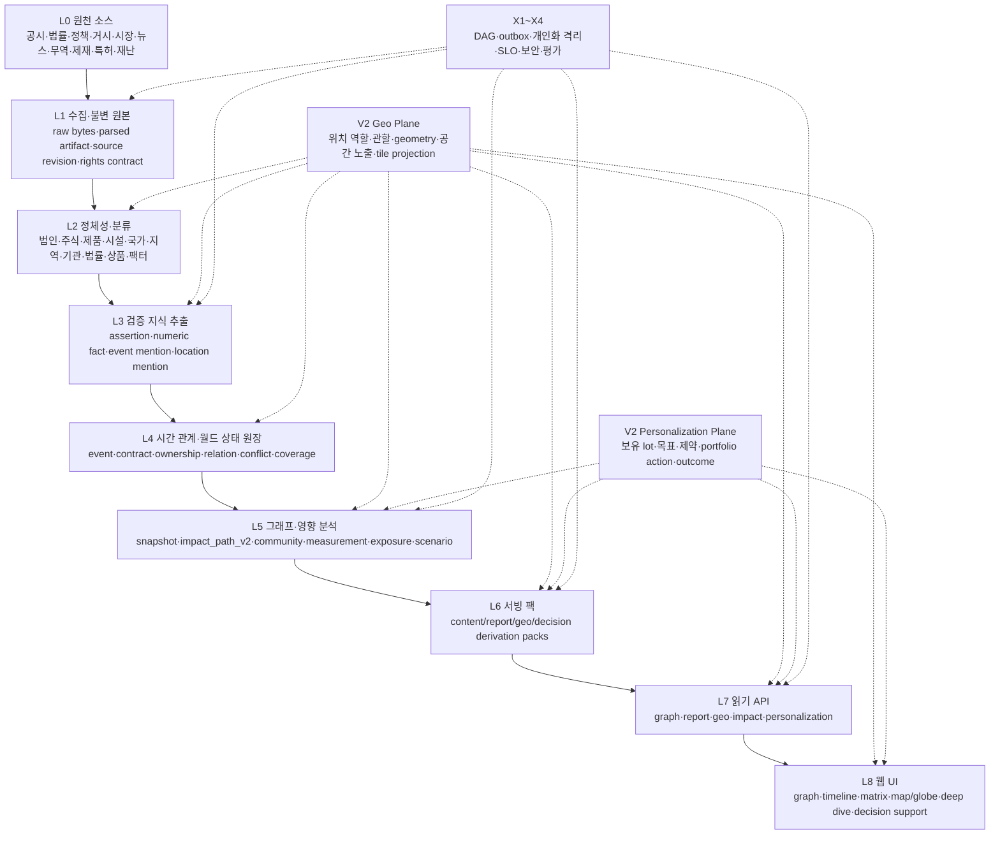

# Stock Insight — V2 고도화 종합 계획 및 심층 검토 보고서

> **목표 명칭**: Evidence-Grounded Market World Model — 근거 기반 시장 월드모델  
> **문서 성격**: 기존 완성형 V2 아키텍처를 폐기하거나 새 메이저 API로 교체하지 않고, 동일한 L0~L8·X1~X4 계약 안에 지리·영향·시나리오·개인화 의사결정 기능을 추가하는 구현 계획  
> **검토 대상**: `stock-insight-e2e-layers.md` (완성형 V2 목표 아키텍처 및 현재 실측표)  
> **검토일**: 2026-07-19 KST  
> **검토 범위**: 제공 문서 기반의 구조·데이터 모델·분석 방법론·지리정보·개인화·운영·보안·제품 설계 검토. 실제 코드, SQL migration, 배포 환경, 데이터 샘플의 정합성은 별도 코드/DB 감사가 필요하다.  
> **버전 계약**: API·read model·팩·핵심 테이블의 제품 계약은 계속 **V2**다. 내부 builder/model/prompt/schema revision은 독립적으로 증가하되, 이를 근거로 새 메이저 API나 새 제품 버전을 만들지 않는다.
---


## 0. 내가 이해한 방향

당신이 만들고 싶은 것은 단순한 종목 관계 그래프, 뉴스 요약기, RAG 챗봇, 자동 리포트 생성기 또는 종목 추천기가 아니다.

최종적으로는 다음과 같은 **시간축·공간축·사용자축을 가진 시장 월드모델**이다.

1. 전 세계에서 발생하는 기업 공시, 정책·법률·규제, 정치적 사건, 거시경제 지표, 산업 변화, 공급망 변화, 기술 변화, 사회적 변화, 자연재해, 지정학, 자금 흐름, 시장 가격과 수급을 지속적으로 축적한다.
2. 원문과 원자적 사실을 보존하고, 기업·주식·상품·국가·정부·법률·산업·공장·제품·인물·사건 등을 동일한 정체성 체계로 연결한다.
3. 뉴스나 공시에서 언급된 장소를 단순 국가 태그로 붙이지 않고, **사건 발생지, 발표 장소, 적용 관할, 대상 지역, 피해 지역, 출발지·도착지·경유지, 기업의 매출·생산·공급망 노출 지역**으로 역할을 나누어 저장한다.
4. 어떤 사건이 어디에서 발생했고 어느 지역에 적용되며, 어떤 경제적 전달 경로를 통해 어느 종목의 매출·비용·생산능력·현금흐름·재무위험·밸류에이션·수급·가격에 영향을 줄 수 있는지 방향, 시차, 크기, 조건, 공간 범위와 불확실성을 함께 추론한다.
5. 전체 시장에서는 충격이 퍼지는 경로와 잠재 수혜·피해 종목을 탐색하고, 지도·지구본에서는 사건·시설·항만·물류·국가 노출과 전파 흐름을 시간에 따라 시각화한다.
6. 특정 종목을 선택하면 직접 관계뿐 아니라 간접 공급망, 경쟁구도, 정책 민감도, 거시 팩터, 지역별 사업 노출, 역사적 유사 사건, 반대 근거와 시나리오까지 깊게 내려간다.
7. 공통 시장 분석과 별도로 사용자의 보유종목, 매입 lot, 투자기간, 위험 허용도, 집중도, 현금 필요, 세금·거래비용, 투자 thesis를 결합해 **추가매수·보유·비중축소·전량정리·관망·판단보류** 중 어떤 행동이 합리적인지 근거와 함께 제시한다.
8. 같은 종목이라도 사용자마다 보유비중·목표·제약이 다르므로 공통 종목 의견과 개인 포트폴리오 행동을 물리적으로 분리한다. 개인화 데이터가 공통 사실 원장이나 시장 전망을 오염시키면 안 된다.
9. 모든 분석 문장과 개인화 판단은 원문, 계산식, 모델 버전, 데이터 시점, 포트폴리오 snapshot까지 역추적 가능해야 한다.
10. 데이터가 누적될수록 단순 검색이 아니라 시장 구조와 충격 전파를 더 잘 이해하는 대규모 다층 지식·노출·인과·공간·시나리오 레이어로 성장한다.
11. 우선 주식에서 이 구조를 완성하고, 이후 코인은 토큰·프로토콜·체인·브리지·거래소·스마트컨트랙트·거버넌스·청산 전염이라는 별도 의미체계를 추가해 확장한다.

따라서 제품의 핵심 질문은 다음 여섯 가지다.

- **무슨 일이 실제로 일어났는가?**
- **어디에서 일어났고, 어디에 적용되며, 어느 지역이 실제로 노출되는가?**
- **그 일이 어떤 경제적 메커니즘으로 누구에게 전달되는가?**
- **그 영향의 방향·크기·시차·조건과 불확실성은 무엇인가?**
- **그 판단을 어떤 원문·데이터·계산·방법론으로 재현할 수 있는가?**
- **공통 시장 판단을 내 포트폴리오와 제약에 적용하면 지금 무엇을 해야 하는가?**

이 관점에서 현재 V2는 매우 좋은 **근거 중심 관계 원장과 서빙 아키텍처**다. 고도화의 중심은 이를 새 버전으로 갈아엎는 것이 아니라, 동일 계약 안에 **영향 메커니즘·경제적 노출·지리 역할·인과 추정·시나리오·개인화 의사결정**을 추가하는 것이다.

### 0.1 구현 LLM·에이전트용 강제 명칭 규칙

이 문서를 구현 계획으로 읽는 LLM이나 자동 코딩 에이전트는 아래 규칙을 변경 제안이 아니라 **상위 호환성 계약**으로 취급한다.

1. 제품·API 계약은 계속 `V2`다. 새 메이저 버전 명칭, 새 메이저 API namespace, 병렬 제품 계약을 생성하지 않는다.
2. 기존 L0~L8 및 X1~X4 레이어 번호를 유지한다. 고도화 기능은 기존 레이어의 하위 모듈 또는 교차 plane으로 추가한다.
3. `impact_path_v2`, `graph-read-model-v2`, V2 content pack, 기존 Graph API 의미를 임의로 rename하거나 duplicate하지 않는다.
4. 새 기능은 additive migration, nullable-to-required 단계 전환, shadow write/read, feature flag, backfill, parity gate 순으로 적용한다.
5. `builder_version`, `model_version`, `prompt_version`, `feature_version`, `ontology_revision`, `contract_revision`은 API major version과 무관하다.
6. 내부 revision 숫자가 증가해도 API 경로나 제품 명칭을 자동 변경하지 않는다.
7. 기존 endpoint에 필드를 추가할 때는 backward-compatible optional field로 시작하고, 새 endpoint도 기존 `/api/...` 아래 의미 기반 경로로 추가한다.
8. 기존 V2 데이터의 migration 없이 별도 진실 원장을 병렬 생성하지 않는다. 정본은 계속 PostgreSQL `research_app`이다.
9. 개인화 결과는 공통 원장에 쓰지 않고 `personalization.*` projection/decision 영역에만 저장한다.
10. 지도 좌표·화면 배치·클러스터 좌표는 presentation/geo projection이며, 관계 원장의 진실을 수정하지 않는다.

---

## 1. 종합 결론

### 1.1 한 문장 진단

현재 문서는 **“근거가 있는 관계를 안전하게 축적하고 웹에 표시하는 시스템”**으로는 강하지만, **“정치·경제·사회 사건이 어떤 경로로 어떤 종목에 얼마나 영향을 주는지 설명·추정하는 시장 월드모델”**로 가기 위한 중간 계층이 빠져 있다.

### 1.2 가장 잘된 부분

- 원문 불변 저장, SHA-256 결속, source revision, append-only, PIT 무결성은 장기적으로 가장 가치 있는 기반이다.
- 회사와 주식을 분리하고 식별자의 유효기간을 관리하는 방향이 맞다.
- LLM을 승인자가 아니라 추출기로 제한하고, 원문 span과 기계 검증으로 승격하는 원칙이 좋다.
- 구조 관계와 시장 측정값을 분리한 판단이 맞다. 가격 상관을 곧바로 실물 관계로 승격하면 그래프가 빠르게 오염된다.
- sealed snapshot, digest, step별 edge FK, 원자적 pack 교체와 fail-closed는 재현성과 서비스 신뢰성을 높인다.
- Kafka, Graph DB, Kubernetes 등을 병목 실측 전까지 보류하고 계약만 고정한 전략은 초기 단계에 합리적이다.

### 1.3 가장 큰 결손

- `relation`이 주장, 사건, 계약, 구조적 관계, 통계적 연관, 경제적 영향, 전망을 지나치게 많이 떠안고 있다.
- `Event -> Shock -> Transmission Channel -> Exposure -> Financial Outcome -> Market Outcome`의 명시적 영향 사슬이 없다.
- 정치·경제·사회 전반을 담기에는 엔티티와 사건 ontology가 너무 좁다.
- 공급계약·법률·제재·M&A·공장중단처럼 여러 당사자·제품·금액·지역·시점이 있는 사실을 단순 이진 edge로 표현하기 어렵다.
- 정확한 출처 span이 있다는 사실만으로는 문장의 부정, 조건, 추정, 인용, 철회, 상충을 판별할 수 없다.
- 인과성의 수준이 구분되지 않는다. “함께 움직임”, “사건 후 반응”, “식별된 인과효과”, “경제적 메커니즘 가설”은 서로 다른 객체여야 한다.
- 데이터 coverage가 없다. 관계가 없다는 결과가 “실제로 없음”인지 “아직 수집하지 못함”인지 알 수 없다.
- 현재 실측에서 path/community/measurement가 0건이므로, 핵심 분석 가치는 아직 작동하지 않는다. 관계와 pack 수가 늘어도 이 문제는 자동으로 해결되지 않는다.
- 뉴스·사건의 지리 역할과 기업의 국가·지역 노출이 정본화되어 있지 않아 향후 지도·지구본을 추가할 때 기사 언급 위치, 실제 사건 위치, 정책 적용 지역, 기업 노출 지역이 혼합될 위험이 크다.
- 개인화가 watchlist/affinity ranker 수준에 머물러 있어 “이 종목이 좋은가”와 “내가 지금 보유분을 줄여야 하는가”를 구분하는 포트폴리오 의사결정 계층이 없다.

### 1.4 정성 평가표

| 영역 | 목표 설계 평가 | 현재 실측 평가 | 핵심 코멘트 |
|---|---:|---:|---|
| 원문·provenance·PIT | 매우 강함 | 강함 | 플랫폼의 가장 좋은 자산 |
| 정체성·분류 | 양호 | 주식 기초 완료 | probabilistic entity resolution과 법인계층 보강 필요 |
| 원자 사실·사건 모델 | 부족 | 초기 | claim/event/numeric fact 분리 필요 |
| 구조 관계 원장 | 강함 | 일부 predicate 중심 | n-ary 관계와 종료·취소 상태 필요 |
| 영향·노출 모델 | 매우 부족 | 사실상 없음 | 제품 비전의 핵심 공백 |
| 인과·통계 검증 | 개념 수준 | 0건 | 방법별 식별 가정과 진단 저장 필요 |
| 예측·시나리오 | 없음 | 없음 | 결과 분포, horizon, calibration 필요 |
| 평가 체계 | 부족 | 부분 gate | gold set과 계층별 품질지표 필요 |
| 서빙·UI | 목표는 양호 | 초기 | force graph 하나로는 전체시장 탐색 불가 |
| 지리·국가/지역 모델 | 없음에 가까움 | 확인 불가 | 사건 위치 역할·관할·시설·노출·불확실성 필요 |
| 개인화 투자 의사결정 | 개념 수준 | 프로토타입 | 공통 종목 view와 사용자별 action 분리 필요 |
| 보안·라이선스 | 부족 | 확인 불가 | prompt injection, SSRF, 콘텐츠 권리·민감 포트폴리오 데이터 위험 |
| 대규모 확장 | 파일럿에는 적합 | 파일럿 | 전부 PostgreSQL·전부 사전계산은 장기 병목 가능 |

---

## 2. 현재 문서에서 반드시 유지할 원칙

보완은 기존의 좋은 원칙을 버리는 작업이 아니라, 그 원칙을 더 세밀한 객체로 확장하는 작업이어야 한다.

### 2.1 절대 유지

1. **원문 우선, 파생물 후순위**
2. **append-only revision과 bitemporal/PIT**
3. **근거 없는 accepted 사실 0**
4. **LLM은 발견·정규화 도구이며 승인 권한 없음**
5. **회사, 법인, 주식, 상장시장, share class 분리**
6. **구조 관계와 시장 측정값 분리**
7. **모든 화면 요소에서 derivation 역추적 가능**
8. **sealed snapshot과 replay 검증**
9. **stale 상태를 숨기지 않고 unavailable로 반환**
10. **기술은 병목 실측 후 도입하되 ID·이벤트·멱등 계약은 미리 고정**

### 2.2 유지하되 수정할 원칙

- “사실과 추론의 물리 분리”는 맞지만 두 층으로는 부족하다. 최소한 사실, 경제적 노출, 통계적 추정, 인과 추정, 전망, 보고서 문장을 분리해야 한다.
- “웹 요청 중 계산 0”은 모든 조합을 사전 계산한다는 의미가 되어서는 안 된다. 자주 쓰는 결과만 사전 계산하고, bounded on-demand 계산을 허용하는 하이브리드 방식이 필요하다.
- “뉴스 공동 등장 영구 승격 불가”는 공동 등장 관계에는 맞다. 그러나 뉴스가 보도한 사건·발언·규제 발표까지 일괄 candidate로 묶으면 중요한 사건층을 만들 수 없다.
- “정확한 재실행 결정론”은 LLM 재호출의 byte-level 동일성을 요구해서는 안 된다. 입력·프롬프트·스키마·모델·출력의 원장을 고정하고 저장된 산출물을 replay하는 방식이어야 한다.

---

## 3. 가장 중요한 구조 변경: 객체의 의미를 분리하라

현재 `relation_revision` 중심 구조만으로는 “관계가 존재함”과 “이 관계가 경제적으로 어떤 영향을 줌”을 구분하기 어렵다. 다음 객체를 물리적으로 분리하는 것을 권고한다.

| 객체 | 의미 | accepted 조건 | 예시 |
|---|---|---|---|
| `source_revision` | 우리가 보유한 원문 버전 | 해시·수집 계약 | DART 공시 원문 |
| `assertion` | 원문이 주장한 최소 단위 | span·polarity·modality·attribution 검증 | “A사는 B사와 공급계약을 체결했다” |
| `numeric_fact` | 단위·기간·차원까지 정규화된 수치 | 원표/셀/태그와 계산 검증 | 중국 매출 1.2조원, FY2025 |
| `event` | 시간에 따라 발생·진행·취소되는 사건 | 참가자·역할·시점·상태 검증 | 수출통제 발표·시행·유예 |
| `relation_instance` | 지속성을 가진 현실 관계 | assertion/event에서 파생 | A가 B에 부품 공급 |
| `exposure` | 엔티티가 특정 shock/factor에 얼마나 노출되는지 | 근거 또는 추정 모델 결속 | 원/달러 상승 시 영업이익 민감도 |
| `mechanism_hypothesis` | 영향 전달 메커니즘 가설 | 논리와 근거 저장, 사실과 분리 | 규제→중국 출하 제한→매출 감소 |
| `statistical_estimate` | 관찰적 연관 또는 반응 추정 | 샘플·방법·진단·CI 저장 | 발표 후 3일 CAR -2.4% |
| `causal_estimate` | 명시적 식별 가정 아래 효과 추정 | estimand·identification·diagnostics 필수 | 규제의 중국 노출기업 초과수익 효과 |
| `forecast` | 미래 분포·시나리오 | as-of·horizon·모델·calibration | 3개월 매출 하향 확률 분포 |
| `report_statement` | 사용자에게 보이는 원자 문장 | 하나의 derivation DAG에 결속 | “중국 매출 비중이 높아 하방 노출” |

핵심 원칙은 다음과 같다.

> **원문에 있는 것은 assertion이고, 현실 세계에서 정규화된 것은 fact/event/relation이며, 경제적 의미는 exposure/mechanism이고, 데이터로 추정한 것은 estimate이며, 미래에 대한 것은 forecast다.**

이 구분이 없으면 시간이 지날수록 사실과 모델 출력이 같은 그래프 안에서 섞여 “왜 이 선이 존재하는지”는 알지만 “그 선을 어떤 수준의 진실로 받아들여야 하는지”를 알 수 없게 된다.

---

## 4. 이진 edge만으로 부족한 이유와 n-ary 모델

공급계약을 `A -SUPPLIES-> B` 하나로 만들면 다음 정보가 손실된다.

- 어떤 제품·서비스인가
- 계약 금액과 통화는 무엇인가
- 계약 시작·종료일은 언제인가
- 최소 물량·해지 조건·지역은 무엇인가
- A와 B 중 실제 계약 법인은 누구인가
- 공시 후 변경·취소되었는가
- 전체 매출 대비 materiality는 얼마인가

정책 사건도 `Event -AFFECTS-> Stock`만으로는 법률안, 규칙, 관할기관, 대상 제품, 국가, 발표일, 시행일, 유예, 법적 상태, 예외 조항을 담기 어렵다.

따라서 중요한 관계는 **reified object**로 승격한다.

```text
Contract C-2026-001
 ├─ party: Supplier A (role=supplier)
 ├─ party: Customer B (role=customer)
 ├─ product: HBM substrate
 ├─ value: KRW 120B
 ├─ valid: 2026-07-01 ~ 2028-06-30
 ├─ status: active
 ├─ evidence: assertion #...
 └─ derived edges: A SUPPLIES B, A EXPOSED_TO B_DEMAND
```

```text
Regulatory Event E-2026-EXP-01
 ├─ issuer: Government Agency
 ├─ action: export restriction
 ├─ target_product: semiconductor equipment class X
 ├─ target_geography: China
 ├─ announced_at / effective_at / known_at
 ├─ status: proposed | enacted | stayed | repealed
 ├─ affected firms: derived, not raw fact
 └─ scenario branches: strict / delayed / exempted
```

직접 edge는 빠른 탐색을 위한 projection으로 유지하되, 정본은 계약·사건·지분보유·소송·정책 같은 관계 인스턴스여야 한다.

---


## 5. V2 고도화 목표 구조: 근거 기반 시장 월드모델

고도화 후에도 레이어 번호와 서빙 계약은 L0~L8을 유지한다. 새 기능은 기존 레이어 안에 추가되고, 지리와 개인화는 여러 레이어를 관통하는 교차 plane으로 동작한다.



### 5.1 현재 V2와 고도화 후의 매핑

| 현재 V2 | V2 고도화 |
|---|---|
| L0·L1 원천과 불변 원문 | raw bytes와 parsed artifact를 분리하고 권리·보존·지리 메타데이터를 강화 |
| L2 금융 엔티티·taxonomy | 정치·법률·거시·제품·시설·지리·관할 ontology와 geo identifier 추가 |
| L3 `document_chunk + Claim/Event` | assertion, numeric fact, event mention, location mention, polarity/modality/attribution 분리 |
| L4 binary relation ledger | 기존 relation 원장을 유지하면서 event/contract/world-state/conflict/coverage를 추가 |
| L5 path/community/measurement | `impact_path_v2` 유지 + exposure, mechanism, causal/statistical estimate, scenario, spatial spillover 추가 |
| L6 one-anchor typed evidence | one derivation anchor 유지. derivation bundle이 여러 typed input·계산 step을 품도록 확장 |
| L7 graph/report/feed API | 기존 API 유지 + geo/impact/decision-support endpoint를 additive로 추가 |
| L8 Force Graph | graph 외 timeline, matrix, map/globe, geography exposure, 개인화 decision panel 추가 |
| X3 공통 팩 위 ranker | 공통 market view와 private portfolio action을 분리한 decision-support plane으로 확대 |

### 5.2 진실 등급과 사용자 출력의 표준 사슬

```text
source_revision
  → assertion / numeric_fact / event_mention / location_mention
  → event / contract / relation_instance / geo_binding
  → exposure / mechanism_hypothesis
  → statistical_estimate / causal_estimate
  → forecast / scenario
  → report_statement / common_asset_view
  → personalized_decision_packet
```

- `source_revision`부터 `event/relation_instance`까지는 사실 계층이다.
- `exposure/mechanism`은 경제적 해석 계층이다.
- `estimate`는 방법·가정·표본이 결속된 분석 계층이다.
- `forecast/scenario`는 미래 분포 계층이다.
- `personalized_decision_packet`은 공통 시장 분석을 특정 사용자의 포트폴리오와 제약에 적용한 파생 결과다.
- 하위 계층이 상위 계층으로 역류해 사실을 수정할 수 없다.

---

## 6. 정치·경제·사회까지 담기 위한 ontology 확장

현재 Company / Stock / ETF / Token / Protocol만으로는 외부 충격을 기업에 연결할 수 없다. 다음 타입을 최소 확장 세트로 권고한다.

### 6.1 조직·사람·법적 주체

- LegalEntity, Company, Subsidiary, Branch, SPV, JointVenture
- Government, Ministry, Regulator, CentralBank, Court, Legislature
- PoliticalParty, PublicOfficial, Executive, Director, BeneficialOwner
- Fund, Bank, Insurer, Broker, Exchange, ClearingHouse

### 6.2 금융·경제 객체

- Security, ShareClass, ADR/GDR, Bond, ETF, Index, Future, Option
- Currency, InterestRate, YieldCurvePoint, CreditSpread, Commodity
- MacroIndicator, Survey, ForecastVintage, PolicyRateDecision
- FinancialStatement, StatementLine, Segment, AccountingConcept

### 6.3 실물·산업 객체

- Product, ProductFamily, Technology, Patent, Standard
- Material, Component, Equipment, Service
- Facility, Factory, Mine, Port, Route, PowerPlant, DataCenter
- Industry, ValueChainStage, HSCode, ECCN/ControlClass, Geography

### 6.4 제도·사건 객체

- Law, Bill, Regulation, Rule, SanctionProgram, Tariff, Subsidy, Tax
- Contract, Tender, License, Permit, Litigation, Investigation
- Election, Speech, PolicyAnnouncement, Strike, CyberIncident
- NaturalDisaster, WeatherEvent, Epidemic, MilitaryConflict
- CorporateAction, EarningsRelease, Guidance, ProductLaunch, Recall


### 6.5 지리·관할 ontology

- Country, MacroRegion, Subregion, AdministrativeArea, City, District
- Facility, Factory, Mine, Port, Airport, PowerPlant, DataCenter, Warehouse
- Route, ShippingLane, RailCorridor, Pipeline, Strait, Canal, MaritimeZone
- Jurisdiction, CustomsArea, TradeBloc, SanctionRegion, ElectoralDistrict
- Point, Polygon, MultiPolygon, LineString, BoundingBox, H3CellProjection
- HistoricBoundary, DisputedBoundaryAssertion, PlaceAlias, TimeZone

국가와 지역은 단순 문자열 dimension이 아니라 유효기간·상위 지역·식별자·geometry·관할 출처를 가진 버전 관리 엔티티여야 한다. 기사에 나온 위치와 사건이 실제 발생한 위치, 법이 적용되는 지역, 기업이 경제적으로 노출된 지역은 서로 다른 역할로 보존한다.

### 6.6 코인 확장 시 추가

- Blockchain, L2, Protocol, SmartContract, Token, Stablecoin
- Bridge, Oracle, Validator, Exchange, Custodian, WalletCluster
- GovernanceProposal, Unlock, EmissionSchedule, LiquidationCascade
- Dependency, Audit, Exploit, Depeg, PegReserve, ProtocolRevenue

코인 객체를 주식 predicate에 억지로 넣지 말고, 공통 identity/provenance 위에 별도 ontology 모듈을 올리는 것이 좋다.

---

## 7. 영향 분석의 중심 모델

### 7.1 표준 영향 사슬

모든 영향 경로를 다음 형태로 정규화한다.

```text
Event / State Change
  → Primitive Shock
  → Transmission Channel
  → Entity Exposure
  → Financial Statement Impact
  → Valuation / Credit / Flow Impact
  → Market Outcome
```

예시:

```text
반도체 장비 수출통제 강화
  → 중국향 출하 가능 물량 감소
  → 공급능력·매출 채널
  → 장비사 중국 매출 비중 및 주문잔고 노출
  → 매출/마진/재고/운전자본 변화
  → 이익추정치 및 멀티플 변화
  → 주가·신용스프레드·수급 반응
```

### 7.2 전달 채널 taxonomy

| 채널 | 주로 영향을 받는 항목 |
|---|---|
| 수요·매출 | 판매량, ASP, 시장점유율, 수주 |
| 원재료·입력비 | 매출원가, 마진, 재고평가 |
| 생산능력·공급 | 가동률, 생산량, 납기, CAPEX |
| 물류·지리 | 운임, 리드타임, 재고, 지역별 매출 |
| 환율 | 거래 노출, 환산 노출, 헤지비용 |
| 금리·신용 | 이자비용, 조달, WACC, 부도위험 |
| 규제·법률 | 판매 가능성, 비용, 벌금, 라이선스 |
| 세금·보조금 | 세후이익, 투자유인, CAPEX |
| 제재·관세·무역 | 시장 접근, 공급대체, 가격전가 |
| 경쟁·대체 | 점유율, 가격결정력, 제품 믹스 |
| 기술·특허·표준 | 제품수명, 진입장벽, 개발비 |
| 소유·지배구조 | 자본배분, 이벤트 리스크, 지배권 |
| 자금흐름·수급 | ETF, 리밸런싱, 공매도, 포지셔닝 |
| 심리·관심 | 단기 attention, 뉴스 확산, 변동성 |
| 물리·기후·재난 | 시설중단, 보험, 공급망 병목 |
| 사이버·운영 | 서비스 중단, 데이터 유출, 복구비 |
| 회계·일회성 | 손상, 충당금, 분류 변경, 재작성 |

### 7.3 exposure가 가져야 할 필드

```text
exposure_id
entity_id
factor_or_shock_type
channel
sign                 -- positive / negative / nonlinear / ambiguous
sensitivity          -- beta, elasticity, share, ordinal bucket
sensitivity_unit
horizon              -- intraday / days / quarter / years
lag_distribution
regime_condition     -- high inflation, recession, supply shortage 등
threshold_condition
substitutability
input_specificity
economic_materiality
valid_from / valid_to / known_from
estimation_method
model_version
supporting_derivation_id
uncertainty_interval
```

### 7.4 점수 하나로 뭉개지 말 것

현재 문서가 confidence를 분해한 것은 좋은 방향이다. 여기서 한 단계 더 나가야 한다.

- **증거 신뢰도**: 이 사실이 맞는가
- **관계 강도**: 현실에서 연결이 얼마나 큰가
- **경제적 materiality**: 실적에 얼마나 중요한가
- **전달 가능성**: shock가 실제로 이 경로를 탈 가능성
- **방향과 비선형성**: 양/음/임계값/포화 효과
- **시차**: 언제 나타나는가
- **시장 반영도**: 이미 가격에 반영되었는가
- **모델 불확실성**: 추정 오차와 구조적 불확실성

이들을 임의의 하나의 `confidence=0.83`으로 표시하지 않는다. 경제적 영향 계산은 점수 곱셈이 아니라 분포와 조건을 가진 함수로 표현하는 것이 바람직하다.

```text
ImpactDistribution = f(
  ShockDistribution,
  ExposureDistribution,
  TransmissionMechanism,
  Regime,
  LagKernel,
  Substitution,
  MarketPricedInState
)
```

초기에는 Monte Carlo가 아니라 규칙 기반 시나리오와 구간으로 시작해도 된다. 중요한 것은 epistemic confidence를 경제적 크기에 곱해 “신뢰도가 낮으니 영향이 작다”로 왜곡하지 않는 것이다.

---

## 8. 추천 핵심 데이터 모델

### 8.1 assertion

```sql
knowledge.assertion (
  assertion_id,
  source_revision_id,
  subject_entity_id,
  predicate_id,
  object_entity_id,
  literal_value,
  polarity,            -- affirmed / negated
  modality,            -- factual / planned / possible / alleged / forecast
  attribution_entity_id,
  quotation_scope,
  valid_time_start,
  valid_time_end,
  published_at,
  available_at,
  known_at,
  source_span_locator,
  parser_version,
  extraction_run_id,
  verification_state
)
```

### 8.2 event, 참가자 및 위치 역할

```sql
world.event (
  event_id,
  event_type,
  status,              -- rumored/proposed/announced/enacted/effective/stayed/repealed/completed/cancelled
  announced_at,
  occurred_at,
  effective_at,
  ended_at,
  valid_from,
  valid_to,
  known_from,
  primary_derivation_id
)

world.event_participant (
  event_id,
  entity_id,
  role,
  scope,
  directness,
  evidence_id
)

world.event_location_revision (
  event_location_revision_id,
  event_id,
  geo_entity_id,
  location_role,       -- OCCURRED_AT/APPLIES_TO/TARGETS/AFFECTED_AREA/ANNOUNCED_AT/ORIGIN/DESTINATION/ROUTE_THROUGH
  is_primary,
  geometry_revision_id,
  precision_class,     -- exact_facility/address/city/admin1/country/region/route/unknown
  resolution_method,
  confidence,
  uncertainty_radius_m,
  valid_from,
  valid_to,
  known_from,
  evidence_id
)
```

`event.location_id` 하나로 축약하지 않는다. 하나의 정책 사건은 워싱턴에서 발표되고, 미국 관할에서 발행되며, 중국향 제품에 적용되고, 여러 국가의 기업·공장에 영향을 줄 수 있다. 각각을 위치 역할로 저장해야 지도와 영향 모델이 정확해진다.

### 8.3 수치 사실

```sql
world.numeric_fact (
  fact_id,
  entity_id,
  concept_id,
  value,
  unit,
  currency,
  scale,
  period_start,
  period_end,
  instant_at,
  fiscal_year,
  fiscal_quarter,
  dimensions_json,
  restatement_group_id,
  original_cell_or_xbrl_locator,
  source_revision_id,
  known_at
)
```

수치에는 원문 셀, XBRL concept, 행·열 헤더, 단위, 스케일, 기간, segment dimension과 restatement가 모두 필요하다. 텍스트 span만으로는 재무 분석의 신뢰성을 만들 수 없다.

### 8.4 derivation DAG

현재 `pack item당 typed anchor 정확히 1개`는 단순 관계 카드에는 좋지만, 여러 근거와 계산을 합성하는 문장에는 너무 제한적이다. 다음으로 바꾸는 것이 좋다.

```text
pack_item → exactly one derivation_id

derivation
  ├─ step 1: assertion A + assertion B → normalized contract C
  ├─ step 2: numeric fact D / revenue fact E → revenue exposure 21%
  ├─ step 3: exposure + event → scenario impact range
  └─ output: one atomic report statement
```

즉 pack item은 하나의 derivation을 가리키고, derivation은 여러 typed input과 계산 step을 가질 수 있다. W3C PROV-O의 Entity–Activity–Agent 및 qualified derivation 패턴을 참고할 수 있다.

### 8.5 coverage ledger

```sql
governance.coverage_ledger (
  entity_id,
  predicate_or_fact_family,
  source_contract_id,
  coverage_period,
  expected_artifact_count,
  observed_artifact_count,
  completeness_state,    -- complete / partial / not_collected / source_unavailable / not_applicable
  last_checked_at,
  gap_reason,
  next_action
)
```

이 테이블이 없으면 `관계 없음`과 `수집 실패`를 구분하지 못한다. UI는 다음처럼 표현해야 한다.

- 확인된 관계 없음
- 해당 기간 수집 완료 후 관계 없음
- 일부 소스만 수집됨
- 아직 조사하지 않음
- 소스 접근 불가

### 8.6 conflict와 supersession

```text
conflict_set
 ├─ assertion A: 계약 체결
 ├─ assertion B: 계약 협상 중
 ├─ assertion C: 계약 취소
 ├─ relation: contradicts / supersedes / narrows / corrects
 └─ resolution: unresolved / resolved_by_later_official_source
```

삭제 대신 revision과 invalidation을 저장하고, 최신 projection에서만 현재 상태를 계산한다.

---

## 9. 시간 모델과 PIT를 더 엄격하게 만들기

현재 `valid_from/valid_to`와 `known_from`을 둔 것은 좋다. 하지만 API의 `asOf` 하나로는 어떤 시간을 뜻하는지 모호하다.

### 9.1 최소 네 시간

- `event_time` 또는 `valid_time`: 현실에서 사실이 성립한 시간
- `published_at`: 출처가 발표한 시간
- `available_at`: 시스템이 합법적으로 접근 가능해진 시간
- `known_at`: 시스템이 수집·검증하여 알게 된 시간

거시지표는 추가로 다음이 필요하다.

- reference period
- initial release time
- revision/vintage time

### 9.2 API 제안

```text
validAt=2026-06-30T23:59:59Z
knownAt=2026-07-01T09:00:00Z
marketCalendar=KRX
informationSet=first_release | latest_revision
```

`asOf`는 편의 alias로만 두고 내부적으로 `validAt`과 `knownAt`을 모두 명시해야 한다.

### 9.3 시장 시간

- UTC 정본 + 원천 timezone 보존
- 거래소별 session·휴장·서머타임
- 장중 발표, 장마감 후 발표, 다음 거래일 매핑
- 공시 제출 시각과 공개 시각의 차이
- 뉴스의 수정 시각과 최초 게시 시각

이 처리가 없으면 사건연구와 누출 방지 결과가 왜곡된다.

---

## 10. 추출·검증 계층의 잠재 문제와 개선

### 10.1 span 실존만으로는 충분하지 않다

다음 문장들은 같은 entity와 predicate를 포함하지만 의미가 다르다.

- “A사는 B사와 계약을 체결했다.”
- “A사는 B사와 계약을 체결하지 않았다.”
- “A사는 B사와 계약 체결을 검토 중이다.”
- “언론은 A사가 B사와 계약했다고 보도했으나 회사는 부인했다.”
- “기존 계약은 종료되었다.”

검증기에 다음을 추가한다.

- polarity/negation
- modality/uncertainty
- tense와 event status
- attribution/quotation
- condition과 exception
- numerical consistency
- document section type
- later correction/retraction

### 10.2 뉴스 정책 수정

`NEWS_MENTION` 공동 등장 edge는 accepted 금지가 맞다. 그러나 다음은 별개다.

- 뉴스 기사 안의 공식 발언
- 신뢰도 높은 통신사의 사건 보도
- 회사 보도자료의 계약 발표
- 정부 브리핑의 정책 발표

권고 정책:

```text
co-mention                  → candidate only
news-extracted claim        → assertion accepted 가능, source tier 표시
high-impact event           → 공식 원천 확보 전 provisional
independent corroboration   → confidence/evidence diversity 상승
official confirmation       → factual event 승격
```

### 10.3 독립 근거 수

같은 통신사 기사를 수십 곳이 복제한 것은 독립 근거 50개가 아니다. 다음을 저장한다.

- canonical story cluster
- syndicated-from/source lineage
- publisher ownership
- quoted primary source
- textual near-duplicate hash
- independent source group

### 10.4 번역

번역문은 검색·요약용 파생물이고 증거 정본이 아니다.

- 원문 span을 anchor로 사용
- 번역 span과 번역 모델 버전 저장
- 숫자·부정·고유명사 정합성 검사
- 사용자에게 원문/번역을 모두 제공

### 10.5 표·이미지·PDF

재무공시는 문장보다 표와 각주가 중요하다.

- raw bytes와 parsed text를 모두 저장
- parser/OCR/table extractor 버전 저장
- page, bounding box, row/column header, cell 좌표 저장
- 수치 계산은 셀 provenance를 따라 재실행
- 이미지·차트에서 추출한 수치는 낮은 자동승격 tier로 분리

---

## 11. Entity Resolution이 독립 레이어여야 하는 이유

공식 identifier가 있는 경우에도 현실 데이터는 다음 문제가 있다.

- 법인명 변경, 합병, 분할, 청산
- 동일 브랜드와 여러 법인
- 모회사·중간지주·사업 자회사
- 영문·한글·중문 alias
- ADR, 우선주, 복수상장, share class
- 티커 재사용
- 펀드와 운용사 혼동
- 기사에서 브랜드명만 사용

### 11.1 제안 파이프라인

1. deterministic identifier match: corp_code, ISIN, LEI, CIK 등
2. alias·주소·도메인·관할·parent 정보를 이용한 blocking
3. Fellegi–Sunter 계열 probabilistic linkage 또는 supervised pair classifier
4. graph consistency check
5. 임계값 이상 자동 결속, 중간 구간 review queue, 낮은 구간 non-link
6. match decision의 feature·score·model version·review lineage 저장

### 11.2 외부 표준

- LEI Level 1은 “who is who”, Level 2는 direct/ultimate accounting parent를 제공하므로 글로벌 법인 계층 보강에 유용하다.
- FIBO는 금융 개념을 처음부터 직접 발명하는 대신 용어·정의·관계의 참고 ontology로 사용할 수 있다.
- 자체 domain ontology는 필요하지만 외부 표준과 mapping table을 두는 것이 장기 데이터 통합에 유리하다.

---

## 12. 경제적 영향과 인과 추정 방법론

한 가지 알고리즘으로 모든 “영향”을 판정하면 안 된다. 질문별로 다른 추정 방법을 사용하고, 결과 객체에 방법·가정·진단을 함께 저장한다.

| 질문 | 추천 방법 | 출력 분류 | 주의점 |
|---|---|---|---|
| 사건 직전·직후 가격 반응 | Event Study | statistical estimate | 이벤트 중첩·시장모형·창 선택 |
| 충격 후 여러 horizon의 동적 반응 | Local Projections | dynamic response estimate | shock identification과 표준오차 |
| 특정 정책이 일부 집단에 미친 효과 | Synthetic Control / DiD | causal estimate | parallel trend·donor pool·spillover |
| 통제변수가 매우 많은 효과 추정 | Double/Debiased ML | causal estimate | unconfoundedness·overlap·cross-fitting |
| 시계열의 잠재 지연 연결 탐색 | PCMCI+ | causal hypothesis candidate | causal sufficiency 등 강한 가정; 자동 사실 승격 금지 |
| 공급망 shock 전파 | firm graph + Input-Output/Leontief | mechanism estimate | 기업 미시자료와 산업행렬의 granularity 차이 |
| 특정 입력의 대체 난이도 | input specificity | transmission modifier | supplier concentration·제품 특수성 필요 |
| 제품 경쟁구도 | TNIC류 text similarity | similarity estimate | 같은 산업이라는 사실과 분리 |
| 관계 후보·숨은 경로 | PathSim/NBFNet/HGT/TGN | candidate ranking | 학습 모델 출력은 accepted relation 아님 |
| 미래 범위 | calibrated probabilistic model / conformal wrapper | forecast | 분포 이동·exchangeability 위반 감시 |

### 12.1 사건연구

사건연구는 사건 주변의 abnormal return을 측정하는 기본 도구다. 다음을 반드시 저장한다.

- event timestamp와 시장 session
- estimation window / event window
- benchmark와 factor model
- overlapping event exclusion
- abnormal return 계산식
- CAR/CAAR와 confidence interval
- multiple testing correction
- sample selection과 exclusions

결과는 “사건이 원인임이 입증됨”이 아니라 우선 **시장 반응 측정값**이다.

### 12.2 Local Projections

정책금리, 환율, 원자재, 규제 충격이 1일·1주·1개월·1분기 후 어떻게 전개되는지 horizon별로 추정할 때 유용하다. VAR보다 specification misspecification에 상대적으로 강하고 비선형·regime interaction을 넣기 쉽지만, shock 자체의 외생성은 별도 문제다.

### 12.3 Synthetic Control / DiD

특정 정책이 특정 국가·산업·기업군에 적용되는 사건에서 비교 가능한 untreated pool을 구성한다. spillover가 큰 공급망에서는 control도 간접 영향을 받을 수 있으므로 graph distance 기반 contamination 검사를 추가해야 한다.

### 12.4 DML

고차원 기업 특성·거시변수·산업변수·노출 변수를 통제할 때 사용한다. Neyman orthogonal score와 cross-fitting은 nuisance model의 정규화 편향과 overfit 영향을 줄이는 데 유용하지만, 관찰되지 않은 confounding을 자동 해결하지는 않는다.

### 12.5 Causal Discovery

PCMCI+ 같은 방법은 autocorrelation이 있는 시계열에서 lagged/contemporaneous 후보를 찾는 데 쓸 수 있다. 그러나 다음 조건을 충족하지 못하면 causal edge로 표시하지 않는다.

- 변수 집합과 sampling frequency가 적절함
- latent confounder 위험 검토
- stationarity/regime shift 검토
- 방향성과 lag 안정성 검증
- 경제적 메커니즘과 외부 근거 결속
- out-of-sample 재현

UI 라벨은 “발견된 인과”가 아니라 **시계열 기반 영향 후보**가 적절하다.

---

## 13. 생산 네트워크와 공급망 레이어

경제 네트워크 연구는 직접 supplier/customer뿐 아니라 고차 간접 연결이 shock를 확산할 수 있음을 보여준다. 따라서 UI는 1~3 hop을 유지할 수 있지만 분석 엔진의 의미적 경로가 3 hop에 고정되어서는 안 된다.

### 13.1 구조 제안

- 산업 수준: OECD ICIO/국가 IOT의 input-output 흐름과 Leontief inverse
- 기업 수준: 공시 supplier/customer, 계약, 수입·수출, 시설, 제품
- 제품 수준: HS code, material/component, controlled item, 대체가능성
- 지리 수준: 국가·항만·공장·운송 경로

### 13.2 분석 경로

```text
산업 shock 후보 생성
  → 기업별 segment/product/geography exposure로 하향 배분
  → 공개 supplier/customer로 정밀화
  → input specificity·대체가능성·재고일수로 감쇠/증폭
  → 직접·간접 실적 영향 범위 계산
```

### 13.3 3-hop 정책 수정

- **UI 기본 표시**: 1~3 hop
- **API bounded traversal**: 사용자가 지정한 typed meta-path와 cost budget
- **offline analytics**: 4 hop 이상도 허용하되 path semantics와 decay 적용
- **금지**: 모든 관계 종류를 섞은 단순 shortest path

예시 meta-path:

```text
Regulation → ProductClass → CompanySegment → Issuer → Stock
Supplier → Component → Product → Customer
Commodity → InputCostExposure → Company → Stock
CountryPolicy → ExportMarket → Segment → Company
```

PathSim처럼 경로 타입 자체가 의미를 갖도록 하고, 경로별 score와 설명을 별도로 만든다.

---

## 14. Graph ML과 LLM의 올바른 역할

### 14.1 사용해도 좋은 곳

- entity 후보 매칭과 alias 발견
- 누락 relation 후보 우선순위
- 유사 제품·경쟁사 후보
- 사건 cluster와 중복 기사 분류
- 사용자별 탐색 ranking
- 그래프 anomaly 탐지
- report 초안과 근거 요약

### 14.2 사용하면 안 되는 곳

- 모델 score만으로 accepted relation 생성
- link prediction을 현실 관계로 표현
- attention weight를 인과 중요도로 해석
- LLM self-confidence를 확률로 표시
- 생성된 설명을 근거 원문 없이 저장
- embedding 근접성을 공급망·경쟁·인과 관계로 일괄 승격

### 14.3 후보 모델의 위치

- **PathSim**: 사람이 정의한 typed meta-path 기반 유사성
- **NBFNet**: 경로 기반 link candidate ranking
- **HGT**: 여러 node/edge type을 가진 이질 그래프 representation
- **TGN**: 시간에 따라 발생하는 event sequence 기반 representation

모두 `analytics.candidate_score`에만 쓰고, accepted 원장과 물리 분리한다.

---

## 15. GraphRAG와 리포트 생성

GraphRAG는 전체 corpus의 주제·커뮤니티를 요약하는 global sensemaking에 유용하지만, 그것 자체가 금융 사실 검증기나 인과 엔진은 아니다.

### 15.1 추천 retrieval 조합

```text
Query/Report Intent Router
 ├─ factual lookup      → entity + assertion + source span
 ├─ numeric question   → numeric facts + executable program
 ├─ relation/path      → typed graph traversal
 ├─ global/theme       → community summaries + source sampling
 ├─ impact/scenario    → exposure + causal estimates + scenarios
 └─ contradiction      → conflict sets + source chronology
```

### 15.2 숫자 문장

FinQA와 TAT-QA가 강조하듯 금융 질문은 텍스트 검색만이 아니라 표·수치·다단계 계산이 필요하다. 따라서 리포트 문장에는 자유 텍스트 근거 외에 계산 프로그램을 저장한다.

```text
statement: 중국 매출 비중은 21.4%다.
program: segment_revenue(china) / total_revenue
inputs: fact#A, fact#B
units: KRW / KRW
rounding: 1 decimal
as_of: FY2025
```

모든 숫자는 재실행 가능해야 하며, LLM이 암산한 숫자를 그대로 발행하지 않는다.


### 15.3 entity graph와 event graph의 이중 구조

일반 KG-RAG가 모든 시점의 엔티티 언급을 하나의 노드에 합치면 시간에 따라 변하는 상태가 사라질 수 있다. V2 고도화에서는 다음을 분리한다.

```text
Entity Graph
- Company / Stock / Product / Facility / Country / Regulation

Event Graph
- 발표 / 시행 / 지연 / 취소 / 재난 / 계약 / 실적 / 경영변화
- before / after / causes / enables / contradicts / supersedes

Bipartite Mapping
- event participant / affected entity / location role / evidence
```

EventRAG류 구조는 여러 문서의 동등 사건을 병합하고 사건 간 시간·논리 관계를 활용하는 후보 retrieval에 유용하다. 2026년 Entity–Event RAG 연구처럼 entity와 event subgraph를 분리하는 설계는 시간·인과 맥락 보존에 특히 적합하다. 다만 retrieval 결과가 사실 승격 권한을 가지지는 않는다.

### 15.4 지리·개인화 질의 라우팅

```text
geo event query       → event_location + geometry + time + event cluster
country exposure      → entity_geo_exposure + numeric fact + supply chain
map viewport query    → MVT/H3 projection + bounded filters
portfolio question    → common_asset_view + private portfolio snapshot + constraints
sell/hold question    → thesis state + scenario + marginal portfolio utility + cost/tax + guardrails
```

개인화 질의에서 사용자의 보유정보를 공통 RAG 인덱스에 넣지 않는다. private context는 요청 시점의 제한된 decision compiler에만 전달한다.

---

## 16. 평가 체계가 현재 gate보다 더 필요하다

현재 machine gate는 무결성 위반을 막는 데 강하지만, “유용하고 정확한 분석인가”를 측정하지 못한다. 평가를 레이어별로 분리한다.

### 16.1 수집·coverage

- source별 성공률·지연·누락률
- 예상 문서 대비 관측 문서
- rate-limit, paywall, parser failure 비율
- source contract 승인 범위
- 삭제·수정·정정 감지율

### 16.2 entity resolution

- precision / recall / abstention rate
- legal entity와 brand 혼동률
- parent/subsidiary 오류율
- ticker reuse와 corporate action 테스트
- 언어·국가·entity type별 stratified 평가

### 16.3 assertion·event 추출

- exact/overlap span F1
- subject/predicate/object accuracy
- polarity/modality/attribution accuracy
- event time/status accuracy
- 숫자·단위·기간 accuracy
- unsupported accepted rate

### 16.4 증거·추론

- entailment precision
- contradiction 탐지 recall
- independent source counting accuracy
- report atomic claim support rate
- derivation replay success
- 숫자 계산 execution pass rate

### 16.5 그래프·경로

- analyst-labeled precision@K / nDCG
- typed path relevance
- superhub contamination rate
- candidate→accepted conversion precision
- path stability across snapshots

### 16.6 인과·통계

- pre-trend·placebo·balance diagnostics
- event overlap contamination
- confidence interval coverage simulation
- multiple hypothesis control
- regime stability
- causal claim downgrade rate when assumptions fail

### 16.7 forecast

- Brier score / log loss / calibration curve
- MAE, pinball loss, interval coverage
- horizon·regime·sector별 성능
- calibration drift
- baseline 대비 incremental value

### 16.8 투자 백테스트

PIT universe, 상장폐지 종목, corporate action, 거래비용, 시장충격, turnover, 가용 시각을 모두 포함한다. 많은 전략과 parameter를 시험했다면 White Reality Check, Hansen SPA, PBO/CSCV, Deflated Sharpe류의 selection-bias 통제를 검토한다. 단순한 최고 Sharpe 결과를 제품 품질 증거로 쓰지 않는다.

### 16.9 human audit

완전 자동화를 목표로 하더라도 사람 검토가 0일 필요는 없다.

- 고위험 predicate와 신규 ontology는 승인 리뷰
- 자동승격 결과의 stratified random audit
- analyst disagreement 기록
- false positive를 active-learning queue로 환류
- 상충 사건과 큰 시장 영향 문장은 별도 audit threshold

사람이 모든 데이터를 승인하는 구조가 아니라, 자동 시스템의 체계적 오류를 발견하는 품질 샘플링 구조다.


### 16.10 지리·사건 위치

- primary event location role classification F1
- candidate geocoding top-K recall과 accepted precision
- haversine distance error 또는 polygon overlap
- precision class별 오류율
- uncertainty radius calibration
- 국가·언어·event type별 stratified 성능
- dateline/source location을 사건 위치로 오인한 비율
- event coreference precision/recall과 duplicate map marker rate
- jurisdiction applicability 오류율

### 16.11 개인화 의사결정

- 공통 forecast calibration과 사용자 action calibration 분리
- 순거래비용·세금 반영 후 사용자 목적함수 개선
- CVaR, 최대낙폭, 집중도, 유동성, turnover, tax drag
- `ADD/HOLD/REDUCE/EXIT` action flip rate와 hysteresis 효과
- `INSUFFICIENT_DATA` abstention precision
- 단순 hold/no-trade, market-cap, equal-weight, risk-parity baseline 대비 증분 가치
- thesis break 탐지 후 손실 회피와 false exit 비용
- user goal·horizon·risk bucket별 성능
- 동일 사용자의 미래 데이터를 누출하지 않는 walk-forward 평가
- 사용자 행동을 정답으로 간주하지 않고, 사후 결과·제약 충족·위험조정 utility로 평가

---

## 17. 현재 문서의 주요 문제 목록

### S0 — 방향 달성을 막는 핵심 문제

| 문제 | 잠재 결과 | 권고 수정 |
|---|---|---|
| 관계 그래프와 영향 모델의 혼동 | 연결은 많지만 왜·얼마나 영향을 주는지 답하지 못함 | L5에 exposure/mechanism, L6에 causal/forecast 추가 |
| `relation` 의미 과적재 | 사실·추정·전망이 섞여 신뢰 수준 붕괴 | assertion/event/relation/estimate/forecast 분리 |
| n-ary 사건·계약 부재 | 금액·제품·역할·상태·조건 손실 | reified event/contract node |
| coverage ledger 부재 | “없음”과 “모름” 혼동 | predicate×entity×period coverage 원장 |
| 수치 원장 부재 | 재무 deep dive와 계산 재현 불가 | XBRL/table-cell numeric fact |
| 인과 수준 미분리 | 상관·사건반응을 원인으로 과장 | association/event response/causal estimate/hypothesis 라벨 |
| 평가 gold set 부재 | edge 수는 늘지만 실제 품질 모름 | 계층별 stratified gold set과 release gate |
| 현재 L5 producer 0건 | 플랫폼의 핵심 가치가 실제로 없음 | 한 vertical slice에서 path+measurement+report 완주 우선 |
| source contract 승인 3/32 | accepted 데이터의 coverage가 매우 제한될 가능성 | 승인 정책·권리·품질 기준 확정, accepted edge provenance 감사 |
| V1 fallback 유지 | 같은 API에서 서로 다른 semantics 혼재 | parity test 후 완전 제거, 전환 동안 surface 분리 |
| 지리 역할 모델 부재 | 기사 dateline·언급 국가·실제 사건·적용 관할이 혼합 | Geo Plane과 event_location_revision 추가 |
| 개인화 action 모델 부재 | 공통 종목 의견을 사용자 매도 판단으로 오용 | common asset view와 private decision packet 분리 |

### S1 — 높은 확률로 품질·운영 문제를 만드는 항목

| 문제 | 잠재 결과 | 권고 수정 |
|---|---|---|
| `asOf` 단일 파라미터 | 사실 시간과 지식 시간 혼동 | validAt + knownAt 분리 |
| LLM byte-level 결정론 기대 | 모델 변경·sampling으로 replay 실패 | 출력 원장 replay, 모델·prompt·schema hash 저장 |
| span 실존만 검증 | 부정·조건·부인·인용 오승격 | polarity/modality/attribution/contradiction gate |
| 뉴스 전체를 candidate 취급 | 중요한 사건 층 누락 | co-mention과 news claim/event 분리 |
| 한 pack item 한 typed anchor | 다중 근거·계산 합성 불가 | one derivation anchor + multi-input DAG |
| 모든 웹 계산 0 | pack 조합 폭발·stale 증가 | 인기 결과 precompute + bounded on-demand |
| 분석 hop 3 고정 | 실제 공급망 cascade 누락 | UI 3 hop, offline typed path cost budget |
| 전부 PostgreSQL 단일 물리 저장 | 시계열·backtest·문서·graph workload 충돌 | 정본 PG + object store + columnar analytics projection |
| 로컬 object store | 장비 장애로 원문·감사 데이터 손실 | 복제·오프사이트 backup·restore drill·RPO/RTO |
| PG DAG가 외부 작업까지 하나의 트랜잭션처럼 표현 | 장기 transaction·lock·failure recovery 문제 | stage-level transaction + immutable artifact manifest |
| PG outbox가 Kafka와 같은 보증이라는 표현 | replay·retention·consumer isolation 오해 | 최소 1회 전달·ordering 범위를 명시, 차이 문서화 |
| candidate 무기한 보존 | 저장 증가·retry storm·오염 UI | TTL이 아닌 lifecycle state, retry budget, archival partition |
| source 독립성 미모델링 | 복제 뉴스가 confidence를 과대증폭 | story lineage·near-duplicate·source group |
| translated text를 근거로 사용 | 부정·숫자·명칭 왜곡 | 원문 anchor, 번역 파생물 |
| 법인 entity resolution이 identifier 중심 | 기사·브랜드·자회사 오결속 | probabilistic linkage 및 review queue |
| 관계 종료·취소 모델 약함 | 오래된 계약이 현재 active로 보임 | state transition, invalidation, supersession |
| corporate action/security master 미완성 | 생존편향·주가 조정 오류 | PIT universe, delisting, split, merger, share class |
| 거시 vintage 미관리 | 수정된 지표로 과거 예측 | release/vintage 원장과 first-release backtest |
| 모델·feature lineage 부재 | 왜 score가 바뀌었는지 재현 불가 | model/prompt/embedding/feature registry |
| user feedback가 진실 원장에 역류 가능 | 인기 편향으로 사실 오염 | feedback는 ranking signal 전용 |
| 지명 해소의 강제 선택 | Paris·Georgia 등 중의성과 잘못된 국가 pin | candidate+abstention+uncertainty geometry |
| cost basis를 전망 신호로 사용 | 손실회피·앵커링을 모델이 강화 | cost basis는 세금·행동·제약에만 사용 |
| action 잦은 변동 | 과잉매매·신뢰 하락 | materiality threshold·cooldown·hysteresis |

### S2 — 제품성과 확장성 문제

| 문제 | 잠재 결과 | 권고 수정 |
|---|---|---|
| force graph 중심 UI | 전체종목에서 hairball·탐색 피로 | timeline, matrix, map, value-chain, table 병행 |
| community를 탐색 도구로만 설명 | 실제 사용자에게 의미 약함 | community driver와 top predicates 설명 |
| candidate 점선 토글 | 일반 사용자가 사실로 오해 | 기본 숨김, 연구 모드에서만 표시 |
| 팩 freshness 하나 | 데이터 종류별 cadence 차이 미반영 | component watermark와 partial availability |
| ontology 변경 승인 절차 부족 | predicate 의미 drift | ontology RFC, migration, compatibility tests |
| 개인화 ranker의 평가 부족 | echo chamber와 편향 | diversity/novelty/exposure constraints |
| 지도 시각적 현저성 편향 | 큰 마커·붉은 색이 경제적 중요도로 오인 | 규모·신뢰도·불확실성·coverage를 분리 표현 |
| 개인 포트폴리오 데이터 격리 부족 | 민감정보 노출·공통 모델 오염 | RLS·암호화·private packs·감사 로그 |
| 보고서 문장 단위가 큼 | 한 문장에 사실과 추론 혼합 | atomic statement compiler |

---

## 18. 저장소·계산 구조 보완

PostgreSQL을 정본으로 유지하는 선택은 현재 규모에 타당하다. 다만 “정본이 PostgreSQL”과 “모든 byte와 모든 계산이 PostgreSQL”은 다르다.

### 18.1 권장 논리 구조

| 역할 | 권장 저장 |
|---|---|
| entity, assertion, event, relation, derivation metadata | PostgreSQL 정본 |
| raw document bytes | content-addressed object store, replicated |
| parsed text/table/image artifacts | object store + manifest in PostgreSQL |
| 시세·수급·거시 시계열 | TimescaleDB 또는 columnar analytical store |
| 대규모 feature/backtest intermediate | Parquet + DuckDB/Polars 또는 필요 시 ClickHouse 계열 |
| vector/graph representation | 재생성 가능한 derived index |
| graph online read | 현재 PG projection 우선, 병목 시 graph store 검토 |

### 18.2 Graph DB를 지금 넣지 않아도 되는 이유

- 현재 핵심 병목은 graph traversal 성능보다 의미 모델과 producer 부재다.
- bounded typed path를 사전·부분 계산하면 PostgreSQL로도 충분할 가능성이 높다.
- 다만 canonical graph와 query projection을 분리해, 향후 Neo4j/AGE/다른 engine으로 복제해도 원장은 바뀌지 않게 한다.

### 18.3 precompute 전략

```text
항상 precompute
- 종목 1-hop 핵심 관계
- 자주 조회되는 2-hop typed paths
- 일일 event→affected stocks top-K
- sector/theme summary

조건부 precompute
- watchlist/보유종목
- 큰 충격 사건
- 트래픽 상위 종목

on-demand bounded
- 임의 A↔B 경로
- 긴 typed meta-path
- 특정 과거 시점의 uncommon 조합
```

캐시는 snapshot ID, query canonical form, ontology version, model version을 키에 포함한다.

---

## 19. 오케스트레이션·운영 문제

### 19.1 PG DAG Executor

초기 배치 수가 적을 때는 사용할 수 있다. 다만 다음을 명시해야 한다.

- 외부 HTTP fetch와 LLM 호출을 포함한 stage 전체를 DB 장기 transaction으로 감싸지 않는다.
- stage는 immutable input manifest를 읽고 immutable output artifact를 만든다.
- DB commit은 짧게 하고, lease/fencing으로 ownership을 보장한다.
- backfill은 production latest pointer와 분리된 run namespace에서 수행한다.
- code version, container image digest, configuration hash를 stage attempt에 저장한다.
- retry는 네트워크 오류, parser 오류, validation 오류별로 정책을 달리한다.

### 19.2 Outbox

PG outbox는 원장과 이벤트 기록의 원자성 및 최소 1회 전달에 적합하다. 그러나 Kafka의 장기 log retention, 독립 consumer replay, partition scale, consumer group isolation을 동일하게 제공한다고 표현하면 안 된다.

권고 문구:

> 현재 요구사항에서는 PostgreSQL outbox가 필요한 원자성·멱등 재처리·소수 소비자 전달을 충족한다. 다중 독립 소비자, 장기 replay, 높은 throughput이 필요할 때 log broker를 추가한다.

### 19.3 SLO 추가

- source별 freshness가 아니라 **information availability lag**
- entity resolution abstention rate
- assertion acceptance precision audit
- candidate backlog age
- conflict unresolved age
- numeric execution failure
- model calibration drift
- source contract expiry
- backup restore success
- legal takedown 처리 시간

---

## 20. 보안·데이터 권리의 잠재 문제

외부 웹 문서를 LLM context에 넣는 순간, 데이터 파이프라인은 검색기가 아니라 공격 표면이 된다.

### 20.1 수집기 보안

- SSRF allowlist/denylist, private IP·metadata endpoint 차단
- DNS rebinding 방어
- redirect 횟수·최종 도메인 검증
- MIME sniffing과 content-type 불일치 차단
- 다운로드 크기·압축 해제 비율·페이지 수 제한
- parser sandbox와 CPU/memory/time quota
- 악성 PDF/Office/HTML script 제거
- credentials·cookie를 fetcher에 전달하지 않음
- egress 정책과 audit log

### 20.2 간접 prompt injection

문서 안의 “이전 지시를 무시하고…” 같은 문장은 데이터이지 명령이 아니다.

- untrusted document를 instruction channel과 물리 분리
- 추출 schema를 강제하고 tool 권한을 최소화
- LLM 출력은 parameterized validator를 거쳐야만 DB write
- URL·SQL·파일 경로·shell command를 LLM이 직접 실행하지 않음
- source 문서가 model/prompt registry나 정책을 수정할 수 없도록 함

NIST AML taxonomy와 OWASP LLM Top 10은 data poisoning, prompt injection, insecure output handling, excessive agency를 핵심 위험으로 다룬다.

### 20.3 데이터 권리

“내부 검증용 전문 사본”도 자동으로 안전하다고 단정할 수 없다.

source contract에 다음이 필요하다.

- API/사이트 이용약관
- 수집·캐시·장기보존 허용 여부
- 파생 모델 학습 허용 여부
- 사용자 재표시 범위
- 원문 링크·짧은 인용 허용 범위
- 시장데이터 재배포 조건
- 지역별 개인정보·삭제 요청
- 보존 기간과 접근 통제
- 계약 종료 후 삭제/비활성화 절차

append-only 감사와 법적 삭제가 충돌할 수 있으므로, 삭제 대상 payload를 crypto-shredding하거나 별도 restricted vault로 분리하는 정책이 필요하다.

### 20.4 원문 내구성

로컬 content-addressed store에는 다음을 추가한다.

- 최소 2개 물리 copy
- offsite encrypted backup
- 정기 hash scrub
- manifest consistency check
- restore drill
- RPO/RTO
- key rotation과 disaster recovery runbook

---

## 21. 제품 UI는 그래프 하나가 아니라 분석 워크스페이스여야 한다

### 21.1 전체 시장 화면

- **Event Radar**: 새 사건과 잠재 영향 종목
- **Factor Map**: 금리·환율·원자재·정책 shock별 노출
- **Propagation Map**: 사건에서 종목으로 퍼지는 typed path
- **Theme/Community**: 왜 묶였는지 driver와 근거
- **Heatmap/Matrix**: 종목 × factor exposure
- **Timeline**: 사건 발표·시행·시장 반응·실적 확인
- **Geographic Map / Globe**: 사건 발생지·적용 관할·피해지역·공장·항만·국가매출·제재·재해·물류 흐름
- **Value-chain View**: 원재료→부품→완제품→고객

### 21.2 종목 Deep Dive

1. 회사·증권 정체성 및 corporate action
2. 실적과 segment·지역·제품 구조
3. 직접 supplier/customer/partner/competitor
4. upstream/downstream 2차 노출
5. 금리·환율·원자재·정책·국가 exposure
6. 현재 진행 사건과 예상 horizon
7. historical analog와 실제 시장 반응
8. bull/base/bear scenario
9. 반대 근거·상충 assertion·unknown coverage
10. 모든 문장의 derivation과 원문
11. 사용자 보유 시 thesis 상태와 `ADD/HOLD/REDUCE/EXIT/INSUFFICIENT_DATA` 판단
12. 판단을 바꾸는 invalidation trigger와 다음 확인 시점

### 21.3 시각 언어

- **사실**: 실선, 원문 확인 가능
- **통계 추정**: 별도 색상/아이콘, 방법과 CI
- **인과 추정**: 식별 방법 라벨
- **메커니즘 가설**: 점선, 조건 명시
- **전망/시나리오**: 미래 영역과 분포
- **candidate**: 기본 비표시, 연구 모드 한정

사용자가 fact와 forecast를 같은 선으로 보게 해서는 안 된다.


### 21.4 지도·지구본 화면 원칙

- 첫 지명이나 기사 발행사를 사건 위치로 사용하지 않는다.
- `occurred`, `applies to`, `affected area`, `facility`, `route`, `revenue exposure`를 layer toggle로 분리한다.
- point가 정확하지 않으면 polygon, bbox, uncertainty halo로 표현한다.
- 시간 slider는 사건 발생일, 발표일, 시행일, 시스템 인지일을 선택할 수 있어야 한다.
- 화면에 보이는 cluster 수와 실제 사건 수를 구분한다. 기사 수가 아니라 deduplicated event 수를 기본값으로 한다.
- flow arc는 사실 관계, 추정 영향, 물류 경로를 선 종류와 legend로 분리한다.

### 21.5 개인화 보유종목 화면

```text
보유종목 판단
- 공통 종목 view: 긍정/중립/부정 + horizon + uncertainty
- 내 포트폴리오 action: ADD/HOLD/REDUCE/EXIT/NO_ACTION/INSUFFICIENT_DATA
- 핵심 이유: thesis, valuation, event, geo exposure, concentration, risk budget
- 행동 범위: 목표 비중 range와 최대 변경 한도
- 비용: 예상 거래비용·세금·유동성 영향
- 반대 근거: 판단을 뒤집을 수 있는 정보
- invalidation: 어떤 사건·실적·가격/위험 조건에서 재평가하는가
- valid_until: 이 판단의 만료 시각
```

“매도”라는 단어 하나만 보여주지 않는다. 종목 자체의 전망이 약화된 것인지, 사용자의 집중도가 너무 높은 것인지, 단기 현금 필요인지, 세금·거래비용 때문에 보류하는지 이유를 분리한다.

---


## 22. V2 Geo Plane — 국가·지역·지도·지구본 기반

### 22.1 목적

Geo Plane의 목적은 “기사에 어느 나라 이름이 나왔는가”를 기록하는 것이 아니다. 다음 질문을 재현 가능하게 답하는 것이다.

- 실제 사건은 어디에서 발생했는가?
- 누가 어느 관할에서 발표했고, 법·정책은 어디에 적용되는가?
- 어느 국가·행정구역·시설·항만·운송 경로가 직접 영향을 받는가?
- 특정 기업은 그 지역에 매출·생산·고객·공급사·자산·자금조달 노출이 얼마나 있는가?
- 공간적 충격이 공급망과 시장을 통해 어디로 확산되는가?
- 위치가 불명확할 때 시스템은 어느 수준까지 알고 있으며 무엇을 모르는가?

### 22.2 반드시 분리할 위치의 종류

| 위치 종류 | 의미 | 예시 |
|---|---|---|
| source origin | 출처 조직·뉴스룸의 위치 | 통신사 본사 |
| reported from | 기자 dateline 또는 보도 작성지 | 서울발 기사 |
| mentioned place | 본문에 언급된 모든 지명 | 미국, 중국, 대만 |
| occurred at | 사건의 실제 발생지 | 공장 화재 위치 |
| announced at | 발표 행사·브리핑 장소 | 워싱턴 브리핑 |
| issuer jurisdiction | 정책·법을 발행한 관할 | 미국 연방정부 |
| applies to | 법·제재·규제가 적용되는 지역/주체 | 미국산 장비 수출 |
| targets | 정책·행동의 대상 지역 | 중국향 제품 |
| affected area | 물리적·사회적 피해 범위 | 태풍 영향권 |
| origin/destination/route | 물류·무역 흐름 | 부산→수에즈→로테르담 |
| facility location | 공장·광산·항만 등 실물 자산 위치 | 대만 반도체 fab |
| entity domicile | 법인의 등록·본점 지역 | 한국 법인 |
| listing market | 증권이 거래되는 시장 | KRX/Nasdaq |
| revenue exposure | 매출이 발생하는 지역 | 중국 매출 28% |
| supply exposure | 투입재·공급사 노출 지역 | 일본 소재 비중 |
| user relevance region | 사용자 보유·관심종목의 경제적 관련 지역 | 보유 반도체 공급망 |

`reported from`과 `mentioned place`는 사건의 정답 위치가 아니다. UI와 분석의 기본 layer는 accepted `occurred at / applies to / affected area`이며, source 관련 위치는 보조 정보로만 표시한다.

### 22.3 권장 데이터 모델

```sql
core.geo_entity (
  geo_entity_id uuid primary key,
  geo_type text not null,      -- COUNTRY/ADMIN1/CITY/FACILITY/PORT/ROUTE/JURISDICTION/...
  canonical_name text not null,
  status text not null,        -- active/historic/disputed/retired
  created_at timestamptz not null
);

core.geo_identifier (
  geo_entity_id uuid not null,
  scheme text not null,        -- UN_M49/ISO_3166/GEONAMES/UNLOCODE/NATIONAL_CODE/INTERNAL
  identifier text not null,
  valid_from timestamptz,
  valid_to timestamptz,
  source_revision_id uuid,
  unique (scheme, identifier, valid_from)
);

core.geo_name_revision (
  geo_entity_id uuid not null,
  language_tag text,
  name text not null,
  name_type text not null,     -- official/short/alias/historic/transliteration
  valid_from timestamptz,
  valid_to timestamptz,
  known_from timestamptz not null,
  source_revision_id uuid not null
);

core.geo_geometry_revision (
  geometry_revision_id uuid primary key,
  geo_entity_id uuid not null,
  geometry geometry(Geometry, 4326) not null,
  geometry_type text not null,
  precision_class text not null,
  boundary_policy text,
  valid_from timestamptz,
  valid_to timestamptz,
  known_from timestamptz not null,
  source_revision_id uuid not null,
  geometry_hash text not null
);

core.geo_hierarchy_revision (
  child_geo_entity_id uuid not null,
  parent_geo_entity_id uuid not null,
  hierarchy_type text not null,   -- administrative/statistical/customs/trade_bloc
  valid_from timestamptz,
  valid_to timestamptz,
  known_from timestamptz not null,
  source_revision_id uuid not null
);
```

지리 경계도 시간에 따라 변하므로 append-only revision이 필요하다. 분쟁 지역은 단일 “정답 polygon”으로 덮어쓰지 말고 `boundary_policy`와 출처별 assertion을 병렬 보존한다.

### 22.4 위치 언급과 사건 위치 해소

```sql
knowledge.location_mention (
  location_mention_id uuid primary key,
  source_revision_id uuid not null,
  source_span_locator jsonb not null,
  mention_text text not null,
  language_tag text,
  mention_role_candidate text,
  extraction_model_version text,
  known_at timestamptz not null
);

knowledge.location_resolution_candidate (
  location_mention_id uuid not null,
  geo_entity_id uuid not null,
  candidate_rank integer not null,
  lexical_score double precision,
  context_score double precision,
  entity_graph_score double precision,
  temporal_score double precision,
  final_score double precision,
  resolution_state text not null,  -- candidate/accepted/rejected/abstained
  model_version text not null
);

world.event_location_revision (
  event_location_revision_id uuid primary key,
  event_id uuid not null,
  geo_entity_id uuid not null,
  location_role text not null,
  is_primary boolean not null default false,
  geometry_revision_id uuid,
  precision_class text not null,
  resolution_method text not null,
  confidence double precision,
  uncertainty_radius_m double precision,
  valid_from timestamptz,
  valid_to timestamptz,
  known_from timestamptz not null,
  evidence_id uuid not null
);
```

#### 위치 해소 pipeline

```text
원문 수집
 → location mention 추출
 → 역할 후보 분류(main event / secondary / dateline / jurisdiction / target / route)
 → alias·언어·역사명 기반 후보 retrieval
 → 주변 entity·event type·행정계층·시간·source scope로 disambiguation
 → geometry와 precision class 선택
 → uncertainty 산출 또는 abstain
 → event coreference와 중복 기사 cluster
 → PostGIS 정본 저장
 → H3/MVT/검색 projection 생성
```

강제 선택하지 않는다. 후보가 비슷하면 `abstained`로 남기고 국가 수준 polygon 또는 unknown으로 표현한다. 잘못된 정밀도보다 보수적인 범위가 낫다.

### 22.5 geometry와 불확실성

- 정본 좌표계는 WGS84(EPSG:4326)로 두고 원천 좌표계와 변환 lineage를 보존한다.
- 정확한 시설은 point 또는 footprint polygon으로 저장한다.
- “대만 남부”, “동해안”, “수에즈 인근”은 centroid point가 아니라 polygon·bbox·route segment로 저장한다.
- point로 시각화해야 할 때 centroid는 `display_anchor`일 뿐 실제 위치로 승격하지 않는다.
- `precision_class`, `resolution_method`, `confidence`, `uncertainty_radius_m`를 항상 함께 제공한다.
- 법률 관할 판정은 정확한 PostGIS geometry/행정 hierarchy로 수행하고 H3 cell만으로 판정하지 않는다.

### 22.6 PostGIS와 H3의 역할 분담

| 기능 | PostGIS | H3 |
|---|---|---|
| 정확한 geometry·경계 정본 | 주 역할 | 사용하지 않음 |
| point-in-polygon·intersection·거리 | 주 역할 | 근사 후보 검색 |
| 관할·행정구역 판정 | 주 역할 | 금지 |
| 대규모 heatmap·aggregation | 가능 | 주 역할 |
| viewport cluster·캐시 키 | 보조 | 주 역할 |
| 다중 resolution drill-down | 보조 | 주 역할 |

H3는 index의 논리적 계층은 정확하지만 실제 지리 containment는 근사이므로, aggregation과 후보 검색 projection으로만 사용한다. 각 accepted geometry에서 필요한 resolution의 H3 set을 파생하고 언제든 재생성 가능하게 한다.

### 22.7 기업의 국가·지역 노출 모델

```sql
world.entity_geo_exposure (
  entity_geo_exposure_id uuid primary key,
  entity_id uuid not null,
  geo_entity_id uuid not null,
  exposure_type text not null,   -- REVENUE/ASSET/PRODUCTION/SUPPLY/CUSTOMER/EMPLOYEE/CAPEX/FINANCING/REGULATORY
  metric_concept_id uuid,
  value numeric,
  unit text,
  currency text,
  share_of_total numeric,
  sign text,
  horizon text,
  substitutability text,
  source_or_estimate_type text not null,
  valid_from timestamptz,
  valid_to timestamptz,
  known_from timestamptz not null,
  derivation_id uuid not null,
  uncertainty_low numeric,
  uncertainty_high numeric
);
```

같은 국가 노출도 `매출`, `생산`, `조달`, `고객`, `규제`, `자산`은 전혀 다르다. “중국 노출 30%”라는 단일 숫자를 만들지 말고 exposure type·분모·기간을 보존한다.

#### 파생 우선순위

1. 기업 공시의 지역 segment·시설·계약
2. 정부·세관·무역 통계와 법인 식별자
3. 공급망·고객·공급사 관계의 가중 전파
4. 신뢰 가능한 제3자 데이터
5. LLM/embedding 기반 후보 추정은 candidate only

### 22.8 공간 영향 경로

```text
재난 polygon
 → polygon과 시설 geometry intersection
 → 시설 생산능력 노출
 → 제품·부품 관계
 → 고객·공급사 경로
 → 재고/리드타임/매출 영향
 → 관련 Stock
```

```text
제재 관할
 → 대상 국가·법인·제품
 → 기업의 매출/공급/금융 노출
 → 법적 판매 가능성·결제 가능성
 → 현금흐름·working capital·valuation
```

```text
항만 폐쇄
 → route segment/port
 → shipment lane
 → supplier/customer contract
 → 대체 항로·추가 운임·지연 분포
 → margin와 inventory
```

공간 distance만으로 영향 edge를 만들지 않는다. 시설·계약·제품·운송 경로 같은 경제적 연결이 있을 때만 accepted 영향 경로로 승격한다.

### 22.9 지리 분석 방법론

#### 안정적으로 도입 가능한 방법

- spatial join, buffer, distance, network route intersection
- 행정구역 hierarchy roll-up과 지역 exposure aggregation
- event coreference: participant + time + location + event type 결합
- Moran's I/LISA 등 공간 자기상관은 탐색 지표로만 사용
- gravity model과 무역 flow는 후보 exposure 생성에 사용
- Input–Output/production network와 지리 시설 그래프 결합
- event study와 Local Projections를 지역·노출도별 panel로 확장
- spatial/network spillover를 고려한 DiD는 식별 가정과 interference 진단을 명시

#### 실험적이지만 가치 있는 방법

- 다국어 event-location classifier와 cross-lingual toponym resolution
- HGT/TGN에 facility·port·route·country node를 넣은 누락 경로 후보 탐색
- 위성·화재·야간조도·선박·항공 데이터로 시설 상태를 보조 관측
- graph-based spatial conformal prediction으로 연관 종목의 예측구간 보정
- satellite foundation model 또는 vision-language model로 재난·가동중단 candidate 추출
- differentiable spatial propagation 또는 neural operator를 이용한 충격 확산 연구

실험 모델의 출력은 언제나 `candidate_score` 또는 `estimate`이며 사실 원장을 직접 수정하지 않는다.

### 22.10 표준과 식별자

- **UN M49**: 국가·지역·subregion 통계 hierarchy의 기본 축
- **ISO 3166**: 국가·subdivision 코드 mapping
- **GeoNames**: 다국어 지명·alias·feature class 후보 사전
- **UN/LOCODE**: 항만·공항·무역·운송 위치 식별
- **IANA Time Zone Database**: 현지 시각·서머타임·역사적 timezone 처리
- **OGC GeoSPARQL**: 장기적인 지리 ontology·관계 표준 참고
- **W3C PROV-O**: geometry, event location, tile projection의 derivation lineage 참고

외부 표준은 내부 UUID를 대체하지 않는다. 내부 stable ID에 여러 identifier와 유효기간을 연결한다.

### 22.11 데이터 소스 우선순위

| 유형 | 1차/공식 우선 소스 예시 | 용도 |
|---|---|---|
| 정책·관할 | 국가 법령·규제기관·중앙은행·OFAC 등 | 발표/시행/적용 지역 |
| 거시·vintage | FRED/ALFRED, IMF, World Bank, 국가 통계 | 지역별 macro와 당시 가용값 |
| 무역 | UN Comtrade, 국가 세관 | 국가×상품 flow |
| 재난 | USGS, 기상·재난 당국, NASA FIRMS | 지진·화재·재난 geometry |
| 시설 | 기업 공시, 허가·환경·산업 데이터 | 공장·광산·발전소 |
| 장소 사전 | UN M49, ISO, GeoNames, UN/LOCODE | 식별·alias·hierarchy |
| 뉴스 이벤트 | 공식 발표 우선, GDELT 등은 candidate/coverage 보조 | 사건 발견·다국어 coverage |

뉴스 aggregation은 사건 발견과 coverage 확대에 유용하지만 accepted location과 사건 상태는 가능한 한 공식 1차 자료로 보강한다.

### 22.12 additive API/read model

새 메이저 namespace 없이 다음을 기존 `/api` 아래 추가한다.

```text
GET /api/geo/events
    bbox | h3 | from | to | eventTypes[] | locationRoles[] | minConfidence | knownAt

GET /api/geo/exposures
    entityKey | geoTypes[] | exposureTypes[] | validAt | knownAt

GET /api/geo/flows
    eventId | entityKey | channel | horizon | scenarioId

GET /api/geo/tiles/{z}/{x}/{y}.mvt
    layer | snapshotId | timeBucket | filterHash

GET /api/entities/:key/geo-exposure
    exposureTypes[] | rollup=country|admin1|facility | validAt | knownAt

GET /api/events/:id/locations
    roles[] | includeCandidates=false
```

- online truth query는 PostGIS read model에서 처리한다.
- 대규모 viewport는 `ST_TileEnvelope`와 `ST_AsMVT` 기반 vector tile projection을 사용한다.
- MVT/GeoJSON/H3 payload는 presentation projection이며 원장이 아니다.
- tile cache key에는 snapshot, ontology revision, time bucket, filter hash를 포함한다.

### 22.13 지도·지구본 렌더러 전략

- **MapLibre GL JS**: 기본 2D map, vector tile, heatmap, cluster, 일반 globe view의 우선 선택
- **CesiumJS**: 시간 동적 3D 지구본, 고도·시설·위성·대규모 3D geospatial 표현이 실제 요구될 때 선택
- **OGC 3D Tiles**: 건물·시설·지형의 대규모 3D streaming이 필요해졌을 때만 도입

초기에는 renderer-neutral GeoJSON/MVT read model을 먼저 확정한다. UI 기술 선택이 데이터 정본을 결정하게 하지 않는다.

### 22.14 주요 잠재 문제와 대응

| 문제 | 잘못된 결과 | 대응 |
|---|---|---|
| 첫 지명 자동 선택 | 뉴스룸이나 대상국을 사건지로 오인 | location role classifier + abstention |
| 지명 중의성 | Georgia/Paris 등 오결합 | 언어·행정 hierarchy·event context·entity graph |
| centroid 과신 | 국가 중앙에 정확한 사건 pin | polygon/bbox/uncertainty halo |
| 분쟁 경계 단일화 | 정치적·법적 오해 | source/policy별 boundary assertion |
| 역사 경계 미반영 | 과거 사건의 관할 오류 | geometry/hierarchy bitemporal revision |
| 동일 사건 다중 기사 | 지도 marker 폭증 | story cluster와 event coreference 분리 |
| 기사 수를 중요도로 표시 | 언론편향이 경제 중요도로 둔갑 | event dedup + economic materiality separate |
| H3로 법적 관할 판정 | 근사 containment 오류 | PostGIS exact geometry 사용 |
| 대규모 tile 재계산 | DB 부하·stale | sealed geo snapshot + incremental tile cache |
| 시설 위치 민감성 | 보안·라이선스 문제 | source contract·precision downgrade·access policy |

### 22.15 Geo Plane 완료 조건

- 한 사건의 source location, main event location, jurisdiction, target, affected area가 역할별로 구분된다.
- accepted 위치 100%가 evidence, precision class, known time을 가진다.
- 지도 pin이 정확하지 않은 경우 uncertainty가 시각화된다.
- event→facility→company→stock 경로가 `impact_path_v2` step과 결속된다.
- 사용자 보유종목을 선택하면 관련 국가·시설·사건이 지도에서 설명 가능하게 표시된다.
- 동일 사건의 중복 기사로 marker가 증식하지 않는다.

---


## 23. V2 Personalization Plane — 보유종목 매수·보유·매도 판단

### 23.1 기본 원칙

개인화 계층은 “종목 추천 점수”를 사용자에게 그대로 보여주는 기능이 아니다. 다음 두 결과를 반드시 분리한다.

1. **Common Asset View**: 특정 종목에 대한 공통 시장 분석. 모든 사용자에게 동일한 사실·추정·시나리오를 사용한다.
2. **Personalized Portfolio Action**: 공통 view를 사용자의 보유비중·목표·기간·위험·현금·비용·세금·제약에 적용한 행동 판단.

같은 종목도 신규 사용자는 `WATCH`, 낮은 비중 보유자는 `HOLD`, 과도한 집중 사용자는 `REDUCE`, 투자 thesis가 깨진 사용자는 `EXIT`가 될 수 있다.

초기 제품은 **의사결정 지원**이며 주문 실행기가 아니다. 자동 주문, 자동 리밸런싱, 손익 보장 표현은 별도 규제·보안·검증 단계를 통과하기 전까지 금지한다.

### 23.2 내부 action taxonomy

```text
ADD                 신규 또는 추가매수 검토
HOLD                현재 비중 유지
REDUCE              일부 비중 축소
EXIT                보유분 전량 정리 검토
WATCH               아직 미보유, 관찰 대상
NO_ACTION           이벤트는 있으나 포트폴리오 행동 필요 없음
INSUFFICIENT_DATA   정보·coverage·확률 calibration 부족으로 판단 보류
```

UI에서 필요하면 매수/보유/매도로 단순 요약할 수 있지만, 저장·평가·설명은 위 세부 action을 사용한다.

### 23.3 공통 view와 개인 action의 데이터 경계

```text
공통 영역
source → fact/event → exposure → estimate → forecast/scenario → common_asset_view

private 영역
portfolio_snapshot + lots + profile + constraints + common_asset_view
  → decision compiler/optimizer
  → personalized_decision_packet
```

- private 데이터는 공통 embedding/GraphRAG corpus, 공통 graph snapshot, 공통 model training set에 기본 포함하지 않는다.
- 사용자 행동은 ranking과 제품 평가 신호로만 사용하며 시장 사실을 수정하지 않는다.
- 공통 view를 재생성해도 과거 decision packet은 당시 portfolio snapshot과 함께 재현 가능해야 한다.

### 23.4 필요한 사용자 데이터

#### 필수 최소 데이터

- 계정·포트폴리오·보유 security
- lot별 수량, 취득일, 취득가, 통화
- 현재 현금과 총자산에서의 비중
- 기본 투자기간과 위험 허용 범위
- 최소 유동성·현금 목표
- 사용자 정의 금지/선호 제약

#### 선택적 고도화 데이터

- 목표금액·목표일·부채·예정 지출
- 손실 허용 한도와 최대낙폭 선호
- 세금·수수료·계좌 유형
- 소득·인적자본·통화 노출
- ESG/산업/국가 제외 조건
- 직접 작성한 투자 thesis와 매수 이유

과도한 개인정보를 먼저 수집하지 않는다. 데이터가 없으면 합리적인 default를 강제하기보다 `INSUFFICIENT_DATA` 또는 제한된 일반 분석 모드로 내려간다.

### 23.5 권장 데이터 모델

```sql
personalization.user_investment_profile_revision (
  profile_revision_id uuid primary key,
  user_id uuid not null,
  base_currency text not null,
  objective_type text not null,
  horizon_bucket text,
  risk_tolerance_bucket text,
  max_drawdown_preference numeric,
  liquidity_need jsonb,
  cash_target numeric,
  jurisdiction text,
  valid_from timestamptz not null,
  valid_to timestamptz,
  known_from timestamptz not null
);

personalization.portfolio_snapshot (
  portfolio_snapshot_id uuid primary key,
  user_id uuid not null,
  as_of timestamptz not null,
  base_currency text not null,
  total_value numeric,
  cash_value numeric,
  holdings_digest text not null,
  source_state text not null
);

personalization.position_lot (
  portfolio_snapshot_id uuid not null,
  security_entity_id uuid not null,
  lot_id text not null,
  quantity numeric not null,
  acquisition_at timestamptz,
  cost_basis numeric,
  cost_currency text,
  account_type text,
  liquidity_constraint jsonb
);

personalization.position_thesis_revision (
  thesis_revision_id uuid primary key,
  user_id uuid not null,
  security_entity_id uuid not null,
  origin text not null,           -- user/model/analyst
  thesis_text text,
  expected_horizon text,
  positive_conditions jsonb,
  invalidation_conditions jsonb,
  valid_from timestamptz not null,
  valid_to timestamptz,
  known_from timestamptz not null
);

personalization.decision_packet (
  decision_packet_id uuid primary key,
  user_id uuid not null,
  portfolio_snapshot_id uuid not null,
  security_entity_id uuid not null,
  common_asset_view_id uuid not null,
  action text not null,
  target_weight_low numeric,
  target_weight_high numeric,
  max_trade_weight numeric,
  horizon text not null,
  thesis_state text not null,
  expected_return_distribution_id uuid,
  downside_risk_id uuid,
  scenario_set_id uuid,
  geo_event_impact_id uuid,
  transaction_cost_estimate numeric,
  tax_impact_estimate numeric,
  confidence_state text not null,
  abstention_reason text,
  valid_until timestamptz not null,
  derivation_id uuid not null,
  created_at timestamptz not null
);
```

### 23.6 decision packet 내용

```text
stock_view
- 사실·실적·valuation·event·geo exposure·forecast

portfolio_action
- ADD/HOLD/REDUCE/EXIT/WATCH/NO_ACTION/INSUFFICIENT_DATA
- 목표 비중 range와 최대 변경 한도

thesis_state
- improved / intact / weakened / broken / unknown

portfolio_fit
- 현재 비중, marginal risk contribution, concentration, diversification

risk
- expected distribution, volatility, drawdown, CVaR, liquidity, scenario loss

cost
- 거래비용, spread/slippage, tax impact, opportunity cost

explanation
- reason codes, supporting evidence, counter-evidence, unknowns

control
- invalidation trigger, next review condition, valid_until, model/calibration state
```

### 23.7 “지금 팔지 말지”를 판단하는 표준 함수

```text
PortfolioAction = f(
  CommonAssetView,
  ThesisState,
  EventAndGeoImpact,
  ExpectedReturnDistribution,
  DownsideAndTailRisk,
  MarginalPortfolioUtility,
  ConcentrationAndRiskBudget,
  UserHorizonAndGoals,
  LiquidityNeed,
  TransactionAndTaxCost,
  AlternativeOpportunitySet,
  UncertaintyAndCoverage
)
```

#### `REDUCE/EXIT`의 주요 이유 code

- `THESIS_WEAKENED` / `THESIS_BROKEN`
- `NEGATIVE_EVENT_TRANSMISSION`
- `GEO_CONCENTRATION_RISK`
- `VALUATION_RISK`
- `RISK_BUDGET_BREACH`
- `PORTFOLIO_CONCENTRATION`
- `LIQUIDITY_NEED`
- `CATALYST_EXPIRED`
- `BETTER_RISK_ADJUSTED_ALTERNATIVE`
- `DATA_QUALITY_DEGRADED`

#### `HOLD/ADD`의 주요 이유 code

- `THESIS_INTACT`
- `POSITIVE_SCENARIO_ASYMMETRY`
- `MARGIN_OF_SAFETY`
- `DIVERSIFICATION_BENEFIT`
- `UNDER_TARGET_WEIGHT`
- `POSITIVE_EVENT_TRANSMISSION`
- `COST_OF_TRADING_EXCEEDS_BENEFIT`
- `WAIT_FOR_CONFIRMATION`

### 23.8 cost basis를 다루는 원칙

매입가는 미래 기대수익률의 원인이 아니다. 따라서 “내 평단보다 아래라서 싸다”를 공통 종목 view에 넣지 않는다.

cost basis는 다음에만 사용한다.

- 세금과 실현손익
- 사용자의 현금·목표·심리적 제약 설명
- lot selection
- 거래비용 대비 action materiality
- 사용자가 명시한 손실 한도 또는 thesis review trigger

이 원칙이 없으면 시스템이 손실회피와 anchoring bias를 강화할 수 있다.

### 23.9 포트폴리오 방법론의 단계적 도입

#### 1단계: 규칙 + 제약 + 투명한 점수

- 최대 종목/산업/국가 비중
- 현금 target
- thesis state와 event severity
- portfolio marginal risk
- transaction/tax threshold
- no-trade zone
- action hysteresis

초기에는 이 단계가 복잡한 AI보다 안정적이고 감사 가능하다.

#### 2단계: convex portfolio optimization

- uncertainty-aware Markowitz
- CVaR/expected shortfall objective
- transaction cost, turnover, leverage, position bounds
- sector/country/factor/geo exposure constraints
- robust covariance와 expected-return shrinkage
- Black–Litterman류 방식으로 시장 equilibrium과 evidence-backed view 결합
- goal/liability constraint와 multi-period planning

현실적인 거래비용과 제약을 optimizer 안에서 직접 처리한다. 최적화 후 비용을 차감하는 방식은 과잉 turnover를 만들 수 있다.

#### 3단계: 확률·regime·동적 의사결정

- hierarchical Bayesian forecast와 view pooling
- Bayesian online change-point/regime detection
- scenario tree와 stochastic programming
- sequential/adaptive conformal prediction으로 interval calibration
- lifecycle/goal-based portfolio choice
- survival/hazard model로 catalyst·event resolution timing

#### 4단계: 실험 연구

- decision-focused learning: 예측오차가 아니라 최종 portfolio utility를 학습 목표에 반영
- offline contextual bandit: 알림·리포트·탐색 ranking 개선
- offline RL: 장기 리밸런싱 정책 연구
- distributionally robust policy learning
- graph neural portfolio risk와 contagion-aware allocation
- differentiable optimizer layer

실험 방법은 먼저 shadow mode에서 기존 정책보다 나은지 off-policy evaluation과 confidence bound로 확인한다. direct trade action에는 즉시 사용하지 않는다.

### 23.10 contextual bandit와 RL의 허용 범위

| 단계 | 허용 | 금지 |
|---|---|---|
| 초기 | 어떤 리포트·경고를 먼저 보여줄지 ranking | 매수/매도 action 자동 선택 |
| 로그 축적 후 | offline policy evaluation, doubly robust estimator, confidence sequence | 충분한 overlap 없이 새 정책 배포 |
| shadow mode | 사용자 목적함수와 위험 제약 내 action candidate 비교 | 실제 주문 연결 |
| 성숙 후 | gated deployment와 작은 traffic 실험 | 안전 한도 없는 online exploration |

개인화 투자 판단은 비정상적 시장과 sparse reward 때문에 일반 추천시스템보다 훨씬 위험하다. exploration 비용을 사용자 돈으로 지불하게 해서는 안 된다.

### 23.11 예측 불확실성과 abstention

`BUY probability 0.73` 같은 미보정 단일 점수를 표시하지 않는다.

- point forecast + prediction interval/distribution
- horizon별 calibration
- regime별 error
- data freshness와 coverage
- model disagreement
- scenario sensitivity
- epistemic/aleatoric uncertainty 분리

다음이면 `INSUFFICIENT_DATA`로 내려간다.

- 핵심 holding 또는 price가 stale
- 기업·지역 exposure coverage가 낮음
- forecast calibration이 임계 이하
- 모델 간 방향이 크게 충돌
- 사용자 risk/goal 정보가 필요한데 없음
- 예상 benefit가 거래비용·세금보다 작음
- event 상태가 rumor/provisional이고 공식 확인이 없음

### 23.12 과잉매매 방지

- **no-trade zone**: 목표 비중 차이가 임계 이하이면 `HOLD`
- **hysteresis**: action 전환 임계값을 진입·해제에 다르게 둠
- **cooldown**: 비긴급 action은 일정 기간 동일 방향 유지
- **confirmation count**: 한 번의 noisy run으로 `HOLD→EXIT` 전환 금지
- **materiality gate**: expected utility 개선이 비용과 model error buffer를 넘어야 함
- **emergency override**: 거래정지·파산·중대 법적 사건 등 별도 정책

### 23.13 개인화 설명과 반대 근거

한 action은 최소 다음을 보여준다.

1. 무엇이 바뀌었는가
2. 공통 종목 view는 무엇인가
3. 내 포트폴리오에서 왜 다른 action이 되는가
4. 직접·간접 사건 경로와 지역 노출
5. 예상 upside/downside와 horizon
6. 거래비용·세금·집중도 변화
7. 반대 근거와 unknown
8. 어떤 조건에서 판단이 바뀌는가
9. 판단 만료 시점

LLM은 이 구조화된 decision packet을 자연어로 설명할 수 있지만, action을 새로 발명하거나 숫자를 변경할 수 없다.

### 23.14 additive API/read model

```text
GET /api/personalization/portfolio-snapshot
GET /api/personalization/portfolio-impact
    eventId | scenarioId | horizon | knownAt

GET /api/personalization/decision-support/:securityKey
    portfolioSnapshotId | horizon | scenarioId | explain=true

GET /api/personalization/decision-history/:securityKey
GET /api/personalization/thesis/:securityKey
POST /api/personalization/thesis/:securityKey
```

- 인증 UUID가 없으면 fail-closed한다.
- `decision-support` 응답은 주문 endpoint가 아니다.
- 공통 view ID와 private snapshot ID를 모두 반환해 재현성을 보장한다.
- 사용자가 직접 기록한 thesis와 system-generated thesis를 구분한다.

### 23.15 보안·프라이버시·제품 통제

- portfolio/lot/profile 테이블에 PostgreSQL RLS 적용
- 암호화 at rest/in transit, 별도 접근 audit
- 운영·분석 로그에는 사용자 식별정보와 보유 상세를 최소화
- LLM context에 필요한 필드만 전달하고 account identifier 제거
- 사용자 삭제 시 private profile·snapshot·behavior·decision history lifecycle 정의
- model training에 개인 데이터를 사용할 때는 명시적 정책·동의·격리 필요
- 두 사용자 negative fixture로 cross-user row 0 상시 검증
- 상업적 개인화 추천은 출시 국가의 투자자문·적합성·설명·기록 의무에 대한 별도 법률 검토 gate를 둔다.

### 23.16 평가와 배포 gate

#### offline

- PIT walk-forward와 당시 가용 정보만 사용
- survivorship bias·corporate action·delisting 포함
- spread, slippage, market impact, tax, turnover 반영
- no-trade/hold baseline과 비교
- 여러 모델·parameter 선택 편향 통제
- action별 precision뿐 아니라 net utility와 downside 평가

#### shadow

- 실제 사용자에게 action을 숨기고 기존 정책과 병렬 계산
- action disagreement와 원인 수집
- forecast calibration·coverage·abstention 확인
- private data isolation과 재현성 검증

#### limited release

- 설명 가능한 rule/optimizer 결과부터 제공
- action size 상한
- 고위험 종목·저유동성 종목 제한
- 명시적 사용자 확인
- 자동 주문 연결 없음

### 23.17 Personalization Plane 완료 조건

- 공통 종목 view와 사용자 action이 서로 다른 테이블·팩·API로 분리된다.
- 동일 종목에 대해 사용자 제약에 따라 다른 action이 재현 가능하게 생성된다.
- 모든 action이 portfolio snapshot, common view, evidence, counter-evidence, 비용, uncertainty에 결속된다.
- stale/coverage 부족 시 `INSUFFICIENT_DATA`가 작동한다.
- action flip·turnover가 no-trade/hysteresis 정책으로 통제된다.
- 사용자 데이터가 공통 원장·공통 모델 출력에 역류하지 않는다.
- 주문 실행 없이도 사용자가 “왜 팔거나 유지해야 하는가”를 이해할 수 있다.

---


## 24. V2 고도화 우선순위 로드맵

기간보다 의존관계와 실패 위험 순으로 진행한다.

### Phase P0 — V2 계약 동결과 현재 blocker 해소

**목표**: 새 기능을 넣기 전에 현재 V2의 미완성 실행 경로를 실제로 닫는다.

실행:

- 본 문서의 명칭 고정 규칙을 repository-level architecture decision record로 저장
- L3 LLM extraction + span·polarity·modality 검증 결선
- L5 `impact_path_v2`, community, measurement producer를 반복 실행 가능한 상태로 가동
- report pack과 latest pointer 정상화
- V1 fallback parity test 후 제거
- outbox delivery worker와 dead-letter/replay 운영
- source contract 32건 중 승인 3건 상태의 승인 정책·권리·quality 기준 확정
- model/prompt/ontology/feature registry와 run manifest 결속

완료 조건:

- 핵심 producer가 0건 상태가 아님
- 동일 input replay digest 일치
- fallback 없는 V2 API로 핵심 여정 통과
- outbox terminal row와 dead-letter 처리가 검증됨

### Phase P1 — Truth Infrastructure + Geo foundation

- assertion/event/numeric fact/location mention 분리
- n-ary event·contract와 event state machine
- conflict/supersession/source independence
- coverage ledger
- probabilistic entity·place resolution과 abstention
- PostGIS, geo entity/identifier/name/geometry/hierarchy revision
- event location role와 entity geo exposure
- UN M49/ISO/GeoNames/UNLOCODE/IANA mapping
- geo gold set과 location machine gate

완료 조건:

- 한 사건에서 source location과 actual/target/applicable location이 구분됨
- geometry와 time/provenance replay 가능
- 국가·시설 exposure의 분모·기간·source가 명확함

### Phase P2 — 영향·인과·시나리오 지능

- shock/channel/exposure taxonomy
- event→shock→channel→financial line 표준 derivation
- 사건연구, Local Projections, SCM/DiD/DML template registry
- production network + firm relation + geo facility 결합
- uncertainty/calibration과 conformal wrapper
- bull/base/bear 및 policy delay/exemption scenario
- counter-evidence와 invalidation condition

완료 조건:

- 사건 하나에서 affected stock top-K와 sign/lag/horizon이 생성됨
- path step마다 evidence와 method가 존재함
- 통계 반응과 인과 주장이 라벨·게이트로 분리됨

### Phase P3 — 지도·지구본과 전체 시장 제품

- MVT/H3 projection과 geo snapshot
- Event Radar + map/globe + timeline + flow arcs
- entity geo exposure heatmap
- facility/port/route drilldown
- geographic coverage/uncertainty UI
- market-wide impact matrix와 stock deep dive 연동

완료 조건:

- viewport 성능 SLO 충족
- marker 중복·false precision gate 통과
- map item에서 원문과 `impact_path_v2`까지 역추적 가능

### Phase P4 — 개인화 의사결정 지원

- portfolio snapshot·lot·profile·constraint·thesis 원장
- common asset view와 private decision packet 분리
- rule + no-trade zone + hysteresis
- transaction/tax/turnover-aware convex optimizer
- risk budget, CVaR, concentration, geo exposure constraint
- personalized event/portfolio impact
- read-only decision-support UI

완료 조건:

- `ADD/HOLD/REDUCE/EXIT/INSUFFICIENT_DATA`가 재현됨
- 같은 종목이 사용자별로 다른 action을 내는 이유가 설명됨
- 자동 주문 없이 human confirmation workflow로 제한됨

### Phase P5 — 실험 모델의 shadow 운영

- EventRAG/entity-event dual graph retrieval
- HGT/TGN/NBFNet candidate ranking
- causal discovery candidate
- adaptive/sequential conformal
- contextual bandit for content ranking
- decision-focused learning·offline RL sandbox
- remote sensing/facility activity candidate

실험 모델은 baseline 대비 안정적 증분 가치, calibration, OPE confidence, 데이터 격리를 통과해야 product gate를 얻는다.

### Phase P6 — 코인 연구 레이어

- 체인·프로토콜·토큰·스마트컨트랙트 identity
- on-chain event와 contract dependency
- token unlock/emission/governance
- bridge/oracle/exchange/custody risk
- depeg/liquidation contagion
- macro·regulation·jurisdiction·geo infrastructure와 공통 연결

코인 확장 전까지 주식 truth/impact/geo/personalization의 수직 관통을 먼저 완성한다.

---


## 25. 수직 관통 예시 — 반도체 수출통제, 지도, 보유종목 판단

### 25.1 입력 사건

“미국 규제기관이 특정 첨단 반도체 장비의 중국 수출 통제를 강화하고 60일 후 시행한다.”

### 25.2 원문·사건·지리 객체

1. 규정 원문·보도자료·FAQ와 source revision
2. assertion: 발행기관, 대상 제품, 예외, 시행일, 법적 상태
3. event: proposed/announced/enacted/effective/delayed/repealed state
4. location roles:
   - issuer jurisdiction: 미국
   - announced at: 발표 장소 또는 온라인 공고
   - applies to: 미국 관할 수출·재수출 범위
   - targets: 중국향 특정 제품/최종사용자
   - affected area: 직접 대상 국가와 기업 노출 지역
5. 제품 control class와 HS/ECCN mapping
6. 기업별 중국 매출, 장비 제품군, 수주잔고, 고객·공급자
7. 기업·자회사·공장·고객 facility geometry
8. 대체가능성, input specificity, license 가능성
9. 과거 유사 사건, 당시 macro/market regime, 실제 가격·실적 반응

### 25.3 영향 경로

```text
Regulation Event
 → Exportability Shock (-)
 → Product Class
 → Company Segment Exposure (China revenue/order share)
 → Revenue / Order / Inventory / Margin
 → Earnings Estimate
 → Valuation and Market Outcome
```

간접 경로:

```text
규제 대상 장비사
 → 장비 발주 감소
 → 한국·일본 부품 공급사 주문 감소
 → 시설 가동률·매출·재고 영향
```

대체 수혜 경로:

```text
규제
 → 중국 내 대체 투자와 공급망 재편
 → 비규제 장비·현지화 소재·다른 국가 생산시설 수요
```

### 25.4 지도·지구본 출력

- 발표 관할과 대상 지역을 다른 layer로 표시
- affected 기업의 공장·고객·공급사 위치
- 매출/생산/공급 exposure를 별도 heatmap으로 표시
- 규제→제품→기업→시설→주식 경로를 flow arc와 graph path로 연결
- uncertainty가 큰 facility/customer는 halo와 partial coverage 표시
- timeline에서 발표·시행·유예·기업 가이던스·실적 반영을 함께 탐색

### 25.5 사용자 보유종목 판단

사용자가 해당 장비주를 포트폴리오의 22% 보유한다고 가정한다.

```text
Common Asset View
- 직접 중국 주문 노출 높음
- 단기 하방, 중기 license/대체시장 시나리오 존재
- 예상 분포와 confidence interval

Personalized Action
- 종목 view가 약한 것 + 22% 집중도 + 사용자 손실 한도 초과 가능성
- REDUCE 후보
- 목표 비중 range, 최대 변경 한도, 예상 비용·세금
- 반대 근거: 대체 고객, backlog, license 승인
- invalidation: 실제 license/수주/가이던스 확인
- valid_until: 다음 규제 update 또는 기업 발표 시점
```

같은 종목을 2%만 가진 장기 사용자는 `HOLD`, 아직 미보유인 사용자는 `WATCH`, 정보가 부족한 사용자는 `INSUFFICIENT_DATA`가 될 수 있다.

### 25.6 완료 출력

- 사실: 규정 대상·법적 상태·시행일·적용 지역
- 지리: 발표/관할/대상/피해/시설/노출 역할
- 직접·간접 exposure와 path
- 통계: 과거 사건의 CAR와 horizon 반응
- 인과 추정: 사용한 식별 전략과 진단
- 시나리오: strict/delayed/exemption
- 반대 근거와 unknown coverage
- 공통 종목 view
- 사용자별 decision packet
- 모든 문장·지도 요소·action의 derivation

이 한 사례가 완전히 작동해야 다른 정치·경제·사회 사건과 산업으로 확장한다.

---


## 26. 기존 machine gate에 추가할 게이트

### Knowledge gates

- polarity/modality/attribution 미확정 accepted assertion = 0
- 원문 문장과 assertion의 semantic verification 실패 = 0
- 번역문만 anchor인 accepted fact = 0
- 표 수치의 row/column/unit/period 미확정 = 0
- correction/retraction 이후 superseded projection 잔존 = 0
- syndicated story를 독립 근거로 중복 카운트 = 0

### World-state gates

- event participant role 누락 = 0
- 상태 전이가 ontology state machine 위반 = 0
- 종료된 계약이 current active projection에 노출 = 0
- 법인과 security 혼동 = 0
- “관계 없음” 응답에 coverage state 누락 = 0
- event/contract의 n-ary 필수 role 누락 = 0

### Geo gates

- accepted event location에 `location_role` 누락 = 0
- accepted location에 evidence·known time·precision class 누락 = 0
- source/dateline location을 main event location으로 무근거 승격 = 0
- country/city centroid를 exact point로 표시 = 0
- invalid geometry 또는 self-intersection = 0
- geo hierarchy cycle = 0
- 역사적 event에 현재 boundary만 소급 적용 = 0
- H3 cell만으로 법적 jurisdiction 판정 = 0
- event location candidate 강제 선택으로 abstention 소실 = 0
- 동일 event의 duplicate visible marker = release threshold 이하
- disputed boundary에 display policy/source 누락 = 0

### Analytics gates

- candidate model 출력의 accepted ledger 유입 = 0
- causal 라벨에 identification method 누락 = 0
- event study에 benchmark/window 누락 = 0
- forecast에 as-of/horizon/model/calibration 누락 = 0
- path의 sign/lag/channel 미설명 = 0
- confidence와 economic magnitude의 단일 점수 혼합 = 0
- spatial proximity만으로 economic impact accepted = 0
- future vintage·future geometry·future holding snapshot 누출 = 0

### Personalization gates

- common asset view에 user-private 데이터 혼입 = 0
- 인증 없는 portfolio/decision 조회 성공 = 0
- cross-user row 노출 = 0
- decision packet에 portfolio snapshot/common view/derivation 누락 = 0
- `ADD/REDUCE/EXIT`에 비용·위험·horizon·reason code 누락 = 0
- coverage/calibration 임계 미달인데 확정 action 발행 = 0
- cost basis를 expected-return input으로 직접 사용 = 0
- no-trade materiality 미달인데 trade action 발행 = 0
- stale holding/price로 최신 decision 발행 = 0
- action size가 사용자·제품 risk limit 초과 = 0
- LLM 자연어가 구조화 action을 변경 = 0
- 자동 주문 endpoint 호출 = 0

### Report/UI gates

- 한 문장 내 서로 다른 claim이 하나의 근거로 뭉침 = 0
- 재실행 불가능 숫자 = 0
- 반대 근거가 존재하지만 숨김 = 0
- unavailable/partial coverage를 확정 표현 = 0
- stale component가 fresh report에 혼입 = 0
- 지도 legend에서 fact/estimate/forecast 구분 누락 = 0
- uncertainty geometry가 exact pin처럼 표시 = 0
- 개인 action과 공통 종목 view의 이유가 혼합 = 0

### Security·rights gates

- 승인되지 않은 source rights로 사용자 재표시 = 0
- private network fetch = 0
- untrusted content가 instruction/tool argument로 직접 전달 = 0
- parser sandbox 우회 = 0
- backup restore 검증 실패 상태의 publish = 0
- 개인 포트폴리오 필드가 일반 analytics log에 평문 노출 = 0
- 사용자 삭제 workflow 이후 private projection 잔존 = 0

---


## 27. 기존 V2 문서에 바로 반영할 수정 항목

| 현재 표현/설계 | V2 고도화 수정안 |
|---|---|
| “웹에서 최종 끝단까지 전체 레이어” | “근거 기반 시장 월드모델 V2 전체 레이어”로 목적 명확화 |
| 새 메이저 버전으로 보일 수 있는 확장 표현 | V2 additive enhancement와 명칭 고정 규칙 명시 |
| `NEWS_COMENTION` | migration 호환을 고려해 내부 alias를 두고 표준 표기는 `NEWS_MENTION`으로 정정 |
| 뉴스는 영구 승격 불가 | co-mention만 금지; 뉴스 assertion/event는 source tier·corroboration 조건으로 허용 |
| `Claim / Event 원장`이 한 묶음 | assertion, numeric fact, event, location mention을 물리 분리 |
| `event.location_id` | event_location_revision의 role-aware n-ary 모델 |
| L4 relation이 플랫폼의 유일한 진실 | L4 factual world-state와 기존 relation ledger를 함께 정본화; exposure/estimate/forecast는 별도 truth class |
| `AFFECTED_BY_EVENT` 단순 edge | event→shock→channel→exposure의 derivation projection으로 변경 |
| one-anchor typed evidence | one derivation anchor 유지, derivation bundle은 multi-input typed DAG |
| `asOf` | `validAt`, `knownAt`, `informationSet` 분리; 호환 alias는 유지 |
| exact re-run determinism | stored output replay + model/prompt/schema/input hashes |
| 최대 3-hop 분석 | UI 기본 3-hop 유지, offline typed path cost budget 허용 |
| 웹 요청 중 그래프 계산 0 | 인기 결과 precompute + bounded on-demand 허용 |
| 단일 국가/지역 tag | source/mentioned/occurred/jurisdiction/target/affected/exposure 역할 분리 |
| 지도 pin | geometry+precision+uncertainty가 결속된 projection으로 제한 |
| 좌표 저장 | PostGIS geometry 정본 + H3/MVT 파생 projection |
| 개인화 ranker | common asset view + private decision packet으로 확대 |
| buy/hold/sell 단일 라벨 | ADD/HOLD/REDUCE/EXIT/WATCH/NO_ACTION/INSUFFICIENT_DATA |
| 사용자별 LLM 판단 | 구조화 optimizer/guardrail이 action 생성, LLM은 설명만 담당 |
| 매입가 중심 판단 | cost basis는 세금·lot·제약에만 사용 |
| PG outbox가 Kafka와 같은 보증 | 요구 범위 내 최소 1회 전달이라고 제한적으로 기술 |
| PG DAG의 같은 transaction 이점 | 외부 작업은 stage-level short commit으로 명확화 |
| 로컬 object store는 한계 도달 시 S3 | 복제·offsite backup·restore drill은 지금부터 필수 |
| confidence 분해 | evidence confidence, effect distribution, calibration, spatial uncertainty 분리 |
| community/path/measurement | exposure/mechanism/causal estimate/scenario/geo spillover 추가 |
| 현재 작성일 2026-07-20 | 검토 기준일 2026-07-19보다 하루 뒤이므로 생성일·기준일 확인 |

---


## 28. 당장 하지 말아야 할 것

1. 새 메이저 API나 새 제품 버전을 만드는 것
2. L5가 비어 있는 상태에서 Force Graph·지도·지구본 UI부터 크게 만드는 것
3. source 수를 무작정 늘리면서 coverage·quality 평가를 뒤로 미루는 것
4. embedding similarity나 가격 상관으로 relation을 대량 생성하는 것
5. link prediction 모델의 후보를 사실처럼 보여주는 것
6. 기사에 처음 등장한 국가·도시를 사건 위치로 자동 확정하는 것
7. 국가 centroid를 실제 사건의 정밀 pin으로 표시하는 것
8. H3 cell을 법률 관할·행정 경계의 정본으로 사용하는 것
9. 기사 수·mention 수를 경제적 중요도로 해석하는 것
10. 모든 가능한 2~3 hop path와 모든 map tile 조합을 사전 계산하는 것
11. LLM의 설명 문장을 그대로 report fact 또는 trade action으로 저장하는 것
12. 여러 backtest 중 최고 결과만 선택해 “검증됨”으로 표현하는 것
13. 정치·사회 사건을 단순 sentiment score 하나로 축약하는 것
14. 공통 종목 전망과 사용자별 매도 판단을 같은 score로 만드는 것
15. 매입가가 낮거나 손실 중이라는 이유를 미래 기대수익 신호로 쓰는 것
16. transaction cost·tax·turnover를 optimizer 밖에서 사후 차감하는 것
17. 충분한 OPE·confidence 없이 bandit/RL action을 실제 사용자에게 배포하는 것
18. 개인 portfolio 데이터를 공통 RAG index나 공통 graph snapshot에 넣는 것
19. 자동 주문과 의사결정 지원을 동시에 출시하는 것
20. 코인을 기존 주식 predicate에 그대로 끼워 넣는 것

---


## 29. 최종 권고

현재 V2를 폐기할 필요는 없다. provenance, PIT, append-only, sealed snapshot, fail-closed라는 어려운 기반을 이미 올바른 방향으로 잡았다. 고도화는 다음 의미 계층과 교차 plane을 같은 계약 안에 추가하는 작업이어야 한다.

```text
원문
 → 주장·수치·위치 언급
 → 사건·계약·관계·지리 역할
 → 경제적 노출·전달 메커니즘
 → 통계·인과 추정
 → 전망·시나리오
 → 공통 종목 view
 → 사용자별 포트폴리오 action
```

가장 중요한 실행 순서는 다음과 같다.

1. **V2 명칭·API·레이어 계약을 먼저 동결한다.**
2. **현재 0건인 path/community/measurement와 미완성 outbox/fallback을 먼저 해결한다.**
3. **assertion–event–relation–exposure–estimate–forecast를 분리한다.**
4. **사건 위치, 적용 관할, 피해 지역, 시설, 기업 지역 노출을 역할 기반으로 정본화한다.**
5. **PostGIS를 지리 정본으로, H3/MVT를 projection으로 사용한다.**
6. **한 산업·한 shock family를 원문→지도→영향 종목→사용자 보유 판단까지 수직 관통시킨다.**
7. **공통 종목 view와 private portfolio action을 분리한다.**
8. **개인화 action은 비용·세금·집중도·위험·목표·불확실성·abstention을 포함한다.**
9. **LLM·Graph ML·bandit·RL은 후보 탐색·retrieval·설명·shadow 실험에 제한하고 accepted fact나 실제 주문 권한을 주지 않는다.**
10. **평가·보안·데이터 권리·개인정보·지도 불확실성을 부가 기능이 아니라 release gate로 만든다.**

이렇게 진행하면 V2는 단순히 edge가 많은 그래프가 아니라, 시간과 공간에 따라 변하는 세계 사건을 이해하고 그 영향이 전체 시장과 특정 사용자의 포트폴리오에 어떻게 전달되는지 설명하는 축적형 시장 월드모델로 성장할 수 있다.

---

## 30. 연구·표준 참고문헌

### Provenance·ontology·identity

- [R01] W3C, **PROV-O: The PROV Ontology**, W3C Recommendation, 2013.
- [R02] Object Management Group / EDM Council, **Financial Industry Business Ontology (FIBO)**.
- [R03] Fellegi & Sunter, **A Theory for Record Linkage**, JASA 64(328), 1969, DOI 10.1080/01621459.1969.10501049.
- [R04] GLEIF, **LEI Level 1 “Who is Who” and Level 2 “Who Owns Whom” data specifications**.
- [R05] Menotti et al., **Provenance-driven nanopublications: representing source lineage and trust networks for multi-source assertions**, International Journal on Digital Libraries, 2025.

### 경제 네트워크·공급망·경쟁

- [R06] Acemoglu, Carvalho, Ozdaglar & Tahbaz-Salehi, **The Network Origins of Aggregate Fluctuations**, Econometrica 80(5), 2012, DOI 10.3982/ECTA9623.
- [R07] Barrot & Sauvagnat, **Input Specificity and the Propagation of Idiosyncratic Shocks in Production Networks**, QJE 131(3), 2016.
- [R08] Cohen & Frazzini, **Economic Links and Predictable Returns**, Journal of Finance 63(4), 2008, DOI 10.1111/j.1540-6261.2008.01379.x.
- [R09] Hoberg & Phillips, **Product Market Synergies and Competition in Mergers and Acquisitions: A Text-Based Analysis**, NBER Working Paper 14289; TNIC 계열 방법론.
- [R10] OECD, **2025 Inter-Country Input-Output Tables / Input-Output Tables and Leontief inverse matrices**.

### 사건·인과·시계열

- [R11] MacKinlay, **Event Studies in Economics and Finance**, Journal of Economic Literature 35(1), 1997.
- [R12] Jordà, **Estimation and Inference of Impulse Responses by Local Projections**, AER 95(1), 2005, DOI 10.1257/0002828053828518.
- [R13] Abadie, Diamond & Hainmueller, **Synthetic Control Methods for Comparative Case Studies**, JASA 105(490), 2010, DOI 10.1198/jasa.2009.ap08746.
- [R14] Chernozhukov et al., **Double/Debiased Machine Learning for Treatment and Structural Parameters**, Econometrics Journal 21(1), 2018.
- [R15] Runge, **Discovering contemporaneous and lagged causal relations in autocorrelated nonlinear time series datasets**, UAI/PMLR 124, 2020.

### 그래프·검색·금융 QA

- [R16] Sun et al., **PathSim: Meta Path-Based Top-K Similarity Search in Heterogeneous Information Networks**, PVLDB 4(11), 2011, DOI 10.14778/3402707.3402736.
- [R17] Hu et al., **Heterogeneous Graph Transformer**, WWW 2020, DOI 10.1145/3366423.3380027.
- [R18] Rossi et al., **Temporal Graph Networks for Deep Learning on Dynamic Graphs**, 2020.
- [R19] Zhu et al., **Neural Bellman-Ford Networks**, NeurIPS 2021.
- [R20] Edge et al., **From Local to Global: A Graph RAG Approach to Query-Focused Summarization**, 2024.
- [R21] Chen et al., **FinQA: A Dataset of Numerical Reasoning over Financial Data**, EMNLP 2021, DOI 10.18653/v1/2021.emnlp-main.300.
- [R22] Zhu et al., **TAT-QA: A Question Answering Benchmark on a Hybrid of Tabular and Textual Content in Finance**, ACL 2021.

### 검증·과적합·보안

- [R23] White, **A Reality Check for Data Snooping**, Econometrica 68(5), 2000, DOI 10.1111/1468-0262.00152.
- [R24] Hansen, **A Test for Superior Predictive Ability**, JBES 23(4), 2005, DOI 10.1198/073500105000000063.
- [R25] Bailey et al., **The Probability of Backtest Overfitting**, Journal of Computational Finance, DOI 10.21314/JCF.2016.322.
- [R26] NIST, **AI 100-2 E2025: Adversarial Machine Learning — Taxonomy and Terminology of Attacks and Mitigations**, 2025.
- [R27] NIST, **AI RMF Generative AI Profile**, NIST AI 600-1.
- [R28] OWASP, **Top 10 for Large Language Model Applications / GenAI Security Project**.

### 공식 데이터 후보

- [R29] OpenDART, KIND, KRX official market/disclosure interfaces.
- [R30] 국가법령정보 공동활용 Open API: 현행·연혁·조문 변경·법령 연계.
- [R31] Federal Reserve Bank of St. Louis, FRED/ALFRED real-time periods and vintage dates.
- [R32] OECD ICIO/IOT, IMF SDMX APIs, UN Comtrade, OFAC Sanctions List Service, GLEIF LEI.


### 지리·공간 표준과 시각화

- [R33] OGC, **GeoSPARQL 1.1 Standard** — RDF/SPARQL 지리 표현과 질의 표준.
- [R34] PostGIS, **ST_TileEnvelope / ST_AsMVT documentation** — PostgreSQL 기반 vector tile 생성.
- [R35] Uber H3, **Indexing and containment documentation** — 정확한 논리 index 계층과 근사적인 geographic containment의 차이.
- [R36] United Nations Statistics Division, **M49 Standard Country or Area Codes for Statistical Use**.
- [R37] ISO, **ISO 3166 Country and Subdivision Codes**.
- [R38] GeoNames, **Geographical Database and Ontology**.
- [R39] UNECE, **UN/LOCODE — Code for Trade and Transport Locations**.
- [R40] IANA, **Time Zone Database**.
- [R41] MapLibre, **MapLibre GL JS** — WebGL 기반 vector map, globe·terrain·3D layer.
- [R42] Cesium, **CesiumJS** — open-source 3D globe and geospatial visualization.
- [R43] OGC, **3D Tiles Standard** — 대규모 3D geospatial content streaming.
- [R44] Tanev & De Longueville, **Where “where” Matters: Event Location Disambiguation with a BERT Language Model**, CASE 2023, ACL Anthology.

### 사건 중심 RAG·시간 인과 검색

- [R45] Yang et al., **EventRAG: Enhancing LLM Generation with Event Knowledge Graphs**, ACL 2025, DOI 10.18653/v1/2025.acl-long.830.
- [R46] Zhang et al., **Respecting Temporal-Causal Consistency: Entity-Event Knowledge Graph for Retrieval-Augmented Generation**, EACL 2026, DOI 10.18653/v1/2026.eacl-long.90.
- [R47] W3C PROV-O의 qualified derivation과 location 모델을 event/entity dual graph의 lineage 참고로 사용.

### 지리·정책·재난·거시 공식 데이터 후보

- [R48] GDELT Project official documentation — 다국어 사건 발견·coverage 보조. accepted truth는 별도 원천 검증 필요.
- [R49] USGS Earthquake Hazards Program, GeoJSON feeds and API.
- [R50] NASA FIRMS, active fire and thermal anomaly data.
- [R51] UN Comtrade, international trade statistics.
- [R52] Federal Reserve Bank of St. Louis, FRED/ALFRED real-time periods and vintage dates.
- [R53] IMF and World Bank official data APIs.
- [R54] U.S. Treasury OFAC Sanctions List Service and 관할별 공식 sanctions source.

### 동적 영향·불확실성

- [R55] Jordà & Taylor, **Local Projections**, Journal of Economic Literature 63(1), 2025, DOI 10.1257/jel.20241521.
- [R56] Arkhangelsky et al., **Synthetic Difference-in-Differences**, American Economic Review 111(12), 2021.
- [R57] Xu & Xie, **Sequential Predictive Conformal Inference for Time Series**, ICML 2023, PMLR 202.
- [R58] Gibbs & Candès, **Adaptive Conformal Inference Under Distribution Shift**, NeurIPS 2021.
- [R59] Adams & MacKay, **Bayesian Online Changepoint Detection**, 2007.

### 포트폴리오·개인화 의사결정

- [R60] Boyd et al., **Markowitz Portfolio Construction at Seventy**, Journal of Portfolio Management 50(8), 2024.
- [R61] Lobo, Fazel & Boyd, **Portfolio Optimization with Linear and Fixed Transaction Costs**, Annals of Operations Research 152, 2007.
- [R62] Ledoit & Wolf, **Markowitz Portfolios under Transaction Costs**, Quarterly Review of Economics and Finance 100, 2025, DOI 10.1016/j.qref.2025.101962.
- [R63] Rockafellar & Uryasev, **Optimization of Conditional Value-at-Risk**, Journal of Risk, 2000.
- [R64] Black & Litterman, **Global Portfolio Optimization**, Financial Analysts Journal, 1992.
- [R65] Choi, Liu & Liu, **Practical Finance: An Approximate Solution to Lifecycle Portfolio Choice**, NBER Working Paper 34166, 2025, DOI 10.3386/w34166.
- [R66] Choukhmane & de Silva, **What Drives Investors' Portfolio Choices? Separating Risk Preferences from Frictions**, NBER Working Paper 32476, revised 2025.

### 안전한 개인화 학습·정책 평가

- [R67] Sun, Dey & Kapoor, **Safety-Aware Algorithms for Adversarial Contextual Bandit**, ICML 2017.
- [R68] Karampatziakis, Mineiro & Ramdas, **Off-Policy Confidence Sequences**, ICML 2021.
- [R69] Sakhi, Alquier & Chopin, **PAC-Bayesian Offline Contextual Bandits With Guarantees**, ICML 2023.
- [R70] Su et al., **Doubly Robust Off-Policy Evaluation with Shrinkage**, ICML 2020.
- [R71] Ryu et al., **Improved Offline Contextual Bandits with Second-Order Bounds: Betting and Freezing**, COLT 2025.

### 실험 연구 후보

- [R72] Decision-focused learning/optimizer-layer 연구 — prediction error와 portfolio decision quality의 불일치 검토.
- [R73] Relational conformal prediction for correlated time series — 그래프 연관성을 이용한 uncertainty interval 연구.
- [R74] Dynamic portfolio optimization with reinforcement learning — transaction cost·risk constraint·nonstationarity 아래 shadow benchmark로만 검토.
- [R75] Satellite/remote-sensing foundation models — facility outage·fire·night-light 변화의 candidate detector로 제한.

---

## 부록 A. 권장 상태 라벨

### Assertion

- extracted
- verified_span
- verified_semantics
- accepted
- contradicted
- superseded
- retracted
- quarantined

### Event

- rumored
- proposed
- announced
- enacted
- effective
- delayed
- stayed
- completed
- cancelled
- repealed

### Estimate

- exploratory
- validated_in_sample
- validated_out_of_sample
- stable
- degraded
- retired

### Forecast

- draft
- published
- resolved
- scored
- recalibrated

---

## 부록 B. 다음 코드·DB 감사에서 확인할 체크리스트

문서 검토 다음 단계에서 실제 구현을 확인할 때 다음 항목을 우선 점검한다.

- accepted 3,430 edge의 source contract 승인 여부와 evidence chain
- relation identity unique key와 bitemporal overlap exclusion
- snapshot canonical serialization과 digest algorithm version
- candidate가 일반 read model이나 report에 유입되는 SQL path
- V1 fallback 7 root의 실제 응답 차이
- pack 66,443 item의 중복·stale·anchor 분포
- source revision의 published/available/fetched/known timestamp 사용
- raw object backup 및 restore 검증
- parser·translation·embedding·LLM model registry
- user isolation/RLS/UUID fail-closed의 DB 레벨 검증
- outbox consumer idempotency와 dead-letter replay
- scheduler lease/fencing 및 SIGTERM recovery
- content fetch SSRF·size limit·MIME·sandbox
- report numeric claim의 실행 가능한 계산 lineage
- corporate action와 delisted universe의 PIT 처리
- market calendar와 장중 event timestamp 처리


---

## 부록 C. 구현 LLM용 작업 순서 체크리스트

```text
[ ] 제품·API 이름이 V2로 유지되는가
[ ] 기존 L0~L8/X1~X4를 재번호화하지 않았는가
[ ] additive migration과 rollback/backfill 계획이 있는가
[ ] 공통 fact와 inference, private decision이 물리 분리되는가
[ ] event 위치가 role-aware 구조인가
[ ] PostGIS truth와 H3/MVT projection이 분리되는가
[ ] uncertainty/abstention을 강제하는가
[ ] impact_path_v2의 step evidence가 유지되는가
[ ] common asset view와 personalized action이 분리되는가
[ ] transaction/tax/risk/coverage가 action에 포함되는가
[ ] LLM은 설명만 하고 action 숫자를 변경하지 않는가
[ ] 자동 주문 호출 경로가 없는가
[ ] PIT·vintage·portfolio snapshot replay test가 있는가
[ ] geo와 personalization machine gate가 release pipeline에 연결되는가
```

## 부록 D. 다음 코드·DB 감사에 추가할 체크리스트

기존 감사 항목에 다음을 추가한다.

- event table에 singular location이 남아 있는지
- source dateline을 accepted main location으로 쓰는 코드 경로
- PostGIS extension, SRID, geometry validity, spatial index
- geo hierarchy cycle과 역사 경계 backfill
- H3 resolution과 index 재생성 manifest
- event coreference/story cluster 중복률
- geo tile cache의 snapshot/freshness key
- country exposure의 분모·기간·currency·source lineage
- portfolio snapshot digest와 lot reconciliation
- common pack과 private decision pack의 DB/RLS 경계
- action hysteresis/no-trade/materiality 구현
- transaction/tax cost 계산 lineage
- `INSUFFICIENT_DATA` fail-closed 조건
- decision natural-language renderer가 구조화 action을 변경하는지
- private data가 LLM logging/telemetry에 남는지
- 모든 개인화 endpoint의 2-user negative fixture
