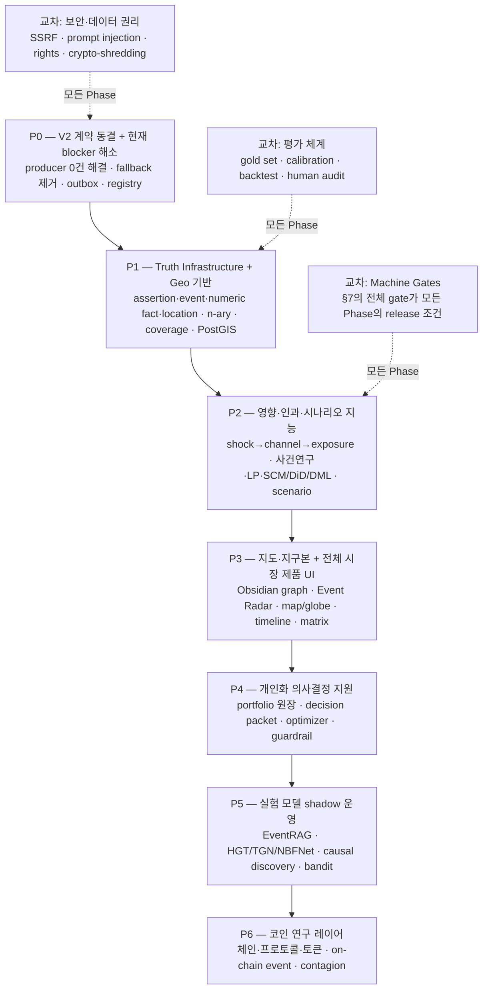
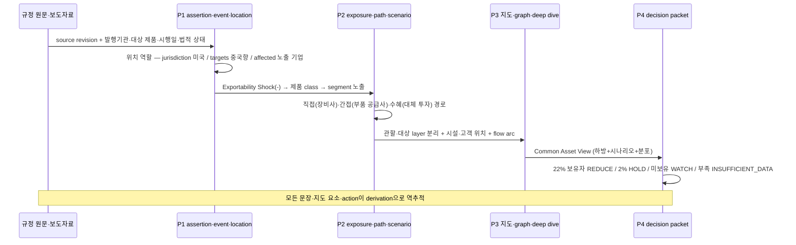

# Stock Insight — V2 고도화 마스터 로드맵 (100% 구현 목표)

> **정본 선언**: 본 문서는 아래 3개 문서를 통합한 **유일한 실행 로드맵 정본**이다. 진행 상태 질문("어디까지 왔나")의 답은 이 문서 하나다.
>
> 1. `docs/plan/stock-crypto-insight-platform-architecture.md` — 플랫폼 기준선 (Phase 0~5)
> 2. `docs/architecture-layers/stock-insight-e2e-layers.md` — 완성형 V2 레이어 정본 (L0~L8 · X1~X4)
> 3. `docs/plan/stock-insight-v2-enhancement-plan.md` — V2 고도화 종합 계획 (근거 기반 시장 월드모델, §0~§30 + 부록 A~D)
>
> - 작성일: 2026-07-20 KST
> - 목표: **고도화 계획의 모든 항목을 예외 없이 100% 구현** (보류·축소 없음; 단, 각 항목의 "100%"는 §3의 scope-bound 정의를 따른다)
> - 폐기된 이전 계획: 2026-07-20 오전 세션의 12-TODO 계획(complete-v2)은 본 문서로 **흡수·대체**된다 (§2 매핑표 참조)

---

## 0. 절대 계약 — 위반 시 어떤 구현도 무효

고도화 계획 §0.1의 명칭 고정 규칙을 **repository-level ADR**로 승격한다. 구현 LLM/에이전트는 이를 변경 제안이 아니라 상위 호환성 계약으로 취급한다.

```text
+----+------------------------------------------------------------------------------+
| #  | 계약                                                                         |
+----+------------------------------------------------------------------------------+
| C1 | 제품·API 계약은 계속 V2다. 새 메이저 버전·namespace·병렬 제품 계약 금지      |
| C2 | L0~L8 및 X1~X4 레이어 번호 유지. 신기능은 하위 모듈 또는 교차 plane로 추가   |
| C3 | impact_path_v2·graph-read-model-v2·V2 content pack·Graph API rename/중복 금지 |
| C4 | 적용 순서: additive migration → nullable→required → shadow → flag → backfill  |
|    | → parity gate                                                                |
| C5 | builder/model/prompt/feature/ontology/contract revision은 API major와 무관   |
| C6 | 내부 revision 증가가 API 경로·제품 명칭을 자동 변경하지 않음                 |
| C7 | 기존 endpoint 확장은 backward-compatible optional field부터; 새 endpoint는   |
|    | 기존 /api/... 아래 의미 기반 경로                                            |
| C8 | 병렬 진실 원장 생성 금지. 정본은 PostgreSQL research_app 하나                |
| C9 | 개인화 결과는 personalization.* projection/decision 영역에만 저장            |
| C10| 지도 좌표·화면 배치·클러스터 좌표는 presentation/geo projection —            |
|    | 관계 원장의 진실을 수정하지 않음                                             |
+----+------------------------------------------------------------------------------+
```

**진실 등급 사슬 (모든 데이터가 이 사슬 위에서만 흐른다)**

```text
source_revision
  → assertion / numeric_fact / event_mention / location_mention
  → event / contract / relation_instance / geo_binding
  → exposure / mechanism_hypothesis
  → statistical_estimate / causal_estimate
  → forecast / scenario
  → report_statement / common_asset_view
  → personalized_decision_packet

하위 계층이 상위 계층으로 역류해 사실을 수정할 수 없다.
```

---

## 1. 전체 구조 한눈에



**순서 원칙** (고도화 계획 §24·§28): 기간이 아니라 **의존관계와 실패 위험 순**. L5 producer가 0건인 상태에서 Force Graph·지도·지구본 UI를 크게 만드는 것은 금지되어 있으므로, 이전 계획에서 UI를 앞세웠던 항목은 P3로 이동했다.

---

## 2. 이전 12-TODO 계획과의 통합 매핑

이전 계획의 모든 항목은 소멸하지 않고 아래처럼 흡수된다. **누락 0을 보증하는 표**다.

```text
+---------------------+--------------------------------------------------------------+
| 이전 TODO id        | 흡수 위치                                                    |
+---------------------+--------------------------------------------------------------+
| plan-contract       | §0 절대 계약 + P0-1 (ADR 저장·layer 문서 §27 수정 반영)      |
| graph-collectors    | P0-7 (source contract 정책) + P1-1~P1-4 (수집→assertion·     |
|                     | event·contract 정규화) + P2-4 (production network 데이터)    |
| graph-semantics     | P1 전체 (assertion 분리·polarity/modality·n-ary·conflict·    |
|                     | coverage·entity resolution)                                  |
| graph-analytics     | P0-3 (producer 가동) + P2 전체 (exposure·인과·시나리오)      |
| graph-ui            | P3 전체 (Obsidian graph + 전체 시장 워크스페이스 + 지도)     |
| v2-cutover          | P0-5 (V1 fallback parity 후 제거; 255/255 커버리지 포함)     |
| phase0 (문서 기준)  | P0-6 (outbox delivery) + P0-8 (registry) + X1 보강 (§6.1)    |
| phase1 (문서 기준)  | P0-4 (report pack·pointer) + P2-6 (evidence 결속 리포트)     |
| phase3 (문서 기준)  | P4 전체 (개인화 — ranker에서 decision packet으로 확대)       |
| phase4 (문서 기준)  | P0-8 (registry) + §6.2 (선택적 재계산·correction·retraction) |
| crypto-research     | P6 전체                                                      |
| release             | §8 검증·출시 계단 (모든 Phase의 교차 gate)                   |
+---------------------+--------------------------------------------------------------+
```

추가로 이전 계획에 없었고 고도화 계획이 새로 요구하는 것: **Geo Plane 전체(P1·P3), Personalization Plane 전체(P4), 실험 모델 shadow(P5), 평가 체계(§16→XEVAL), 보안·데이터 권리(§20→XSEC), derivation DAG, coverage ledger, validAt/knownAt 분리, 4-시간 모델, n-ary reified object, conflict/supersession, story lineage, 번역 정책, 표·이미지·PDF provenance, probabilistic entity resolution.**

---

## 3. "100%"의 정의 (scope-bound)

"전 세계 모든 관계"가 아니라 **승인된 범위 안에서의 무결점**이다. 각 Phase의 100%는:

```text
1. 해당 Phase의 모든 작업 항목이 코드·DB·테스트로 존재하고
2. 해당 Phase의 모든 machine gate가 위반 0이며
3. 수직 관통 예시(§5)의 해당 구간이 실측으로 작동하고
4. 독립 리뷰 BLOCKER 0 / HIGH 0이며
5. 다음 Phase가 이 Phase의 산출물만으로 시작 가능한 상태
```

---

## 4. Phase별 상세 실행 계획

### P0 — V2 계약 동결과 현재 blocker 해소

> **목표**: 새 기능을 넣기 전에 현재 V2의 미완성 실행 경로를 실제로 닫는다. (고도화 계획 §24 P0)

```text
+------+----------------------------------------------------------------------------+
| 항목 | 작업                                                                       |
+------+----------------------------------------------------------------------------+
| P0-1 | 명칭 고정 규칙(§0)을 ADR로 저장: docs/adr/ADR-001-v2-naming-freeze.md      |
|      | + e2e-layers.md에 §27 수정표 26건 전건 반영 (목적 명칭·NEWS_MENTION 표기·  |
|      | 뉴스 assertion 허용·Claim/Event 물리 분리·event_location role·truth class· |
|      | AFFECTED_BY_EVENT derivation화·derivation anchor·validAt/knownAt·          |
|      | stored output replay·hop 정책·hybrid precompute·지리 역할·PostGIS/H3·      |
|      | 개인화 확대·action 라벨·LLM 설명 한정·cost basis·outbox 제한 문구·         |
|      | DAG short commit·backup 필수화·confidence 분해·L5 확장·기준일 정정)        |
| P0-2 | L3 LLM extraction 결선: run-knowledge-extraction 확장 — span 실존 +        |
|      | polarity/negation + modality + attribution + tense/status + condition +    |
|      | numerical consistency + section type + correction/retraction 검증기        |
| P0-3 | L5 producer 3종 가동: impact-path-builder·graph-community·                 |
|      | relation-measurement를 반복 실행 가능 상태로 — 운영 데이터 0건 해소        |
| P0-4 | report pack + serving.latest_report_pointer 정상화 (항상 존재·section 재생성)|
| P0-5 | V1 fallback 제거: 7 root 커버리지 → V2 no-data envelope → parity test →    |
|      | 테마·Workspace·개인화·inference legacy 소비자 이전 → fallback 완전 제거    |
| P0-6 | outbox delivery worker + dead-letter/replay 운영 (delivery 0건 해소)       |
| P0-7 | source contract 승인 정책 확정: 32건 중 3건 승인 상태 해소 — 권리·품질·    |
|      | 보존·재표시 기준 명문화 후 전 소스 심사                                    |
| P0-8 | model/prompt/ontology/feature registry + run manifest 결속                 |
|      | (code version·image digest·config hash를 stage attempt에 저장)             |
| P0-9 | PG DAG 보강(§6.1): stage-level short commit·immutable manifest·backfill    |
|      | 분리 namespace·retry 유형별 정책                                           |
| P0-10| 원문 내구성(§20.4): 최소 2 물리 copy·offsite encrypted backup·hash scrub·  |
|      | restore drill·RPO/RTO — "한계 도달 시 S3"가 아니라 지금부터 필수           |
+------+----------------------------------------------------------------------------+

완료 조건 (전부 실측):
[ ] impact_path_v2·community·measurement 각각 운영 행 > 0, 반복 실행 성공
[ ] 동일 input replay digest 일치
[ ] fallback 없는 V2 API로 핵심 여정 통과 (255/255 root, v1_fallback 호출 0)
[ ] outbox terminal row 미정착 0, dead-letter 처리 검증
[ ] latest_report_pointer 상시 존재
[ ] restore drill 1회 성공 (RPO/RTO 문서화)
```

### P1 — Truth Infrastructure + Geo 기반

> **목표**: relation 과적재를 해소하고 사실 계층을 물리 분리한다. (§3·§8·§10·§11·§22)

```text
+------+----------------------------------------------------------------------------+
| P1-1 | knowledge.assertion 신설 (§8.1): polarity·modality·attribution·quotation·  |
|      | span locator·parser version·verification_state (부록 A 상태 라벨 적용)     |
| P1-2 | world.event + event_participant + event_location_revision (§8.2):          |
|      | n-ary·state machine(rumored→…→repealed)·위치 역할 8종                      |
| P1-3 | world.numeric_fact (§8.3): 단위·기간·차원·restatement·XBRL/cell locator    |
| P1-4 | reified Contract/Regulation 객체 (§4): 당사자·제품·금액·기간·상태·파생 edge|
| P1-5 | derivation DAG (§8.4): pack item → 정확히 1 derivation anchor,             |
|      | derivation은 multi-input typed step (PROV-O 참조)                          |
| P1-6 | governance.coverage_ledger (§8.5): "없음"과 "모름"의 구분 — UI 5단계 표현  |
| P1-7 | conflict_set + supersession (§8.6): contradicts/supersedes/narrows/corrects|
| P1-8 | 4-시간 모델 (§9): event/valid·published·available·known + 거시 vintage;    |
|      | API validAt+knownAt+informationSet (asOf는 호환 alias); 시장 session 처리  |
| P1-9 | story lineage (§10.3): canonical cluster·syndication·publisher ownership·  |
|      | near-duplicate hash·independent source group                               |
| P1-10| 번역 정책 (§10.4): 원문 anchor 강제·번역은 파생물·정합성 검사              |
| P1-11| 표·이미지·PDF provenance (§10.5): raw bytes+parsed artifact 분리·          |
|      | parser/OCR 버전·cell 좌표·이미지 추출 수치 저티어 분리                     |
| P1-12| probabilistic entity resolution (§11): deterministic→blocking→             |
|      | Fellegi-Sunter/classifier→graph check→auto/review/non-link + LEI·FIBO 매핑 |
| P1-13| 뉴스 정책 수정 (§10.2): co-mention candidate only 유지, 뉴스 assertion/    |
|      | event는 source tier·corroboration·공식 확인 사다리로 승격 허용             |
| P1-14| Geo 기반 (§22.3): PostGIS + geo_entity/identifier/name/geometry/hierarchy  |
|      | revision (bitemporal·분쟁 경계 boundary_policy)                            |
| P1-15| 위치 해소 (§22.4): location_mention → candidate → role 분류 → abstention;  |
|      | 강제 선택 금지                                                             |
| P1-16| entity_geo_exposure (§22.7): REVENUE/ASSET/PRODUCTION/SUPPLY/… 유형 분리·  |
|      | 분모·기간 보존; 파생 우선순위 5단계                                        |
| P1-17| 표준 매핑 (§22.10): UN M49·ISO 3166·GeoNames·UN/LOCODE·IANA tz            |
|      | + geo 데이터 소스 우선순위 (§22.11): 정책·거시 vintage·무역·재난·시설·     |
|      | 장소 사전·뉴스(GDELT는 candidate/coverage 보조만)                          |
| P1-18| geo gold set + location machine gate (§16.10 지표 포함)                    |
| P1-19| entity ontology 확장 (§6.1~6.4): 조직·사람·법적 주체 / 금융·경제 객체 /    |
|      | 실물·산업 객체 / 제도·사건 객체 — 정치·경제·사회 충격을 기업에 연결할      |
|      | 최소 타입 세트; LEI Level 1/2·FIBO mapping table (§11.2)                   |
| P1-20| PIT universe·security master 완성 (§S1): delisting·split·merger·share      |
|      | class·티커 재사용 — 생존편향·주가 조정 오류 차단; 거시 vintage 원장과 결합 |
| P1-21| ontology 변경 통제 (§S2): predicate 의미 drift 방지 — ontology RFC·        |
|      | migration·compatibility test 절차                                          |
+------+----------------------------------------------------------------------------+

완료 조건:
[ ] 한 사건에서 source/actual/jurisdiction/target/affected 위치가 역할별 구분
[ ] geometry·time·provenance replay 가능
[ ] 국가·시설 exposure의 분모·기간·source 명확
[ ] accepted 위치 100%가 evidence·precision class·known time 보유
[ ] assertion 상태 전이가 부록 A 라벨을 따름 (Knowledge gates 위반 0)
```

### P2 — 영향·인과·시나리오 지능

> **목표**: "연결은 많지만 왜·얼마나 영향을 주는지 답하지 못함"을 해소. (§7·§12·§13)

```text
+------+----------------------------------------------------------------------------+
| P2-1 | shock/channel/exposure taxonomy (§7.2 채널 17종) + 표준 영향 사슬          |
|      | Event→Shock→Channel→Exposure→Financial→Valuation→Market (§7.1)             |
| P2-2 | exposure 원장 (§7.3): sign·sensitivity·horizon·lag·regime·threshold·       |
|      | substitutability·materiality·uncertainty — 필드 전체                       |
| P2-3 | 점수 분해 강제 (§7.4): 증거 신뢰도·관계 강도·materiality·전달 가능성·      |
|      | 방향·시차·시장 반영도·모델 불확실성 — 단일 confidence 곱셈 금지;           |
|      | epistemic confidence를 경제 크기에 곱하지 않음                             |
| P2-4 | production network (§13): OECD ICIO/Leontief(산업) + 공시 supplier/customer|
|      | (기업) + HS/ECCN(제품) + 항만·경로(지리) 결합; 산업→기업 하향 배분 경로    |
| P2-5 | 방법론 registry (§12): Event Study·Local Projections·SCM/DiD·DML template  |
|      | — 방법·가정·진단·CI를 결과 객체에 저장; PCMCI+는 candidate only;           |
|      | UI 라벨 "시계열 기반 영향 후보" (인과 표시 금지)                           |
| P2-6 | 3-hop 정책 수정 (§13.3): UI 1~3 hop + API bounded typed meta-path cost     |
|      | budget + offline 4-hop 이상 허용; 전 관계 혼합 shortest path 금지          |
| P2-7 | 시나리오 (§24 P2): bull/base/bear + policy delay/exemption 분기;           |
|      | counter-evidence·invalidation condition 필수                               |
| P2-8 | uncertainty/calibration + conformal wrapper                                |
| P2-9 | precompute 전략 (§18.3): 항상/조건부/on-demand bounded 3단 + cache key에   |
|      | snapshot·query·ontology·model version                                      |
| P2-10| 저장 분리 (§18.1): 시계열→TimescaleDB, backtest 중간산출→Parquet+DuckDB,   |
|      | vector/graph→재생성 가능 derived index                                     |
| P2-11| GraphRAG retrieval router (§15.1): factual/numeric/relation/global/impact/ |
|      | contradiction 6-way + 숫자 문장 실행 가능 program (§15.2) +                |
|      | entity/event dual graph (§15.3) + geo/portfolio 질의 라우팅 (§15.4) +      |
|      | atomic statement compiler (§S2 — 한 문장에 사실·추론 혼합 금지)            |
| P2-12| 공간 영향 경로 (§22.8~22.9): 재난 polygon×시설 intersection·제재 관할·     |
|      | 항만 폐쇄 3대 표준 경로; 공간 distance만으로 영향 edge 승격 금지;          |
|      | 안정 방법(spatial join·hierarchy roll-up·event coreference·gravity·        |
|      | IO+시설 그래프·지역 panel event study) 우선 도입                           |
+------+----------------------------------------------------------------------------+

완료 조건:
[ ] 사건 하나에서 affected stock top-K + sign/lag/horizon 생성
[ ] path step마다 evidence와 method 존재
[ ] 통계 반응과 인과 주장이 라벨·게이트로 분리 (Analytics gates 위반 0)
[ ] 재실행 불가능한 발행 숫자 0 (program+inputs 저장)
```

### P3 — 지도·지구본과 전체 시장 제품 UI

> **목표**: force graph 하나가 아니라 분석 워크스페이스. (§21·§22.12~14) — **P0에서 L5가 채워진 뒤에만 착수**

```text
+------+----------------------------------------------------------------------------+
| P3-1 | Obsidian형 Force Graph (이전 계획 승계): Sigma WebGL·Graphology·ForceAtlas2|
|      | worker·1/2/3-hop·경로 강조·A↔B 비교·근거 drawer·키보드/모바일/reduced-motion|
| P3-2 | 전체 시장 화면 8종 (§21.1): Event Radar·Factor Map·Propagation Map·        |
|      | Theme/Community(driver 설명 §S2)·Heatmap/Matrix·Timeline·Map/Globe·        |
|      | Value-chain View                                                           |
| P3-3 | 종목 Deep Dive 12항목 (§21.2): 정체성→실적 구조→직접 관계→2차 노출→factor  |
|      | 노출→진행 사건→historical analog→시나리오→반대 근거→derivation→보유 판단→  |
|      | invalidation trigger                                                       |
| P3-4 | 시각 언어 (§21.3): 사실=실선/추정=별도 표기/인과=식별 라벨/가설=점선/      |
|      | 전망=분포/candidate=기본 비표시·연구 모드 한정 (점선 토글 정책 §S2 수정)   |
| P3-5 | 지도·지구본 (§21.4·§22.13): MapLibre GL 기본, CesiumJS는 3D 실요구 시;     |
|      | renderer-neutral GeoJSON/MVT 먼저; layer toggle 역할 분리·uncertainty halo·|
|      | 시간 slider 4종·dedup event 기본·flow arc 종류 분리                        |
| P3-6 | geo API (§22.12): /api/geo/events·exposures·flows·tiles/{z}/{x}/{y}.mvt·   |
|      | /api/entities/:key/geo-exposure·/api/events/:id/locations                  |
| P3-7 | MVT/H3 projection + sealed geo snapshot + incremental tile cache;          |
|      | PostGIS=정본·H3=근사 projection 역할 분담 (§22.6 표)                       |
| P3-8 | freshness 세분화 (§S2): component watermark와 partial availability         |
+------+----------------------------------------------------------------------------+

완료 조건:
[ ] viewport 성능 SLO 충족
[ ] marker 중복·false precision gate 통과 (Geo gates 위반 0)
[ ] map item → 원문 → impact_path_v2까지 역추적 실측
[ ] Geo Plane 완료 조건 (§22.15) 전건: 역할 구분·evidence 100%·uncertainty 시각화·
    event→facility→company→stock 경로 결속·보유종목 지도 설명·marker 비증식
[ ] Report/UI gates 위반 0 (fact/estimate/forecast legend 구분 포함)
[ ] 브라우저 QA: 데스크톱·모바일·키보드·화면낭독·reduced-motion·console 0
```

### P4 — 개인화 의사결정 지원

> **목표**: "이 종목이 좋은가"와 "내가 지금 줄여야 하는가"의 분리. (§23 전체) — 의사결정 지원이며 주문 실행기가 아니다.

```text
+------+----------------------------------------------------------------------------+
| P4-1 | 원장 5종 (§23.5): user_investment_profile_revision·portfolio_snapshot·     |
|      | position_lot·position_thesis_revision·decision_packet                      |
| P4-2 | Common Asset View ↔ Personalized Action 물리 분리 (§23.3): private 데이터는|
|      | 공통 embedding/graph/training에 불포함; 행동은 ranking 신호로만            |
| P4-3 | action taxonomy (§23.2): ADD/HOLD/REDUCE/EXIT/WATCH/NO_ACTION/             |
|      | INSUFFICIENT_DATA — 저장·평가·설명은 세부 action 사용                      |
| P4-4 | 표준 판단 함수 (§23.7) + reason code 18종 (REDUCE/EXIT 10 + HOLD/ADD 8)    |
| P4-5 | cost basis 원칙 (§23.8): 세금·lot·제약·materiality에만 사용; 기대수익      |
|      | 입력 금지 (손실회피·anchoring 강화 방지)                                   |
| P4-6 | 1단계 rule+제약 엔진 (§23.9-1): 비중 한도·현금 target·thesis state·        |
|      | marginal risk·비용 임계·no-trade zone·hysteresis                           |
| P4-7 | 2단계 convex optimizer (§23.9-2): CVaR·거래비용·turnover·bounds·           |
|      | Black-Litterman — 비용은 optimizer 안에서 처리 (사후 차감 금지)            |
| P4-8 | 과잉매매 방지 (§23.12): no-trade zone·hysteresis·cooldown·confirmation     |
|      | count·materiality gate·emergency override                                  |
| P4-9 | abstention (§23.11): 미보정 단일 점수 금지; stale·coverage 부족·calibration|
|      | 미달·모델 충돌·정보 부족·비용>편익·rumor 상태 → INSUFFICIENT_DATA          |
| P4-10| 설명 구조 (§23.13): 9항목 — LLM은 구조화 packet의 자연어 설명만, action·   |
|      | 숫자 변경 불가                                                             |
| P4-11| API (§23.14): portfolio-snapshot·portfolio-impact·decision-support/:key·   |
|      | decision-history·thesis GET/POST — 인증 UUID fail-closed                   |
| P4-12| 보안·법률 (§23.15): RLS·암호화·LLM context 최소화·삭제 lifecycle·          |
|      | 2-user negative fixture·투자자문 규제 법률 검토 gate                       |
| P4-13| 평가·배포 (§23.16): offline(PIT walk-forward·비용 반영·baseline 비교) →    |
|      | shadow(disagreement 수집) → limited release(상한·확인·주문 없음)           |
| P4-14| 사용자 데이터 최소 수집 (§23.4): 필수 최소(계정·lot·현금·기간·위험·제약) / |
|      | 선택 고도화(목표·세금·소득·ESG·thesis) 분리 — 과도한 개인정보 선수집 금지; |
|      | 데이터 없으면 default 강제 대신 INSUFFICIENT_DATA 또는 제한 모드           |
| P4-15| read-only decision-support UI (§21.5·§23.6): 공통 view·내 action·이유·     |
|      | 행동 범위·비용·반대 근거·invalidation·valid_until — "매도" 단어 하나만     |
|      | 표시 금지, 이유 분리 표시                                                  |
| P4-16| 3단계 확률·regime·동적 의사결정 (§23.9-3): hierarchical Bayesian·BOCPD·    |
|      | scenario tree·adaptive conformal·lifecycle·hazard — rule/optimizer 검증 후 |
|      | 단계 도입 (4단계 실험 연구는 P5-6으로 위임)                                |
+------+----------------------------------------------------------------------------+

완료 조건:
[ ] 같은 종목이 사용자 제약별로 다른 action을 재현 가능하게 생성 (22%→REDUCE·
    2%→HOLD·미보유→WATCH·정보부족→INSUFFICIENT_DATA)
[ ] 모든 action이 snapshot·common view·evidence·비용·uncertainty에 결속
[ ] Personalization Plane 완료 조건 (§23.17) 전건: 테이블·팩·API 분리·재현성·
    abstention 작동·flip 통제·역류 0·주문 없는 이해 가능성
[ ] Personalization gates 위반 0 (자동 주문 endpoint 0 포함)
[ ] action flip·turnover가 정책으로 통제됨 (실측)
```

### P5 — 실험 모델 shadow 운영

> **목표**: 후보 탐색·retrieval·설명·shadow에 한정된 ML. (§14·§24 P5) — accepted 원장·실주문 권한 없음.

```text
+------+----------------------------------------------------------------------------+
| P5-1 | EventRAG/entity-event dual graph retrieval (candidate retrieval 전용)      |
| P5-2 | PathSim·NBFNet·HGT·TGN candidate ranking → analytics.candidate_score만     |
| P5-3 | causal discovery (PCMCI+) candidate — §12.5의 6조건 미충족 시 인과 표기 금지|
| P5-4 | adaptive/sequential conformal calibration                                  |
| P5-5 | contextual bandit — 콘텐츠 ranking만 (§23.10 허용 범위표 준수)             |
| P5-6 | decision-focused learning·offline RL — sandbox·OPE·confidence bound 통과   |
|      | 전 실사용 금지                                                             |
| P5-7 | 위성·화재·야간조도·선박 데이터 — 시설 상태 candidate detector로 제한       |
+------+----------------------------------------------------------------------------+

완료 조건:
[ ] 모든 실험 출력이 candidate_score/estimate에만 존재 (accepted 유입 0)
[ ] baseline 대비 안정적 증분 가치 + calibration + OPE confidence + 격리 통과
    시에만 product gate 부여
```

### P6 — 코인 연구 레이어

> **목표**: 주식 수직 관통 완성 후, 별도 의미체계로 확장. (§6.6·§24 P6) — 읽기 전용·주문 없음.

```text
+------+----------------------------------------------------------------------------+
| P6-1 | identity: Blockchain·L2·Protocol·SmartContract·Token·Stablecoin·Bridge·    |
|      | Oracle·Validator·Exchange·Custodian·WalletCluster                          |
| P6-2 | on-chain event + contract dependency + audit/exploit/depeg                 |
| P6-3 | token unlock/emission/governance proposal                                  |
| P6-4 | bridge/oracle/exchange/custody risk + liquidation contagion                |
| P6-5 | macro·regulation·jurisdiction·geo infrastructure와 공통 연결               |
| P6-6 | 코인 일일 리포트 (공통 report pack 체계)                                   |
+------+----------------------------------------------------------------------------+

완료 조건:
[ ] 주식 predicate에 코인을 끼워 넣은 사례 0 (별도 ontology 모듈)
[ ] 코인 사건 1건의 수직 관통 (원문→사건→노출→리포트) 실측
```

---

## 5. 수직 관통 인수 시나리오 (전 Phase의 공통 완료 증명)

고도화 계획 §25의 **반도체 수출통제 사례**를 인수 기준으로 채택한다. "이 한 사례가 완전히 작동해야 다른 사건·산업으로 확장한다."



**인수 체크리스트** (§25.6): 사실(대상·상태·시행일·지역) / 지리(역할 6종) / 직·간접 exposure와 path / 통계(과거 CAR) / 인과(식별 전략·진단) / 시나리오(strict·delayed·exemption) / 반대 근거·unknown coverage / 공통 view / 사용자별 packet / 전체 derivation — **10개 전부 실측 통과 = 로드맵 완료**.

---

## 6. 운영·저장 보강 (교차)

### 6.1 PG DAG Executor 보강 (§19.1)

```text
- 외부 HTTP fetch·LLM 호출을 DB 장기 transaction으로 감싸지 않는다
- stage = immutable input manifest 읽기 → immutable output artifact 생성
- DB commit은 짧게, lease/fencing으로 ownership 보장
- backfill은 production latest pointer와 분리된 run namespace
- code version·container image digest·config hash를 stage attempt에 저장
- retry는 네트워크/parser/validation 오류별 정책 분리
```

### 6.2 Outbox 표현 제한 (§19.2)

> 현재 요구사항에서는 PostgreSQL outbox가 필요한 원자성·멱등 재처리·소수 소비자 전달을 충족한다. 다중 독립 소비자, 장기 replay, 높은 throughput이 필요할 때 log broker를 추가한다. — Kafka와 "같은 보증"이라는 표현 금지.

### 6.3 SLO 추가 (§19.3)

information availability lag · ER abstention rate · assertion acceptance precision audit · candidate backlog age · conflict unresolved age · numeric execution failure · calibration drift · source contract expiry · backup restore success · legal takedown 처리 시간

### 6.4 보안·데이터 권리 (§20 — 모든 Phase의 착수 조건)

```text
수집기: SSRF allow/denylist·private IP 차단·DNS rebinding·redirect 검증·MIME 검사·
        크기/압축 한도·parser sandbox·quota·악성 문서 제거·no credentials·egress audit
주입:   untrusted 문서 ≠ instruction·schema 강제·validator 경유 DB write·
        LLM의 URL/SQL/shell 직접 실행 금지·registry/정책 수정 불가
권리:   source contract에 약관·캐시/보존·학습 허용·재표시 범위·재배포 조건·
        개인정보/삭제·보존 기간·종료 절차; append-only와 법적 삭제 충돌은
        crypto-shredding 또는 restricted vault
```

### 6.5 candidate lifecycle (§S1)

무기한 보존 금지 — TTL이 아닌 lifecycle state + retry budget + archival partition.

---

## 7. Machine Gates 통합 원장 (§26 전체 — 생략 없음)

기존 18종(e2e-layers §5)에 아래를 **추가**한다. 모든 gate는 SQL probe+테스트+fail-closed 발행 검증으로 존재해야 한다.

```text
Knowledge (6):  polarity/modality/attribution 미확정 accepted 0 · semantic 검증 실패 0 ·
                번역만 anchor 0 · 표 수치 미확정 0 · superseded projection 잔존 0 ·
                syndicated 중복 카운트 0
World-state(6): participant role 누락 0 · state machine 위반 0 · 종료 계약 active 노출 0 ·
                법인/security 혼동 0 · coverage state 누락 0 · n-ary 필수 role 누락 0
Geo (11):       location_role 누락 0 · evidence/precision/known 누락 0 · dateline 승격 0 ·
                centroid exact 표시 0 · invalid geometry 0 · hierarchy cycle 0 ·
                역사 사건 현재 경계 소급 0 · H3 관할 판정 0 · abstention 소실 0 ·
                duplicate marker 임계 이하 · disputed boundary 정책 누락 0
Analytics (8):  candidate→accepted 유입 0 · causal 라벨 method 누락 0 · event study
                benchmark/window 누락 0 · forecast as-of/horizon/calibration 누락 0 ·
                path sign/lag/channel 미설명 0 · confidence×magnitude 혼합 0 ·
                공간 근접만으로 영향 0 · future vintage/geometry/snapshot 누출 0
Personalization(12): private 혼입 0 · 미인증 조회 0 · cross-user 0 · packet 결속 누락 0 ·
                비용/위험/reason 누락 0 · calibration 미달 확정 action 0 · cost basis
                기대수익 입력 0 · materiality 미달 trade 0 · stale 기반 decision 0 ·
                risk limit 초과 0 · LLM의 action 변경 0 · 자동 주문 호출 0
Report/UI (8):  claim 뭉침 0 · 재실행 불가 숫자 0 · 반대 근거 숨김 0 · coverage 확정
                표현 0 · stale 혼입 0 · legend 구분 누락 0 · uncertainty exact pin 0 ·
                개인/공통 이유 혼합 0
Security (7):   미승인 rights 재표시 0 · private fetch 0 · untrusted→instruction 0 ·
                sandbox 우회 0 · restore 미검증 publish 0 · 개인 필드 평문 로그 0 ·
                삭제 후 projection 잔존 0
```

---

## 8. 검증·출시 계단 (모든 Phase 공통)

```text
단위 테스트(TDD) → typecheck/lint/build → fresh PostgreSQL(+PostGIS)
→ production clone rehearsal ×2 → candidate API → 인증 브라우저 QA
→ 독립 리뷰 3종 (backend / data-contract / UI) → BLOCKER 0 / HIGH 0
→ production backup → additive migration → shadow → flag 전환 → readback
→ 관찰 기간 → legacy 정리(별도 파괴 승인)
```

**평가 체계 (XEVAL — §16 전체를 Phase별 release 조건에 결속)**

```text
수집·coverage(§16.1) → P0·P1 | entity resolution(§16.2) → P1
assertion·event 추출(§16.3) → P1 | 증거·추론(§16.4) → P1·P2
그래프·경로(§16.5) → P2 | 인과·통계(§16.6) → P2 | forecast(§16.7) → P2·P4
투자 백테스트(§16.8: PIT universe·비용·White/SPA/PBO 통제) → P4
human audit(§16.9: stratified sampling·active learning) → P1~P4 상시
지리·사건 위치(§16.10) → P1·P3 | 개인화 의사결정(§16.11) → P4
```

---

## 9. 금지 목록 (§28 — 20개 전부, 위반 = 즉시 중단)

```text
1  새 메이저 API/제품 버전       11 LLM 문장을 fact/action으로 저장
2  L5 빈 상태에서 UI 먼저        12 최고 backtest만 골라 "검증됨"
3  coverage 평가 없는 소스 확장  13 정치·사회 사건의 단일 sentiment 축약
4  embedding/가격 상관 관계 양산 14 공통 전망과 개인 매도 판단 동일 score
5  link prediction을 사실 표시   15 매입가·손실을 기대수익 신호로 사용
6  첫 등장 지명 = 사건 위치      16 비용·세금·turnover 사후 차감
7  국가 centroid = 정밀 pin      17 OPE 없이 bandit/RL 실배포
8  H3 = 관할 정본                18 개인 데이터를 공통 index/snapshot에
9  기사 수 = 경제 중요도         19 자동 주문과 의사결정 지원 동시 출시
10 전 조합 사전 계산             20 코인을 주식 predicate에 끼워 넣기
```

---

## 10. TODO 원장 (실행 추적용)

```text
[P0] p0-blockers      — P0-1~P0-10 (계약 동결·producer·fallback·outbox·registry·백업)
[P1] p1-truth-geo     — P1-1~P1-21 (assertion·event·numeric·n-ary·coverage·ER·Geo·
                        ontology 확장·PIT universe·ontology RFC)
[P2] p2-impact        — P2-1~P2-12 (exposure·인과·시나리오·정책 수정·저장 분리·RAG·
                        공간 영향 경로)
[P3] p3-product-ui    — P3-1~P3-8 (Obsidian graph·8화면·deep dive·지도·geo API)
[P4] p4-personalization — P4-1~P4-16 (원장·packet·optimizer·guardrail·법률 gate·
                        최소 수집·decision UI·3단계 확률 방법)
[P5] p5-shadow-ml     — P5-1~P5-7 (candidate 전용 실험 모델)
[P6] p6-crypto        — P6-1~P6-6 (코인 연구 레이어)
[XG] x-gates          — §7 gate 원장 + §8 계단 + §9 금지 감시 (전 Phase 교차)
```

- 한 시점에 하나의 Phase만 주 작업으로 진행하되, XSEC(보안)·XEVAL(평가)·XG(gate)는 해당 Phase 작업에 인라인으로 포함한다.
- 각 Phase 완료 시 이 문서의 해당 절에 `★완료(날짜)` 마킹과 실측 수치를 기록한다 — 본 문서가 유일한 진행 원장이다.
- 부록 B·D의 코드/DB 감사 체크리스트는 P0 착수 직전과 각 Phase 종료 시 재실행한다.

---

## 부록. 고도화 계획 대비 누락 검증표

고도화 계획의 모든 절이 본 로드맵 어디에 반영됐는지의 역방향 색인:

```text
§0 방향·명칭 규칙 → §0 | §1 진단 → §1·§2 | §2 유지 원칙 → §0·전 Phase
§3 객체 분리 → P1-1~4 | §4 n-ary → P1-2·P1-4 | §5 목표 구조 → §1
§6 ontology 확장 → P1(6.1~6.5)·P6(6.6) | §7 영향 모델 → P2-1~3
§8 데이터 모델 → P1-1~7 | §9 시간 모델 → P1-8 | §10 추출 검증 → P0-2·P1-9~13
§11 entity resolution → P1-12 | §12 인과 방법론 → P2-5 | §13 공급망 → P2-4·P2-6
§14 Graph ML 역할 → P5 | §15 GraphRAG → P2-11 | §16 평가 → §8 XEVAL
§17 문제 목록(S0 12건/S1 23건/S2 9건) → 각 Phase 항목에 분산 반영 (아래 S-색인 참조)
§18 저장·계산 → P2-9·P2-10 | §19 운영 → §6.1~6.3 | §20 보안 → §6.4
§21 UI → P3 | §22 Geo Plane → P1-14~18·P3-5~7 | §23 Personalization → P4
§22.8~9 공간 영향·방법 → P2-12 | §22.11 geo 소스 → P1-17 | §22.15 완료 조건 → P3
§23.4 데이터 최소 수집 → P4-14 | §23.9-3 → P4-16 | §23.9-4 → P5-6 | §23.17 → P4
§6.1~6.4 ontology → P1-19 | §S1 PIT universe·vintage → P1-20 | §S2 ontology RFC → P1-21
§24 로드맵 → §4 (P0~P6 라벨 그대로 승계) | §25 수직 관통 → §5
§26 gates → §7 | §27 문서 수정 26건 → P0-1 | §28 금지 20건 → §9
§29 최종 권고 10건 → §1 순서 원칙·각 Phase | §30 참고문헌 → 원문서 참조 유지
부록 A 상태 라벨 → P1-1·P1-2 | 부록 B·D 감사 → §10 | 부록 C 체크리스트 → §0·§8
```

**§17 S-색인 (44건 전건)**

```text
S0 (12): 관계/영향 혼동→P2 | relation 과적재→P1-1~4 | n-ary 부재→P1-2·P1-4 |
coverage 부재→P1-6 | 수치 원장 부재→P1-3 | 인과 미분리→P2-5 | gold set 부재→XEVAL |
L5 0건→P0-3 | contract 승인 3/32→P0-7 | V1 fallback→P0-5 | 지리 역할 부재→P1-14~15 |
개인화 action 부재→P4

S1 (23): asOf 단일→P1-8 | byte 결정론→P0-1(§27)·C4 | span만 검증→P0-2 |
뉴스 일괄 candidate→P1-13 | one anchor 제한→P1-5 | 전체 계산 0→P2-9 |
hop 3 고정→P2-6 | 전부 PG 저장→P2-10 | 로컬 store→P0-10 | DAG 장기 tx→P0-9 |
outbox 과장→§6.2 | candidate 무기한→§6.5 | source 독립성→P1-9 | 번역 근거→P1-10 |
identifier 중심 ER→P1-12 | 종료·취소 약함→P1-2(state machine)·P1-7 |
security master→P1-20 | 거시 vintage→P1-8·P1-20 | model lineage→P0-8 |
feedback 역류→P4-2 | 지명 강제 선택→P1-15 | cost basis 신호화→P4-5 |
action 잦은 변동→P4-8

S2 (9): force graph 중심→P3-2 | community 설명→P3-2 | candidate 점선→P3-4 |
freshness 단일→P3-8 | ontology 절차→P1-21 | ranker 평가→P4-13·XEVAL |
지도 현저성 편향→P3-5 | 개인 데이터 격리→P4-12 | 문장 단위 큼→P2-11
```

*이 표에서 빠진 절이 발견되면 그것은 로드맵 결함이며, 즉시 본 문서를 수정한다.*
