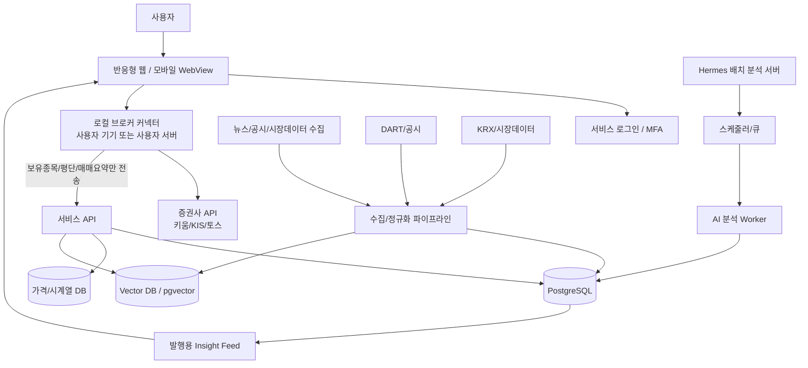
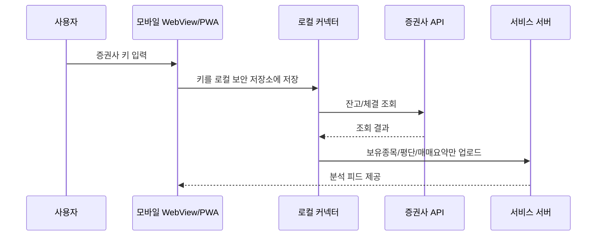
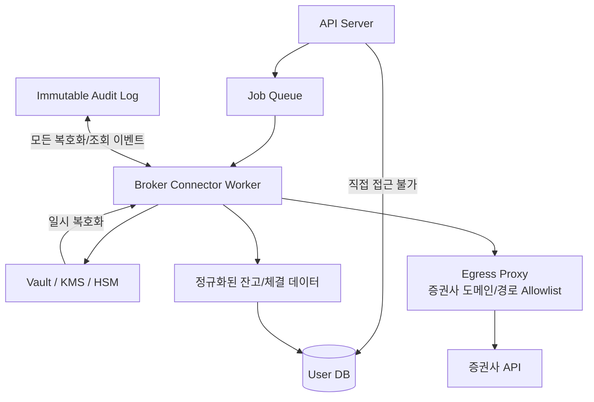
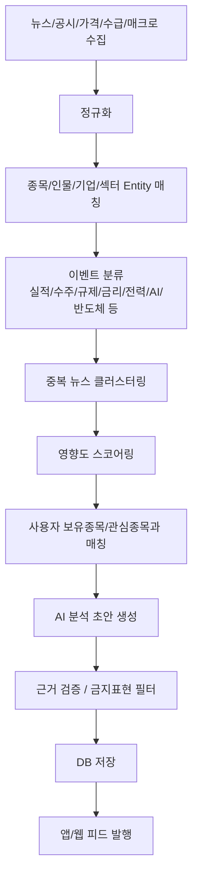
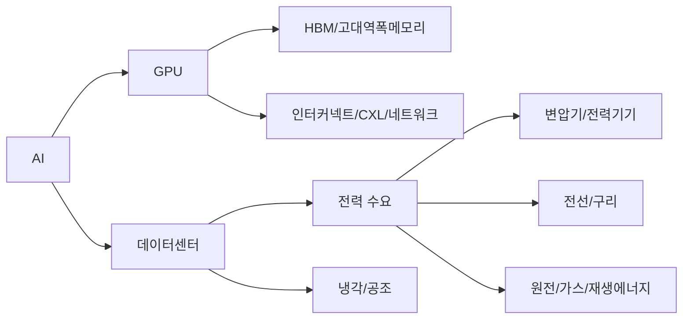
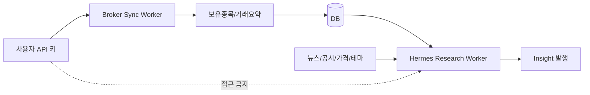

# 주식 정보 추천 앱/웹 전체 설계안

> 목적: 키움증권, 한국투자증권, 토스증권 등의 API를 활용하되 **매수/매도 주문은 하지 않고**, 사용자 보유종목·잔고·매매내역 등 조회성 데이터를 바탕으로 개인화된 주식 정보, 뉴스, 테마, 섹터, 종목 분석을 제공하는 반응형 웹/모바일 WebView 기반 서비스 설계안입니다.  
> AI는 실시간 챗봇이 아니라, Hermes 같은 분석 서버가 스케줄러/cron 기반으로 미리 분석하고 DB에 저장한 뒤 발행하는 구조를 기준으로 합니다.

---

## 0. 한 줄 요약

이 서비스의 핵심은 **“AI가 종목을 맞히는 것”이 아니라, 사용자가 가진 종목과 시장의 큰 흐름을 연결해서 이해하게 만드는 것**입니다.

단순 주식 뉴스 앱이 아니라 다음에 가까운 제품입니다.

> **내 계좌와 시장 뉴스를 연결해서, 내가 보유한 종목에 영향을 주는 이슈와 다음 관심 섹터를 쉽게 설명해주는 개인화 투자 리서치 피드**

---

## 1. 제품의 핵심 방향

### 1-1. 만들려는 서비스의 본질

서비스는 다음 기능을 종합적으로 제공합니다.

- 사용자 보유종목 조회
- 잔고 조회
- 매매 타이밍 복기
- 종목별 뉴스 추천
- 보유종목에 영향을 주는 경제뉴스 추천
- 종목별 분석
- 섹터별 유망 기업 탐색
- 테마 이동 분석
- AI → HBM → 데이터센터 → 전력 → 냉각 → 구리/전선/변압기처럼 테마가 확산되는 흐름 분석
- 관심종목 후보 제안
- 주간/일간 포트폴리오 리포트 발행

즉 단순히 “뉴스를 많이 보여주는 앱”이 아니라, **내 포트폴리오와 시장의 흐름을 연결해주는 앱**이어야 합니다.

---

## 2. 가장 중요한 리스크 3가지

### 2-1. 증권사 API 키 보안 리스크

키움증권, 한국투자증권, 토스증권 API 키는 단순 조회 목적으로 쓰려 해도, 발급된 키 자체가 주문 권한까지 포함할 수 있습니다.

따라서 서비스가 매수/매도를 하지 않더라도, 서버가 사용자 app key/app secret을 보관하면 보안 사고 시 큰 문제가 될 수 있습니다.

핵심 원칙은 다음입니다.

> **사용자가 “조회만 허용”한다고 생각해도, 발급받은 API 키 자체가 주문 권한을 포함할 수 있다면 그 키는 사실상 금융자산 접근 권한입니다.**

그래서 초기 MVP에서는 서버가 사용자 API 키를 보관하지 않는 구조를 추천합니다.

---

### 2-2. 투자자문 규제 리스크

아래 표현은 조심해야 합니다.

위험한 표현:

```text
지금 사야 할 종목 추천
이 종목 매도하세요
사용자님 포트폴리오 기준으로 다음 매수 종목은 A입니다
내일 오를 종목
목표가 00원
손절가 00원
익절가 00원
```

초기 서비스에서 더 안전한 표현:

```text
관심 있게 볼 만한 종목
이 테마와 연결된 기업
내 보유종목에 영향을 줄 수 있는 뉴스
매수 당시 조건 점검
추가 확인이 필요한 리스크
시장 관심도가 높아진 섹터
비슷한 테마의 기업
```

초기에는 **정보제공 + 포트폴리오 해석 + 테마 연결 + 매매 복기** 중심으로 가는 것이 좋습니다.

개인별 포트폴리오와 결합된 구체적인 매수/매도 추천은 법무/준법 검토가 필요합니다.

---

### 2-3. UX 리스크

주식 앱은 보통 정보가 너무 많아서 초보자나 고령 사용자가 피로감을 느낍니다.

이 앱은 차트와 지표를 많이 보여주는 것보다, 다음 질문에 답해야 합니다.

```text
오늘 내 종목에 중요한 뉴스가 뭐야?
그 뉴스가 왜 내 종목이랑 관련 있어?
내가 산 가격은 괜찮았어?
지금 이 테마가 어디로 이동하고 있어?
내 포트폴리오에서 위험하게 쏠린 부분은 뭐야?
```

따라서 UX는 **카드형 피드 + 쉬운 언어 + 근거 보기 + 초보/고급 모드**가 핵심입니다.

---

## 3. 추천하는 전체 아키텍처

초기 추천 구조는 아래와 같습니다.



핵심은 다음입니다.

- 증권사 키는 가능하면 사용자 기기 또는 로컬 커넥터에만 저장
- 서버에는 종목코드, 보유수량, 평균단가, 평가금액, 매매요약 등 분석용 데이터만 저장
- Hermes는 사용자 API 키를 모르고, 이미 동기화된 보유종목 데이터와 시장 데이터를 분석
- AI 결과는 바로 응답하지 않고, DB에 `insights` 형태로 저장 후 발행

---

## 4. 증권사 API 키 보관 방식

## 4-1. A안: 키 비보관 구조 — MVP 추천



### 장점

| 항목 | 장점 |
|---|---|
| 보안 | 서버가 사용자 증권사 키를 보관하지 않음 |
| 신뢰 | “키를 서버에 저장하지 않습니다”라는 메시지가 강함 |
| 사고 대응 | 서버 DB가 유출되어도 주문 가능한 키 원문은 없음 |
| 초기 개발 | Vault/HSM까지 바로 가지 않아도 됨 |
| 사용자 설득 | 민감한 사용자에게 더 안전하게 보임 |

### 단점

| 항목 | 단점 |
|---|---|
| 자동 동기화 | 사용자 기기 또는 커넥터가 실행되어야 함 |
| 모바일 웹 한계 | 순수 웹은 OS 보안 저장소 접근이 약함 |
| 초보자 UX | 로컬 커넥터 설치가 어렵게 느껴질 수 있음 |

### 추천 구현

모바일 앱은 단순 WebView가 아니라 다음 구조를 추천합니다.

```text
React/Next.js 반응형 웹 UI
+
모바일 Native Shell
+
WebView
+
Native Secure Storage Bridge
```

Android는 Keystore, iOS는 Keychain을 사용하고, WebView의 JavaScript에서는 원문 키를 직접 오래 들고 있지 않게 설계합니다.

---

## 4-2. B안: 서버 키 보관 구조 — 나중에 확장

완전 자동 동기화를 하려면 서버가 사용자 키를 저장해야 할 수 있습니다.

예를 들어 매일 새벽 6시에 모든 사용자의 계좌를 자동으로 동기화하려면 서버가 증권사 API를 호출해야 합니다.

이 경우 구조는 아래처럼 강하게 설계해야 합니다.



### 서버 보관 시 필수 원칙

| 보안 영역 | 해야 할 것 |
|---|---|
| 비밀값 저장 | DB에 appsecret 원문 저장 금지 |
| 암호화 | 사용자별 DEK로 암호화, KEK는 Vault/KMS/HSM에 보관 |
| 복호화 | Broker Connector Worker에서만 일시 복호화 |
| 네트워크 | Worker의 외부 통신은 증권사 API 도메인으로만 제한 |
| 주문 차단 | 주문 API 경로는 egress proxy에서 차단 |
| 로그 | appkey/appsecret/access token 로그 출력 금지 |
| 감사 | 누가, 언제, 어떤 계좌 키를 복호화했는지 불변 로그 저장 |
| 운영자 권한 | 운영자도 원문 키 조회 불가 |
| 삭제 | 사용자 탈퇴 시 키/토큰/동기화 데이터 삭제 |
| 이상탐지 | 대량 복호화, 대량 조회, 야간 비정상 호출 알림 |

---

## 5. 현실적인 단계별 선택

### 5-1. 1차 버전

**키 비보관 구조**로 시작합니다.

- 사용자가 직접 키 입력
- 키는 모바일 앱/PC 로컬에 저장
- 서버에는 보유종목, 평균단가, 보유수량, 평가금액, 매수일 요약만 저장
- 주문 API는 아예 구현하지 않음
- 소개 문구에 “증권사 API 키는 서버에 저장하지 않습니다” 표시

---

### 5-2. 2차 버전

**선택형 서버 동기화**를 제공합니다.

- 사용자가 원할 때만 자동 동기화 활성화
- Vault/KMS 기반으로 암호화 보관
- 주문 권한 없는 키만 허용 가능하면 가장 좋음
- 조회 전용 권한 분리가 불가능한 증권사는 “주문 권한 포함 키일 수 있음” 명확히 고지

---

### 5-3. 3차 버전

**증권사/마이데이터/제휴 연동**을 검토합니다.

- 사용자 appsecret을 직접 받는 모델에서 벗어나기
- 증권사 OAuth 또는 제휴 API로 scope 제한된 access token을 받는 구조가 이상적
- 이 단계로 가면 보안과 UX가 크게 좋아짐

---

## 6. Hermes 배치 분석 구조

사용자가 추가로 말한 방향처럼, AI는 실시간 챗봇으로 쓰지 않고 **Hermes가 cron/scheduler로 분석해서 DB에 저장하고 발행하는 구조**가 적합합니다.

### 6-1. 왜 배치 분석이 더 좋은가

| 방식 | 장점 | 단점 |
|---|---|---|
| 실시간 AI 챗봇 | 자유도가 높음 | 환각, 비용, 속도, 규제 리스크 큼 |
| 배치 분석 발행 | 품질관리, 비용절감, 검수 가능 | 즉흥 질문 대응은 약함 |

주식 정보 서비스에서는 실시간 대화보다 **신뢰 가능한 발행물**이 더 중요합니다.

Hermes는 “답변기”가 아니라 **리서치 편집국**처럼 동작해야 합니다.

---

## 7. Hermes 분석 파이프라인



### 중요한 원칙

LLM이 모든 것을 판단하면 안 됩니다.

- 숫자 계산은 DB/룰 기반
- 수익률 계산은 서버 계산
- 랭킹/스코어는 명시적 알고리즘
- LLM은 요약, 해석, 설명, 카드 문장 생성에 사용

즉, AI는 최종 판단자가 아니라 **분석글 작성 보조자**에 가깝게 써야 합니다.

---

## 8. 데이터 소스 설계

### 8-1. 필수 데이터

| 데이터 | 용도 | 예시 |
|---|---|---|
| 사용자 보유종목 | 개인화 피드 | 보유종목, 평균단가, 수량, 매수일 |
| 매매내역 | 타이밍 분석 | 매수/매도 시점, 손익 |
| 가격 데이터 | 수익률/상대강도 | 일봉, 주봉, 분봉 |
| 재무 데이터 | 종목 분석 | 매출, 영업이익, PER, PBR, 부채비율 |
| 공시 | 이벤트 분석 | 실적, 수주, 유상증자, 주요계약 |
| 뉴스 | 이슈 탐지 | 산업뉴스, 기업뉴스, 정책뉴스 |
| 테마 그래프 | 연관 종목 추천 | AI → HBM → CXL → 전력 → 변압기 |
| 섹터/산업분류 | 비교 분석 | 반도체, 전력기기, 데이터센터 |
| 거시지표 | 시장 분위기 | 금리, 환율, 유가, CPI, FOMC |

---

### 8-2. 뉴스 데이터 주의점

뉴스는 특히 조심해야 합니다.

기사 본문을 무단 크롤링해서 AI로 요약 후 재배포하면 저작권/계약 문제가 생길 수 있습니다.

초기에는 다음 방식이 안전합니다.

```text
뉴스 제목
언론사
발행시간
원문 링크
짧은 스니펫
자체 분석 코멘트
```

본문 기반 요약이나 전문 분석을 하려면 뉴스 API 계약 또는 콘텐츠 제휴를 검토하는 것이 좋습니다.

---

## 9. 데이터베이스 설계

초기에는 PostgreSQL 하나로도 충분합니다.

다만 가격 데이터와 뉴스 검색이 커지면 분리하는 것이 좋습니다.

### 9-1. 추천 저장소

| 용도 | 추천 |
|---|---|
| 기본 서비스 DB | PostgreSQL |
| 시계열 가격 데이터 | TimescaleDB 또는 ClickHouse |
| 뉴스/공시 검색 | OpenSearch 또는 PostgreSQL full-text |
| AI 임베딩 검색 | pgvector 또는 Qdrant |
| 큐/스케줄 | Redis + BullMQ, 이후 Temporal |
| 파일/원문 저장 | S3 호환 Object Storage |
| 감사 로그 | Append-only table + WORM storage |

---

### 9-2. 핵심 테이블 예시

```sql
users
- id
- email
- name
- age_group nullable
- risk_profile nullable
- created_at

brokerage_accounts
- id
- user_id
- broker_type -- KIS, KIWOOM, TOSS
- account_alias
- masked_account_no
- sync_mode -- LOCAL_ONLY, SERVER_SYNC
- last_synced_at

broker_credentials
- id
- user_id
- broker_account_id
- encrypted_app_key
- encrypted_app_secret
- encrypted_access_token
- key_id
- status
- created_at
-- MVP 키 비보관 구조에서는 이 테이블을 아예 안 쓰는 것이 좋음

positions
- id
- user_id
- account_id
- symbol
- quantity
- avg_price
- market_value
- unrealized_pnl
- snapshot_date

trades
- id
- user_id
- account_id
- symbol
- side
- trade_date
- quantity
- price
- fees
- source

instruments
- symbol
- market
- name
- sector
- industry
- country
- currency

price_bars
- symbol
- date
- open
- high
- low
- close
- volume

news_items
- id
- title
- source
- published_at
- url
- summary
- language
- hash

entity_mentions
- id
- news_id
- entity_type -- company, sector, macro, person
- entity_id
- confidence

themes
- id
- name
- description
- parent_theme_id

theme_edges
- from_theme_id
- to_theme_id
- relation_type
- strength
-- 예: AI -> HBM, HBM -> 메모리 장비, AI 데이터센터 -> 전력

company_theme_exposure
- symbol
- theme_id
- exposure_score
- evidence

insights
- id
- insight_type
- title
- body
- impact
- confidence
- horizon
- published_at
- model_version
- prompt_version

insight_targets
- insight_id
- symbol nullable
- theme_id nullable
- user_id nullable

insight_sources
- insight_id
- source_type
- source_id
- url
- published_at

audit_events
- id
- actor_type
- actor_id
- action
- target_type
- target_id
- ip
- user_agent
- created_at
```

---

## 10. “좋은 타이밍에 샀는지” 분석 로직

이 기능은 UX적으로 강력합니다.

하지만 “잘 샀다/못 샀다”를 너무 단정하면 사용자 반감과 규제 리스크가 커질 수 있습니다.

### 10-1. 추천 표현

좋은 표현:

```text
매수 당시 조건은 양호했습니다.
가격은 좋았지만, 실적 모멘텀 확인은 부족했습니다.
결과적으로 수익이 났지만, 당시에는 리스크가 큰 진입이었습니다.
당시 뉴스와 수급 기준으로는 추격매수에 가까웠습니다.
분할매수가 더 적합했을 가능성이 있습니다.
```

피해야 할 표현:

```text
잘 샀습니다.
못 샀습니다.
지금 더 사세요.
지금 파세요.
이 가격 아래로 내려가면 손절하세요.
```

---

### 10-2. 타이밍 분석 지표

| 영역 | 판단 기준 |
|---|---|
| 가격 위치 | 20/60/120일 이동평균 대비 위치 |
| 추세 | 최근 1개월/3개월 상대수익률 |
| 섹터 | 같은 섹터 대비 강도 |
| 거래량 | 거래량 증가율, 거래대금 순위 |
| 변동성 | ATR, 최근 급등락 여부 |
| 밸류에이션 | PER/PBR/EV/EBITDA 과거 밴드 |
| 실적 | 최근 실적 서프라이즈, 컨센서스 변화 |
| 뉴스 | 매수 전후 긍정/부정 이벤트 |
| 수급 | 기관/외국인 순매수 추이 |
| 리스크 | 유증, CB, 소송, 규제, 실적 악화 |

---

### 10-3. 결과론 방지

매수 타이밍 분석에서 가장 중요한 것은 **그 당시 알 수 있었던 정보만으로 평가**하는 것입니다.

예시:

```text
매수일: 2026-03-10
분석 기준 데이터: 2026-03-10 이전에 공개된 가격/뉴스/공시/재무정보만 사용
사후 결과: 2026-03-10 이후 수익률은 별도 표시
```

4월 1일에 대형 수주 공시가 나왔는데, 3월 10일 매수를 평가하면서 그 공시를 근거로 “좋은 판단이었다”고 하면 안 됩니다.

따라서 데이터 모델에 `as_of_date` 개념이 필요합니다.

---

### 10-4. 화면 예시

```text
삼성전자 매수 타이밍 점검

매수일: 2026.03.10
매수가: 72,000원
현재가: 78,000원
수익률: +8.3%

당시 조건
- 가격: 60일선 위, 단기 과열은 약함
- 섹터: 반도체 섹터가 KOSPI 대비 강세
- 뉴스: AI 서버 메모리 수요 관련 긍정 뉴스 증가
- 리스크: 환율 상승과 메모리 가격 둔화 우려 존재

판정
나쁘지 않은 진입이었지만, 실적 확인 전 선반영 구간이어서 분할매수가 더 적합한 상황이었습니다.

사후 결과
이후 수익은 주로 AI 메모리 수요 기대와 외국인 순매수 확대의 영향을 받았습니다.
```

---

## 11. 종목 추천/섹터 추천 로직

테마 분석은 이 서비스의 핵심 차별화가 될 수 있습니다.

예를 들어 AI 테마는 다음과 같이 이동할 수 있습니다.

```text
AI
→ GPU
→ HBM
→ CXL/인터커넥트
→ 데이터센터
→ 전력
→ 변압기
→ 전선
→ 냉각
→ 원전/가스
→ 구리
```

---

### 11-1. 테마 그래프 예시



---

### 11-2. 테마별 기업 연결

```text
AI
- 대형 플랫폼
- 클라우드 사업자
- AI 반도체

HBM
- 메모리 제조사
- HBM 장비
- 테스트/패키징

인터커넥트
- CXL
- 네트워크 스위치
- 광모듈
- PCB/기판

데이터센터
- IDC 운영
- 서버/랙
- 냉각
- 전력 설비

전력
- 변압기
- 전선
- 전력기기
- 발전
```

---

### 11-3. 회사별 테마 노출 점수

단순히 뉴스에 “AI”가 들어갔다고 AI 관련주로 분류하면 품질이 낮습니다.

아래처럼 점수화해야 합니다.

| 항목 | 설명 | 가중치 예시 |
|---|---|---:|
| 매출 노출도 | 해당 테마가 실제 매출에 기여하는가 | 30 |
| 공시/사업보고서 근거 | 사업보고서에 관련 사업이 명시되어 있는가 | 20 |
| 뉴스 빈도 | 최근 관련 뉴스가 증가했는가 | 15 |
| 가격 반응 | 테마 뉴스에 주가가 반응했는가 | 10 |
| 밸류에이션 부담 | 이미 너무 비싸졌는가 | 10 |
| 수급 | 기관/외국인 매수세가 있는가 | 10 |
| 리스크 | 실체 부족, 적자, CB/유증 위험 | -20 |

최종 화면에서는 점수보다 **왜 연결되는지**를 설명해야 합니다.

---

### 11-4. 화면 예시

```text
AI 전력 인프라 테마에서 같이 볼 기업

1. A사
연결 이유: 초고압 변압기 수출 비중 증가, 북미 전력망 투자와 연관
긍정 요인: 수주잔고 증가, 전력기기 업황 강세
주의 요인: 최근 주가 급등, 밸류에이션 부담

2. B사
연결 이유: 데이터센터 전력 배전 장비 공급
긍정 요인: 신규 증설 사이클
주의 요인: 영업이익률 변동성
```

---

## 12. AI 분석 카드 구조

나이에 상관없이 읽히려면 긴 리포트보다 **카드형 구조**가 좋습니다.

### 12-1. 카드 기본 구조

```text
[영향도: 높음] [내 보유종목 관련] [AI 데이터센터]

제목
AI 데이터센터 전력 수요 뉴스가 내 전력기기 종목에 중요한 이유

한 줄 요약
AI 서버 증설이 계속되면서 전력 인프라 기업에 대한 시장 관심이 커지고 있습니다.

내 종목과의 연결
내가 보유한 A사는 변압기/전력기기 매출 비중이 있어 데이터센터 전력 투자와 연결됩니다.

긍정 포인트
1. 북미 데이터센터 투자 확대
2. 전력망 병목 이슈 지속
3. 관련 섹터 거래대금 증가

주의 포인트
1. 이미 주가가 단기 급등
2. 신규 수주가 실적으로 반영되기까지 시간 필요
3. 원자재 가격 상승 가능성

확인할 일정
- 다음 실적 발표
- 주요 수주 공시
- 미국 전력망 투자 관련 정책 발표

내가 볼 것
추가 매수가 아니라, 실적과 수주가 주가 기대를 따라오는지 확인하는 구간입니다.
```

---

## 13. 개인화 피드 랭킹 공식

사용자마다 피드가 달라야 합니다.

하지만 AI가 무작정 골라주면 안 됩니다.

### 13-1. 기본 공식

```text
최종 피드 점수 =
보유종목 관련도 * 0.30
+ 관심종목 관련도 * 0.15
+ 뉴스 영향도 * 0.20
+ 테마 확산성 * 0.10
+ 신뢰도/근거 품질 * 0.10
+ 최신성 * 0.10
+ 사용자 반응 * 0.05
```

### 13-2. 예시

사용자가 SK하이닉스, LS ELECTRIC, HD현대일렉트릭을 보유하고 있다면:

| 뉴스 | 보유 관련도 | 영향도 | 최종 우선순위 |
|---|---:|---:|---:|
| HBM 수요 증가 | 높음 | 높음 | 1 |
| 북미 데이터센터 전력난 | 높음 | 높음 | 2 |
| 바이오 임상 결과 | 낮음 | 중간 | 낮음 |
| 원달러 환율 급등 | 중간 | 높음 | 3 |

---

## 14. AI를 쓸 영역과 쓰지 말아야 할 영역

### 14-1. AI를 쓰기 좋은 영역

| 영역 | 설명 |
|---|---|
| 뉴스 요약 | 긴 뉴스를 쉬운 말로 요약 |
| 이벤트 분류 | 실적, 수주, 정책, 규제, 소송, 테마 분류 |
| 종목 연결 | 뉴스가 어떤 종목/섹터에 영향을 줄지 후보 생성 |
| 반대 근거 생성 | 긍정 뉴스의 리스크도 같이 제시 |
| 초보자 설명 | PER, HBM, CXL 같은 용어 쉽게 설명 |
| 리포트 작성 | 정해진 템플릿에 맞춰 카드 생성 |
| 테마 그래프 확장 | AI → 병목 → 수혜 산업 연결 |

---

### 14-2. AI에게 맡기면 안 되는 영역

| 영역 | 이유 |
|---|---|
| 현재가/수익률 계산 | DB 숫자로 해야 함 |
| 보유수량/평단 계산 | 증권사 조회값 기반으로 해야 함 |
| 최종 매수/매도 지시 | 규제·책임 리스크 큼 |
| 근거 없는 예측 | 신뢰도 하락 |
| 기사 원문 무단 재작성 | 저작권 리스크 |
| 사용자 키 처리 | AI worker가 키에 접근하면 안 됨 |

---

### 14-3. Worker 분리 원칙

```text
Broker Sync Worker
- 사용자 키 접근 가능
- 증권사 API 호출
- 잔고/체결 정규화
- AI 호출 금지

Hermes Research Worker
- 사용자 키 접근 불가
- 보유종목 코드/평단/수익률만 접근
- 뉴스/공시/가격/테마 분석
- 발행 카드 생성
```



---

## 15. 발행 전 검증 시스템

AI가 만든 분석글은 바로 사용자에게 보여주지 않는 것이 좋습니다.

최소한 아래 검사를 통과해야 합니다.

### 15-1. AI 발행 검증 체크

| 검사 | 예시 |
|---|---|
| 출처 존재 여부 | 모든 주장에 source_id가 있는가 |
| 숫자 검증 | 수익률, 가격, 날짜가 DB와 일치하는가 |
| 금지 표현 | “무조건 상승”, “지금 매수”, “확정 수익” 금지 |
| 투자자문 위험 | 개인별 매수/매도 지시 문구 제거 |
| 중복 뉴스 | 같은 뉴스 반복 발행 방지 |
| 과장 표현 | “폭등”, “대박”, “몰빵” 제거 |
| 리스크 포함 | 긍정 카드에도 반대 근거 1개 이상 |
| 모델 버전 기록 | 어떤 모델/프롬프트로 생성됐는지 저장 |

발행물 테이블에는 반드시 다음 정보를 저장합니다.

```text
model_version
prompt_version
source_version
created_by_job_id
quality_check_status
published_at
```

나중에 문제가 생겼을 때 추적 가능해야 합니다.

---

## 16. 보안 설계 상세

## 16-1. MVP에서 서버 저장 금지 데이터

```text
app key
app secret
access token
refresh token
계좌 비밀번호
공동인증서 관련 정보
주문 가능 권한이 있는 모든 credential
```

---

## 16-2. 서버 저장 가능 데이터

```text
마스킹된 계좌번호
보유종목 코드
보유수량
평균단가
평가금액
손익률
체결 요약
관심종목
사용자가 직접 입력한 투자 메모
```

---

## 16-3. 서버 보관을 하게 될 때 필수 조치

```text
1. appsecret 원문 DB 저장 금지
2. 사용자별 Data Encryption Key 생성
3. DEK로 appsecret 암호화
4. DEK는 KMS/HSM/Vault로 감싸서 저장
5. 복호화는 Broker Connector Worker에서만 가능
6. 복호화 이벤트는 전부 감사 로그
7. 운영자 콘솔에서 원문 조회 기능 금지
8. 로그/에러/Sentry에 secret 자동 마스킹
9. 주문 API endpoint는 코드/네트워크 양쪽에서 차단
10. 대량 호출 이상탐지
```

---

## 16-4. 주문 API 차단

“우리는 주문 기능을 구현하지 않는다”만으로는 부족합니다.

실수나 침해 상황에서 주문 API가 호출되지 않게 여러 겹으로 막아야 합니다.

| 계층 | 조치 |
|---|---|
| 코드 | Broker Adapter에 조회 API만 구현 |
| 타입 | `OrderClient` 자체를 만들지 않음 |
| 테스트 | 주문 endpoint 호출 시 테스트 실패 |
| 네트워크 | Egress Proxy에서 주문 URL/method 차단 |
| 권한 | 가능하면 조회 전용 키만 허용 |
| 모니터링 | POST 주문류 경로 접근 시 즉시 알림 |
| 운영 | 주문 관련 환경변수/권한 미발급 |

---

## 16-5. 사용자별 데이터 접근 통제

나쁜 API 예시:

```http
GET /api/portfolio/12345
```

서버가 `12345` 계좌를 그대로 조회하면, 객체 ID 조작으로 다른 사용자의 데이터에 접근하는 문제가 생길 수 있습니다.

좋은 API 예시:

```http
GET /api/me/portfolio
```

서버 내부에서 로그인 사용자 ID 기준으로만 조회해야 합니다.

관리자 API도 일반 사용자 API와 완전히 분리하는 것이 좋습니다.

---

## 17. 모바일 WebView + 반응형 웹 전략

반응형 웹을 만들고 모바일은 WebView로 감싸는 방향은 좋습니다.

다만 금융/증권 키를 다루는 서비스라면 순수 WebView만으로는 부족합니다.

### 17-1. 추천 구조

```text
공통 UI
- Next.js / React 반응형 웹
- 모바일/데스크탑 동일 디자인 시스템

모바일 앱
- Native Shell
- WebView
- Secure Storage Bridge
- Push Notification
- Deep Link
- Biometric Auth

웹
- PWA
- Passkey / MFA
- 서버에는 증권사 키 저장하지 않음
```

---

### 17-2. 왜 Native Shell이 필요한가

| 기능 | 순수 웹 | WebView + Native |
|---|---:|---:|
| 반응형 UI | 가능 | 가능 |
| 푸시 알림 | 제한적 | 좋음 |
| 생체인증 | 제한적 | 좋음 |
| OS 보안 저장소 | 약함 | 좋음 |
| app key/appsecret 로컬 저장 | 위험 | 상대적으로 안전 |
| 앱스토어 배포 | 불가 | 가능 |

즉, 화면은 웹으로 만들되 **보안 저장소, 푸시, 생체인증은 네이티브가 담당**하는 구조가 좋습니다.

---

## 18. 나이에 상관없는 UI/UX 설계

### 18-1. 핵심 UX 원칙

| 원칙 | 설명 |
|---|---|
| 첫 화면은 피드 | 차트보다 “오늘 내 종목에 중요한 것” |
| 어려운 용어 자동 해설 | HBM, CXL, PER, 컨센서스를 바로 설명 |
| 카드형 구조 | 제목 → 한 줄 요약 → 내 종목 영향 → 근거 → 리스크 |
| 초보/고급 모드 | 초보는 쉬운 말, 고급은 지표/차트 확대 |
| 색만으로 판단 금지 | 빨강/파랑 + 텍스트 라벨 같이 표시 |
| 버튼 크게 | 모바일 터치 실수 방지 |
| 글자 크게 | 기본 16px 이상, 핵심 숫자 22px 이상 |
| 알림은 적게 | 하루 1~3개 고품질 알림 |
| 모든 분석에 근거 표시 | “왜?”를 누르면 출처와 계산 방식 표시 |

---

### 18-2. UX 문장 원칙

나쁜 문장:

```text
HBM 관련 모멘텀 및 밸류에이션 리레이팅 가능성이 존재합니다.
```

좋은 문장:

```text
AI 서버가 늘어나면서 고성능 메모리 수요가 커지고 있습니다. 이 종목은 그 흐름과 연결되어 있어 시장 관심이 높아질 수 있습니다.
```

---

## 19. 화면 구성 제안

하단 탭은 5개 정도가 적당합니다.

```text
1. 오늘
2. 내 종목
3. 테마
4. 발견
5. 설정
```

---

## 19-1. 오늘 화면

가장 중요한 화면입니다.

```text
오늘의 투자 브리핑

[내 종목 영향 큰 뉴스 3개]
- AI 데이터센터 전력 수요 확대 → 내 전력기기 종목 관련
- HBM 가격 전망 상향 → 내 반도체 종목 관련
- 원달러 환율 상승 → 내 미국주식/수출주 영향

[내 포트폴리오 상태]
- 오늘 영향도: 중간
- 집중 리스크: 반도체 비중 42%
- 새로 볼 테마: 전력 인프라, 냉각, CXL

[확인할 일정]
- 삼성전자 실적 발표
- 미국 CPI
- FOMC
```

---

## 19-2. 내 종목 화면

```text
내 보유종목

삼성전자
수익률 +8.2%
상태: 실적 확인 구간
관련 이슈: HBM, 메모리 가격, 환율
최근 뉴스 영향: 긍정 2 / 중립 1 / 부정 1

LS ELECTRIC
수익률 +22.1%
상태: 기대감 선반영 주의
관련 이슈: 전력기기, 데이터센터, 북미 인프라
최근 뉴스 영향: 긍정 4 / 부정 1
```

종목 상세 화면:

```text
이 종목을 왜 보유 중인지 점검

1. 내 매수 타이밍
2. 현재 가격 위치
3. 최근 뉴스 영향
4. 실적/밸류에이션
5. 앞으로 확인할 것
6. 비슷한 테마 종목
```

---

## 19-3. 테마 화면

```text
요즘 시장 테마 흐름

AI
↓
HBM
↓
CXL/네트워크
↓
데이터센터
↓
전력/변압기
↓
냉각/구리/원전

각 테마별:
- 왜 뜨는지
- 관련 기업
- 이미 많이 오른 기업
- 아직 실적 확인이 필요한 기업
- 리스크
```

---

## 19-4. 발견 화면

이 화면이 “종목 추천”에 가장 가까운 화면입니다.

하지만 표현은 “추천”보다 “발견”이 더 좋습니다.

```text
새로 발견한 관심 기업

[AI 전력 인프라]
A사
관심 이유: 데이터센터 전력 설비 수요와 연결
주의: 최근 3개월 급등, 실적 확인 필요

[HBM 장비]
B사
관심 이유: HBM 증설 사이클과 연결
주의: 고객사 투자 지연 가능성

[냉각]
C사
관심 이유: 고밀도 서버 냉각 수요 증가
주의: 실제 데이터센터 매출 비중 확인 필요
```

---

## 19-5. 설정 화면

```text
- 증권사 연동
- 키 저장 방식: 이 기기에만 저장 / 서버 자동 동기화
- 알림 설정
- 초보/중급/고급 모드
- 관심 테마
- 데이터 삭제
- 보안 로그
```

보안 로그는 꼭 넣는 것이 좋습니다.

```text
최근 계좌 조회 기록
- 2026.06.22 07:30, 내 기기, 한국투자증권 잔고조회
- 2026.06.22 07:31, 내 기기, 체결내역 조회
```

사용자 입장에서 신뢰가 생깁니다.

---

## 20. 알림 설계

알림을 많이 보내면 주식 앱은 피로도가 커집니다.

알림은 중요도 높은 것만 보내는 것이 좋습니다.

### 20-1. 알림 종류

| 알림 | 예시 |
|---|---|
| 내 종목 중요 뉴스 | “보유 중인 A사 관련 대형 수주 공시가 나왔습니다” |
| 급격한 리스크 | “보유종목 B사에 유상증자 공시가 나왔습니다” |
| 테마 이동 | “AI 테마 관심이 전력기기/냉각으로 확산 중입니다” |
| 실적 일정 | “내일 C사 실적 발표 예정” |
| 포트폴리오 리스크 | “반도체 비중이 50%를 넘었습니다” |
| 주간 리포트 | “이번 주 내 포트폴리오에 영향을 준 이슈 5개” |

---

### 20-2. 알림 문구

나쁜 알림:

```text
A사 급등 예상! 지금 확인하세요
```

좋은 알림:

```text
A사 관련 수주 공시가 나왔습니다. 내 보유종목 영향도를 정리했습니다.
```

---

## 21. 기술 스택 추천

### 21-1. 프론트엔드

| 영역 | 추천 |
|---|---|
| 웹 | Next.js + React |
| 스타일 | Tailwind + shadcn/ui 또는 MUI |
| 상태관리 | Zustand |
| 서버상태 | TanStack Query |
| 차트 | Lightweight Charts, ECharts |
| 모바일 | Capacitor 또는 React Native WebView |
| 인증 | Passkey + MFA 지원 구조 |

React, Zustand, TanStack Query 경험이 있다면 이 조합이 현실적으로 좋습니다.

---

### 21-2. 백엔드

| 영역 | 추천 |
|---|---|
| API 서버 | NestJS 또는 Fastify |
| Worker | Node.js Worker + Python 분석 Worker 혼합 |
| DB | PostgreSQL |
| 시계열 | TimescaleDB 또는 ClickHouse |
| 큐 | Redis + BullMQ |
| 워크플로우 | 초기 BullMQ, 고도화 후 Temporal |
| 검색 | OpenSearch 또는 Typesense |
| 벡터검색 | pgvector 시작, 커지면 Qdrant |
| 인증 | Keycloak, Auth0, Clerk 중 선택 |
| 비밀값 | HashiCorp Vault 또는 Cloud KMS |
| 모니터링 | OpenTelemetry + Prometheus/Grafana + Sentry |

---

### 21-3. AI/Hermes

| 영역 | 추천 |
|---|---|
| 분석 스케줄 | cron + queue |
| 뉴스 분류 | LLM + 룰 기반 |
| 종목 매칭 | ticker dictionary + LLM 보조 |
| 임베딩 | 기사/공시/테마 문서 임베딩 |
| 검증 | 숫자는 DB 기반, 문장은 LLM |
| 발행 | `insights` 테이블 저장 후 앱 노출 |

---

## 22. Hermes Job 설계

```text
job: market_news_ingest
주기: 10~30분
역할: 뉴스 수집, 중복 제거, 종목/섹터 매칭

job: disclosure_ingest
주기: 10~30분
역할: DART 공시 수집, 중요 공시 분류

job: price_sync
주기: 장중/장후
역할: 가격/거래량/섹터 수익률 업데이트

job: theme_graph_update
주기: 매일
역할: 새로 등장한 테마와 기존 테마 연결

job: portfolio_snapshot_analysis
주기: 사용자가 동기화할 때마다
역할: 보유종목 상태, 비중, 손익, 리스크 계산

job: insight_generation
주기: 매일 아침/장후/중요 이벤트 발생 시
역할: 사용자별 또는 공통 분석 카드 생성

job: quality_guard
주기: insight 발행 전
역할: 금지 표현, 출처 누락, 숫자 오류 검사

job: weekly_digest
주기: 주 1회
역할: 내 포트폴리오 주간 리포트 생성
```

---

## 23. 추천/분석 엔진 구조

### 23-1. 종목 분석 점수

```text
stock_score =
fundamental_score * 0.25
+ earnings_momentum * 0.20
+ price_momentum * 0.15
+ theme_exposure * 0.15
+ news_sentiment * 0.10
+ liquidity_score * 0.05
+ valuation_score * 0.05
+ risk_penalty * -0.15
```

---

### 23-2. 사용자 관련도 점수

```text
user_relevance =
holding_weight * 0.35
+ watchlist_match * 0.20
+ same_theme_exposure * 0.15
+ recent_trade_match * 0.15
+ risk_overlap * 0.10
+ user_click_preference * 0.05
```

---

### 23-3. 피드 발행 우선순위

```text
feed_priority =
impact_score * 0.30
+ user_relevance * 0.30
+ source_reliability * 0.15
+ novelty * 0.10
+ recency * 0.10
+ explainability * 0.05
```

여기서 `explainability`가 중요합니다.

아무리 점수가 높아도 “왜 관련 있는지” 설명하지 못하면 발행하지 않는 것이 좋습니다.

---

## 24. 규제 리스크를 줄이는 제품 정책

### 24-1. 금지

```text
사용자별 “매수하세요/매도하세요” 문구
목표가 단정
수익 보장 표현
단기 급등 예측
손절/익절 가격 제시
주문 버튼 연결
AI가 생성한 무근거 종목 추천
```

---

### 24-2. 허용 방향

```text
관련 뉴스 요약
보유종목 영향도 분석
섹터/테마 설명
관심종목 후보 제공
리스크 체크리스트
과거 매수 타이밍 복기
포트폴리오 비중/집중도 분석
공시/실적 일정 알림
```

---

### 24-3. 화면 하단 고지 예시

```text
이 콘텐츠는 투자 판단을 돕기 위한 정보 제공이며, 특정 금융상품의 매수·매도 지시가 아닙니다. 최종 투자 판단과 책임은 사용자에게 있습니다.
```

단, 면책문만으로 규제 리스크가 사라지는 것은 아니므로 서비스 출시 전 법무 검토가 필요합니다.

---

## 25. MVP 범위 제안

처음부터 너무 크게 만들면 실패 가능성이 높습니다.

MVP는 아래 정도가 적당합니다.

| 기능 | 포함 여부 |
|---|---|
| 회원가입/로그인 | 포함 |
| 반응형 웹 | 포함 |
| 모바일 WebView | 포함 |
| 증권사 1개 연동 | 포함 |
| 서버 키 저장 | 제외 |
| 로컬 키 저장 | 포함 |
| 보유종목 동기화 | 포함 |
| 관심종목 | 포함 |
| 뉴스 수집 | 포함 |
| DART 공시 수집 | 포함 |
| 보유종목 관련 뉴스 카드 | 포함 |
| 매수 타이밍 복기 | 기본형 포함 |
| 테마 그래프 | 기본형 포함 |
| 종목 추천 | “관심 후보” 형태로 제한 |
| 주문 기능 | 완전 제외 |
| 실시간 챗봇 | 제외 |
| Hermes 배치 발행 | 포함 |

---

## 26. MVP에서 가장 중요한 화면 3개

### 26-1. 오늘 화면

- 내 종목 관련 중요한 뉴스
- 내 포트폴리오 리스크
- 오늘 확인할 일정

### 26-2. 종목 상세

- 내 매수 타이밍
- 관련 뉴스
- 실적/밸류
- 리스크
- 비슷한 테마 종목

### 26-3. 테마 지도

- AI → HBM → 전력 → 냉각처럼 시장 관심 이동 설명
- 관련 기업
- 이미 오른 기업/아직 실적 확인 필요한 기업 구분

---

## 27. 가장 중요한 차별화 포인트

이미 뉴스 앱, 증권사 리포트, 토스/네이버/증권앱은 많습니다.

차별화는 “뉴스를 많이 보여주는 것”이 아닙니다.

---

### 27-1. 내 보유종목과 뉴스의 연결

일반 뉴스:

```text
AI 데이터센터 전력 수요 급증
```

이 앱:

```text
이 뉴스는 네가 보유한 LS ELECTRIC, HD현대일렉트릭과 연결됩니다.
이유는 데이터센터 전력 설비 투자와 변압기 수요 때문입니다.
다만 두 종목 모두 최근 기대감이 많이 반영되어 실적 확인이 필요합니다.
```

---

### 27-2. 테마의 이동을 설명

일반 앱:

```text
오늘의 테마: AI
```

이 앱:

```text
AI 테마는 이제 단순 GPU에서 전력·냉각·네트워크 병목으로 이동 중입니다.
그래서 시장은 HBM뿐 아니라 변압기, 전선, 냉각 기업도 같이 보기 시작했습니다.
```

---

### 27-3. 매수 복기

일반 앱:

```text
수익률 +12%
```

이 앱:

```text
수익은 났지만, 매수 당시에는 단기 과열 구간이었습니다.
다음에는 같은 테마 안에서 덜 오른 대체 종목을 같이 비교하는 게 좋습니다.
```

---

### 27-4. 반대 근거 제공

일반 추천:

```text
A사 유망
```

이 앱:

```text
A사는 AI 전력 테마와 연결되지만, 최근 주가가 실적보다 먼저 움직였을 수 있습니다.
다음 실적에서 수주잔고와 영업이익률을 확인해야 합니다.
```

---

## 28. 운영자/관리자 도구

Hermes가 발행하는 구조라면 관리자 페이지가 필요합니다.

### 28-1. 관리자 기능

```text
수집된 뉴스 목록
종목 매칭 결과 확인
테마 그래프 수정
AI 생성 카드 검수
금지어/위험 표현 필터 관리
사용자 신고/피드백 확인
발행 취소
모델 버전별 품질 비교
증권사 API 오류 모니터링
키 복호화/조회 감사 로그
```

초기에는 모든 AI 카드를 자동 발행하지 말고, 공통 리서치 카드는 관리자 검수 후 발행하는 것이 좋습니다.

사용자별 단순 조합 카드, 예를 들어 “내 보유종목에 이 뉴스가 연결됨” 정도는 자동 발행해도 됩니다.

---

## 29. 예시 사용자 경험

### 29-1. 가입 후 첫 연결

```text
1. 앱 설치
2. 로그인
3. 증권사 선택
4. “키를 이 기기에만 저장합니다” 안내
5. app key/app secret 입력
6. 잔고 조회 테스트
7. 서버에는 보유종목 요약만 저장된다는 안내
8. 첫 포트폴리오 분석 생성
```

---

### 29-2. 첫 분석 결과

```text
내 포트폴리오 요약

보유 종목 8개
가장 큰 테마: AI/반도체 46%
두 번째 테마: 전력 인프라 22%
현금 비중: 12%

좋은 점
- 최근 시장 주도 테마와 연결된 종목이 많습니다.
- 일부 종목은 실적 모멘텀이 확인되고 있습니다.

주의할 점
- AI/반도체 비중이 높아 같은 뉴스에 동시에 흔들릴 수 있습니다.
- 단기 급등 종목 2개는 실적 확인 전 기대감이 많이 반영되어 있습니다.

오늘 볼 뉴스
1. HBM 수요 전망 상향
2. 데이터센터 전력망 투자 확대
3. 환율 상승
```

---

## 30. 개발 우선순위

### Phase 1 — 기반

```text
Next.js 반응형 UI
로그인/MFA
사용자/관심종목/보유종목 DB
증권사 1개 로컬 연동
보유종목 스냅샷 저장
기본 뉴스/공시 수집
```

---

### Phase 2 — 분석 카드

```text
종목별 뉴스 매칭
보유종목 영향도 카드
매수 타이밍 복기
종목 상세 화면
Hermes 배치 발행
```

---

### Phase 3 — 테마 그래프

```text
테마 DB
테마 간 연결
회사별 테마 노출 점수
시장 관심 이동 화면
관심 후보 기업 카드
```

---

### Phase 4 — 보안 고도화

```text
모바일 Native Secure Storage Bridge
감사 로그
이상 호출 탐지
서버 자동 동기화 선택 옵션
Vault/KMS 구조
```

---

### Phase 5 — 사업화/규제 정리

```text
투자자문 해당성 검토
유사투자자문/투자자문업/제휴모델 판단
뉴스 콘텐츠 라이선스 검토
유료 플랜 설계
리포트/알림 고도화
```

---

## 31. 수익모델

초기에는 주문을 하지 않으므로 거래수수료 모델보다 구독형이 맞습니다.

### 31-1. 무료

```text
관심종목 10개
보유종목 수동 입력
일반 테마 뉴스
일부 분석 카드
```

---

### 31-2. 개인 프리미엄

```text
증권사 연동
내 보유종목 영향 분석
매수 타이밍 복기
주간 포트폴리오 리포트
테마 이동 알림
```

---

### 31-3. 고급 투자자

```text
다계좌/복수 증권사
고급 지표
섹터 비교
이벤트 백테스트
엑셀/CSV export
```

---

### 31-4. B2B

```text
투자 스터디/커뮤니티용 리서치 피드
프라이빗 테마 DB
기업 내부 리서치 도구
```

단, 개인별 매수/매도 추천을 유료로 제공하면 투자자문업 리스크가 커지므로 과금 범위와 문구를 신중히 설계해야 합니다.

---

## 32. 최종 추천 구조

```text
제품
- 개인화 주식 리서치 피드
- 포트폴리오 복기
- 테마 그래프

프론트
- Next.js 반응형 웹
- 모바일은 WebView + Native Secure Storage Bridge

증권사 연동
- 초기에는 키 서버 비보관
- 사용자 기기에서 조회 후 보유종목 요약만 서버 전송

AI
- Hermes 배치 분석
- 실시간 챗봇 없음
- 뉴스/공시/가격/테마를 분석해 insight 테이블에 저장 후 발행

보안
- 서버에 주문 가능 키 저장하지 않음
- 서버 저장 옵션은 나중에 Vault/KMS/HSM 구조로만 제공
- 주문 API는 코드/네트워크/정책 3중 차단

UX
- 첫 화면은 “오늘 내 종목에 중요한 것”
- 종목 추천보다 “관심 후보”
- 항상 근거와 리스크 같이 제공
- 초보/고급 모드 분리

규제
- 초기에는 정보제공/리서치/복기 중심
- 개인별 매수·매도 지시 금지
- 종목 추천 고도화 전 법무 검토
```

---

## 33. 참고 링크

아래 링크들은 설계 검토 시 참고할 만한 공식/신뢰 자료입니다.

- 한국투자증권 KIS Developers: https://apiportal.koreainvestment.com/apiservice
- 키움증권 OpenAPI 안내: https://openapi.kiwoom.com/guide/apiguide
- 토스증권 Open API: https://corp.tossinvest.com/ko/open-api
- DART OpenAPI: https://opendart.fss.or.kr/intro/main.do
- KRX Data Marketplace Open API: https://openapi.krx.co.kr/
- OWASP Secrets Management Cheat Sheet: https://cheatsheetseries.owasp.org/cheatsheets/Secrets_Management_Cheat_Sheet.html
- OWASP API Security - Broken Object Level Authorization: https://owasp.org/API-Security/editions/2023/en/0xa1-broken-object-level-authorization/
- WCAG 2.2: https://www.w3.org/TR/WCAG22/

---

## 34. 결론

이 서비스는 “종목 맞히기 앱”으로 가면 규제와 신뢰 리스크가 커집니다.

반대로 아래 방향으로 가면 경쟁력이 있습니다.

```text
내 종목에 어떤 뉴스가 중요한지 알려준다.
내가 산 시점을 당시 정보 기준으로 복기해준다.
시장이 어떤 테마에서 어떤 병목으로 이동하는지 설명해준다.
관심 있게 볼 만한 기업을 근거와 리스크와 함께 보여준다.
사용자 키는 최대한 서버에 저장하지 않는다.
AI는 실시간 예측기가 아니라 검증 가능한 리서치 발행기로 쓴다.
```

최종적으로 이 앱의 승부처는 다음입니다.

> **사용자가 가진 종목과 시장의 큰 흐름을 연결해서 이해하게 만드는 것.**

